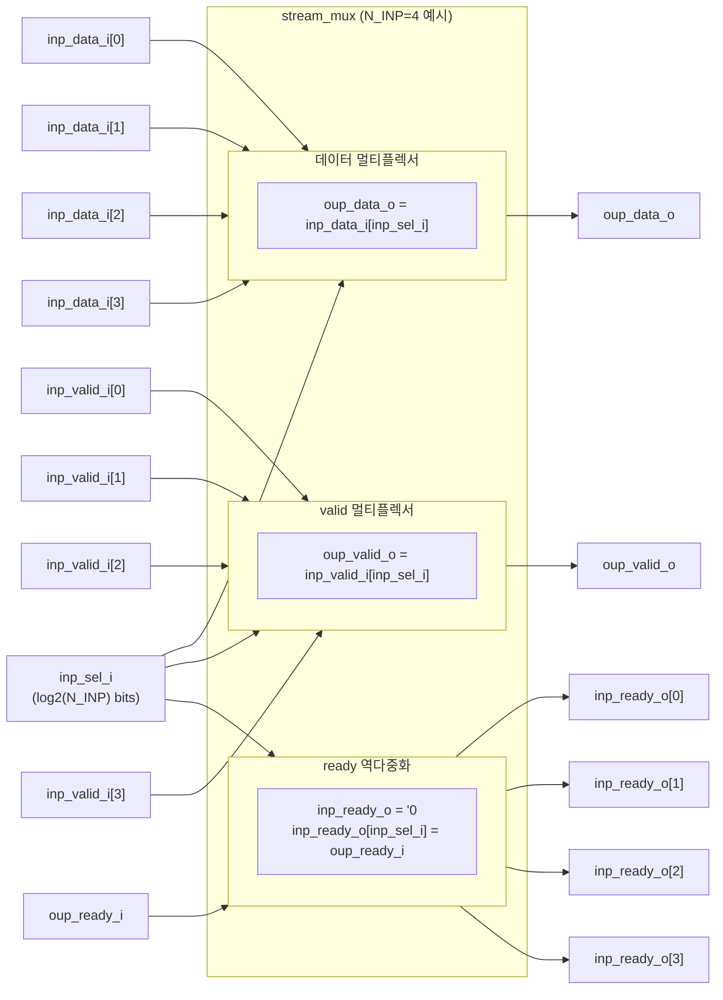

# stream_mux.sv

## 개요

`stream_mux`는 `N_INP`개의 입력 데이터 스트림(valid-ready 핸드셰이크) 중 하나를 선택하여 단일 출력 스트림으로 연결하는 멀티플렉서 모듈이다. `inp_sel_i` 신호로 어떤 입력을 출력에 연결할지 지정하며, 선택된 입력만 핸드셰이크에 참여한다.

## 블록 다이어그램



## 포트/파라미터

### 파라미터

| 파라미터 | 타입 | 기본값 | 설명 |
|----------|------|--------|------|
| `DATA_T` | type | `logic` | 데이터 페이로드 타입 |
| `N_INP` | `integer` | `0` | 입력 스트림 수 (최소 1 이상) |
| `SEL_WIDTH` | `integer` | `cf_math_pkg::idx_width(N_INP)` | 선택 신호 비트 폭 (파생 파라미터, 오버라이드 금지) |

### 포트

| 포트명 | 방향 | 폭 | 설명 |
|--------|------|----|------|
| `inp_data_i` | input | N_INP × DATA_T | 각 입력 스트림의 데이터 |
| `inp_valid_i` | input | N_INP | 각 입력 스트림 valid |
| `inp_ready_o` | output | N_INP | 각 입력 스트림 ready (선택된 채널만 oup_ready_i 전달) |
| `inp_sel_i` | input | SEL_WIDTH | 출력으로 연결할 입력 인덱스 |
| `oup_data_o` | output | DATA_T | 선택된 입력의 데이터 |
| `oup_valid_o` | output | 1 | 선택된 입력의 valid |
| `oup_ready_i` | input | 1 | 출력 스트림 ready |

## 동작 설명

### 순수 조합 논리

클록, 리셋, 상태가 없는 순수 조합 논리 모듈이다.

### 선택된 채널 연결

`inp_sel_i`가 가리키는 인덱스 `k`에 대해:

```
oup_data_o  = inp_data_i[k]
oup_valid_o = inp_valid_i[k]
inp_ready_o = '0  (기본값: 모든 입력 ready 비활성화)
inp_ready_o[k] = oup_ready_i  (선택된 채널만 ready 전달)
```

선택되지 않은 입력들은 `inp_ready_o = 0`이므로 핸드셰이크에 참여하지 않는다.

### 스트림 흐름

```
생산자[k] → inp_data_i[k], inp_valid_i[k] → (MUX) → oup_data_o, oup_valid_o → 소비자
소비자 → oup_ready_i → (DEMUX) → inp_ready_o[k] → 생산자[k]
```

## 의존성 및 관계

| 항목 | 설명 |
|------|------|
| 헤더 | `common_cells/assertions.svh` |
| 사용하는 패키지 | `cf_math_pkg` (SEL_WIDTH 계산) |
| 사용하는 모듈 | 없음 (독립 조합 논리) |
| 관련 모듈 | `stream_demux` (반대 방향: 하나의 입력을 여러 출력으로), `stream_xbar` (완전 연결 크로스바) |
