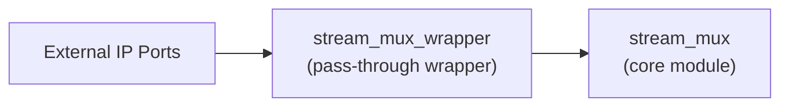

# stream_mux_wrapper (`stream_mux_wrapper.sv`)

## 개요

`stream_mux_wrapper`는 AMD Custom IP Packaging용 패스스루(wrapper) 모듈로, 내부에서 원본 `stream_mux` 모듈을 1:1로 인스턴스화합니다. Wrapper 자체의 기능 로직은 없고, 파라미터/포트를 외부에 노출하는 목적입니다.

## 블록 다이어그램

## 포트 목록

| 포트명 | 방향 | 타입/폭 | 설명 |
|--------|------|---------|------|
| `inp_data_i` | `input` | `logic [DATA_T_WIDTH-1:0] [N_INP-1:0]` | 원본 모듈 `stream_mux`로 전달되는 포트 |
| `inp_valid_i` | `input` | `logic [N_INP-1:0]` | 원본 모듈 `stream_mux`로 전달되는 포트 |
| `inp_ready_o` | `output` | `logic [N_INP-1:0]` | 원본 모듈 `stream_mux`로 전달되는 포트 |
| `inp_sel_i` | `input` | `logic [SEL_WIDTH-1:0]` | 원본 모듈 `stream_mux`로 전달되는 포트 |
| `oup_data_o` | `output` | `logic [DATA_T_WIDTH-1:0]` | 원본 모듈 `stream_mux`로 전달되는 포트 |
| `oup_valid_o` | `output` | `logic` | 원본 모듈 `stream_mux`로 전달되는 포트 |
| `oup_ready_i` | `input` | `logic` | 원본 모듈 `stream_mux`로 전달되는 포트 |

## 파라미터

| 파라미터 | 선언 | 설명 |
|----------|------|------|
| `parameter int unsigned DATA_T_WIDTH = 1` | `parameter int unsigned DATA_T_WIDTH = 1` | Wrapper에서 동일 이름으로 core에 전달 |
| `parameter integer N_INP = 0` | `parameter integer N_INP = 0` | Wrapper에서 동일 이름으로 core에 전달 |
| `parameter integer SEL_WIDTH = cf_math_pkg::idx_width(N_INP)` | `parameter integer SEL_WIDTH = cf_math_pkg::idx_width(N_INP)` | Wrapper에서 동일 이름으로 core에 전달 |

## 연결 방식

- Wrapper 인스턴스는 core 모듈과 명시적 named port 매핑(`.port(port)`)을 사용합니다.
- Wrapper 내부 추가 연산/레지스터/조합 로직은 없습니다.
