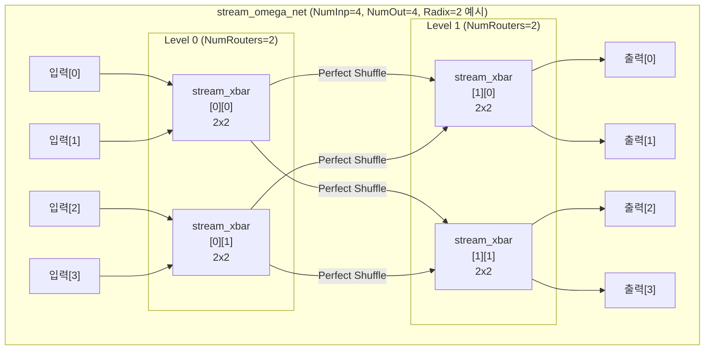
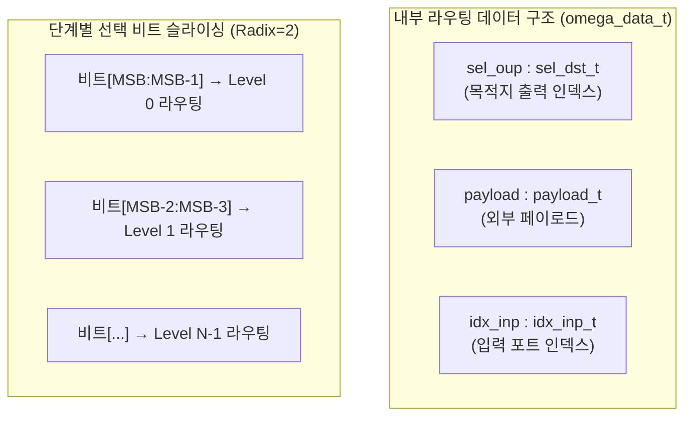

# stream_omega_net.sv

## 개요

`stream_omega_net`은 여러 `stream_xbar` 모듈을 스위치 포인트로 사용하는 오메가 네트워크(Omega Network) 구현이다. 오메가 네트워크는 버터플라이 네트워크(Butterfly Network)와 위상적으로 동형(isomorphic)이다.

`NumInp`개의 입력과 `NumOut`개의 출력을 가지며, 지정된 `Radix`의 스위치를 여러 단계(level)로 배치하여 임의의 입력을 임의의 출력으로 라우팅한다. `NumInp` 또는 `NumOut`이 `Radix` 이하이면 단순 `stream_xbar` 하나로 퇴화(degenerate)된다.

## 블록 다이어그램





## 포트/파라미터

### 파라미터

| 파라미터 | 타입 | 기본값 | 설명 |
|----------|------|--------|------|
| `NumInp` | `int unsigned` | `0` | 네트워크 입력 포트 수 |
| `NumOut` | `int unsigned` | `0` | 네트워크 출력 포트 수 |
| `Radix` | `int unsigned` | `2` | 스위치 기수 (현재 2와 4 지원) |
| `DataWidth` | `int unsigned` | `1` | 스트림 데이터 비트 폭 (payload_t 미사용 시) |
| `payload_t` | type | `logic[DataWidth-1:0]` | 페이로드 데이터 타입 |
| `SpillReg` | `bit` | `0` | 각 출력에 스필 레지스터 추가 여부 |
| `ExtPrio` | `int unsigned` | `0` | 외부 우선순위 사용 여부 (`rr_arb_tree` 용) |
| `AxiVldRdy` | `int unsigned` | `1` | AXI valid-ready 핸드셰이크 준수 모드 |
| `LockIn` | `int unsigned` | `1` | 중재 결정 잠금 여부 |
| `AxiVldMask` | `payload_t` | `'1` | valid 입력 안정성 검증 대상 비트 마스크 |
| `SelWidth` | `int unsigned` | (파생) | 출력 선택 신호 폭 (`$clog2(NumOut)`) |
| `sel_oup_t` | type | (파생) | 출력 선택 신호 타입 |
| `IdxWidth` | `int unsigned` | (파생) | 입력 인덱스 폭 (`$clog2(NumInp)`) |
| `idx_inp_t` | type | (파생) | 입력 인덱스 타입 |

### 포트

| 포트명 | 방향 | 폭 | 설명 |
|--------|------|----|------|
| `clk_i` | input | 1 | 클록 (positive edge) |
| `rst_ni` | input | 1 | 비동기 리셋 (active low) |
| `flush_i` | input | 1 | 내부 rr_arb_tree 상태 초기화 |
| `rr_i` | input | NumOut × IdxWidth | 외부 라운드 로빈 우선순위 (`ExtPrio=1` 시 사용) |
| `data_i` | input | NumInp × payload_t | 입력 데이터 |
| `sel_i` | input | NumInp × SelWidth | 각 입력의 목적지 출력 선택 |
| `valid_i` | input | NumInp | 입력 valid |
| `ready_o` | output | NumInp | 입력 ready |
| `data_o` | output | NumOut × payload_t | 출력 데이터 |
| `idx_o` | output | NumOut × IdxWidth | 출력 데이터의 원본 입력 인덱스 |
| `valid_o` | output | NumOut | 출력 valid |
| `ready_i` | input | NumOut | 출력 ready |

## 동작 설명

### 네트워크 파라미터 도출

```
NumLanes   = Radix^ceil(log_Radix(max(NumInp, NumOut)))   // Radix의 거듭제곱으로 정규화
NumLevels  = ceil(log_Radix(NumLanes))                    // 라우팅 단계 수
NumRouters = NumLanes / Radix                             // 단계당 라우터 수
```

미사용 입출력 레인은 tied-off되며, 합성 시 최적화로 제거된다.

### 퍼펙트 셔플 (Perfect Shuffle)

단계 간 연결은 퍼펙트 셔플 방식으로 수행된다. 레인 인덱스 `IdxLane = Radix*j + k`에 대해:

```
다음 단계 라우터 인덱스: IdxLane % NumRouters
다음 단계 입력 포트:     IdxLane / NumRouters
```

### 내부 라우팅 데이터

각 레인은 `omega_data_t` 구조체를 운반한다:
- `sel_oup`: 목적지 출력 인덱스 (단계별로 상위 비트부터 슬라이싱하여 현재 스위치 선택에 사용)
- `payload`: 사용자 페이로드
- `idx_inp`: 원본 입력 인덱스

### 단계별 선택 비트 슬라이싱

단계 `i`의 라우터에서 사용하는 선택 신호:

```
sel_router[k] = sel_oup[SelW*(NumLevels-i-1) +: SelW]
```

MSB 쪽 비트가 첫 번째 단계 라우팅에 사용되어 네트워크 직경을 최대화한다.

### 퇴화 케이스

`NumInp <= Radix && NumOut <= Radix`이면 `stream_xbar` 하나로 직접 구현된다.

## 의존성 및 관계

| 항목 | 설명 |
|------|------|
| 헤더 | `common_cells/assertions.svh` |
| 사용하는 모듈 | `stream_xbar` (스위치 포인트) |
| 사용하는 패키지 | `cf_math_pkg` (수학 함수) |
| 관련 모듈 | `stream_xbar` (단일 단계 크로스바), `rr_arb_tree` (중재기, stream_xbar 내부) |
