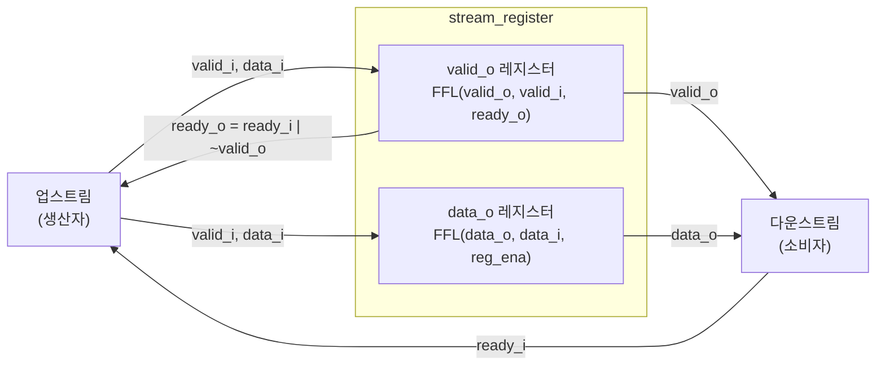

# stream_register (`stream_register.sv`)

## 개요

`stream_register`는 ready/valid 스트림 핸드셰이크를 갖는 단일 레지스터입니다. 제어 신호(valid, ready)의 조합 경로를 완전히 차단하지 않으며, 타이밍 경로 완전 분리가 필요할 때는 `spill_register`를 사용해야 합니다. 로드 인에이블 플립플롭(FFL)과 동기식 클리어(`clr_i`)를 지원합니다.

## 블록 다이어그램



## 포트 목록

| 포트명 | 방향 | 비트폭 | 설명 |
|--------|------|--------|------|
| `clk_i` | input | 1 | 클록 |
| `rst_ni` | input | 1 | 비동기 리셋 (액티브 로우) |
| `clr_i` | input | 1 | 동기식 클리어 |
| `testmode_i` | input | 1 | 테스트 모드 (클록 게이팅 바이패스) |
| `valid_i` | input | 1 | 입력 데이터 유효 신호 |
| `ready_o` | output | 1 | 입력 수락 가능 신호 |
| `data_i` | input | T | 입력 데이터 |
| `valid_o` | output | 1 | 출력 데이터 유효 신호 |
| `ready_i` | input | 1 | 출력 수락 신호 |
| `data_o` | output | T | 출력 데이터 |

## 파라미터

| 파라미터명 | 기본값 | 설명 |
|-----------|--------|------|
| `T` | `logic` | 데이터 페이로드 타입 (커스텀 struct 사용 가능) |

## 동작 설명

### 핵심 신호

```
ready_o = ready_i | ~valid_o  // 출력이 비었거나, 다운스트림이 수락 가능하면 입력 수락
reg_ena = valid_i & ready_o   // 실제 데이터 저장 인에이블
```

### valid_o 업데이트

`ready_o`가 High일 때 `valid_i`를 레지스터에 저장합니다:
- `valid_i=1, ready_o=1`: 다음 클록에 `valid_o=1`
- `valid_i=0, ready_o=1`: 다음 클록에 `valid_o=0`
- `clr_i=1`: 다음 클록에 `valid_o=0` (동기식 클리어)

### data_o 업데이트

`reg_ena = valid_i & ready_o`가 High일 때만 `data_i`를 저장합니다. 클리어 시 `T'('0)`으로 초기화됩니다.

### 타이밍 다이어그램

```
clk_i   : _/‾\_/‾\_/‾\_/‾\_/‾\
valid_i : ‾‾‾‾‾‾‾‾‾‾‾____________
data_i  : ==A===B===============
ready_i : __________‾‾‾‾‾‾‾‾‾‾‾
ready_o : ‾‾‾‾‾____________‾‾‾‾  (valid_o=1 & ready_i=0 구간)
valid_o : ______‾‾‾‾‾‾‾‾‾‾‾‾‾‾‾
data_o  : ======A===A===A===B===
```

### `spill_register`와의 비교

| 특성 | stream_register | spill_register |
|------|-----------------|----------------|
| 타이밍 경로 차단 | 부분적 (ready만) | 완전 (all) |
| 최대 처리량 | 1/사이클 | 1/사이클 |
| 내부 레지스터 수 | 1 | 2 (A+B) |
| 플러시 지원 | clr_i (동기) | flush_i |

## 내부 구조

`common_cells/registers.svh`의 `FFLARNC` 매크로를 사용합니다:
- `FFLARNC(valid_o, valid_i, ready_o, clr_i, 1'b0, clk_i, rst_ni)` — valid 레지스터
- `FFLARNC(data_o, data_i, reg_ena, clr_i, T'('0), clk_i, rst_ni)` — data 레지스터

## 의존성

- `common_cells/registers.svh` — `FFLARNC` 플립플롭 매크로

## 사용 예시

```systemverilog
stream_register #(
    .T (logic [31:0])
) u_stream_reg (
    .clk_i      (clk),
    .rst_ni     (rst_n),
    .clr_i      (clear),
    .testmode_i (1'b0),
    .valid_i    (up_valid),
    .ready_o    (up_ready),
    .data_i     (up_data),
    .valid_o    (dn_valid),
    .ready_i    (dn_ready),
    .data_o     (dn_data)
);
```
