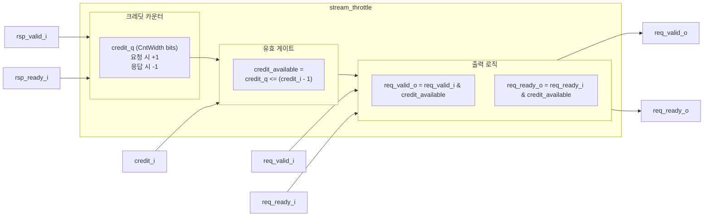
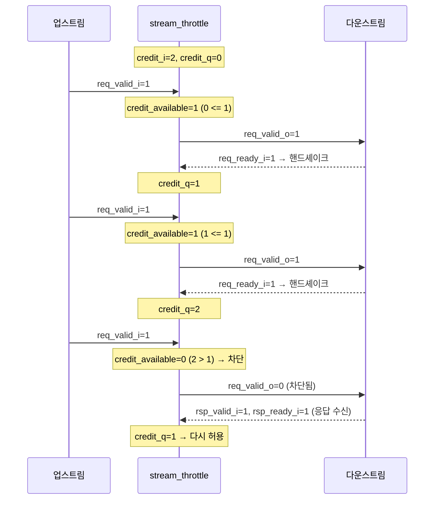

# stream_throttle.sv

## 개요

`stream_throttle`은 ready-valid 핸드셰이크된 버스를 조율(throttle)하는 모듈이다. 최대 미결(outstanding) 전송 횟수는 컴파일 타임 파라미터 `MaxNumPending`으로 설정하며, 실제 허용 미결 전송 수는 런타임에 `credit_i`로 조정할 수 있다.

요청 발생 시 크레딧 카운터를 증가시키고, 응답 수신 시 감소시키는 크레딧 기반 흐름 제어를 구현한다. 요청/응답의 순서 내(in-order) 처리 또는 요청/응답의 구별 불가 상황을 전제로 동작한다.

## 블록 다이어그램





## 포트/파라미터

### 파라미터

| 파라미터 | 타입 | 기본값 | 설명 |
|----------|------|--------|------|
| `MaxNumPending` | `int unsigned` | `1` | 최대 미결 요청 수 (컴파일 타임 상한) |
| `CntWidth` | `int unsigned` | (파생) | 카운터 비트 폭 (`cf_math_pkg::idx_width(MaxNumPending)`) |
| `credit_t` | type | (파생) | 카운터 타입 (`logic[CntWidth-1:0]`) |

### 포트

| 포트명 | 방향 | 폭 | 설명 |
|--------|------|----|------|
| `clk_i` | input | 1 | 클록 신호 |
| `rst_ni` | input | 1 | 비동기 리셋 (active low) |
| `req_valid_i` | input | 1 | 요청 valid 입력 |
| `req_valid_o` | output | 1 | 요청 valid 출력 (크레딧 없으면 차단) |
| `req_ready_i` | input | 1 | 요청 ready 입력 (다운스트림) |
| `req_ready_o` | output | 1 | 요청 ready 출력 (업스트림, 크레딧 없으면 차단) |
| `rsp_valid_i` | input | 1 | 응답 valid 입력 |
| `rsp_ready_i` | input | 1 | 응답 ready 입력 |
| `credit_i` | input | CntWidth | 허용 미결 전송 수 (런타임 설정, 최대 MaxNumPending) |

## 동작 설명

### 크레딧 카운터 동작

```
요청 핸드셰이크 (req_valid_o & req_ready_o): credit_q += 1
응답 핸드셰이크 (rsp_valid_i & rsp_ready_i): credit_q -= 1
```

같은 사이클에 요청과 응답이 동시에 발생하면 카운터는 변하지 않는다.

### 크레딧 가용성 판단

```
credit_available = credit_q <= (credit_i - 1)
```

즉, `credit_q < credit_i`일 때만 새로운 요청이 통과된다.

### 전송 차단

`credit_available = 0`이면:
- `req_valid_o = 0` (다운스트림으로 valid 차단)
- `req_ready_o = 0` (업스트림으로 ready 차단)

### 전제 조건

- 순서 내(in-order) 응답 처리 또는 요청/응답의 구별이 불필요한 경우에만 올바르게 동작한다.
- `credit_i`는 `MaxNumPending` 이하 값을 사용해야 한다.

## 의존성 및 관계

| 항목 | 설명 |
|------|------|
| 헤더 | `common_cells/registers.svh` |
| 사용하는 매크로 | `` `FF `` (플립플롭 레지스터) |
| 사용하는 패키지 | `cf_math_pkg` (카운터 폭 계산) |
| 사용하는 모듈 | 없음 |
| 관련 모듈 | `stream_to_mem` (미결 요청 카운팅 유사 패턴) |
