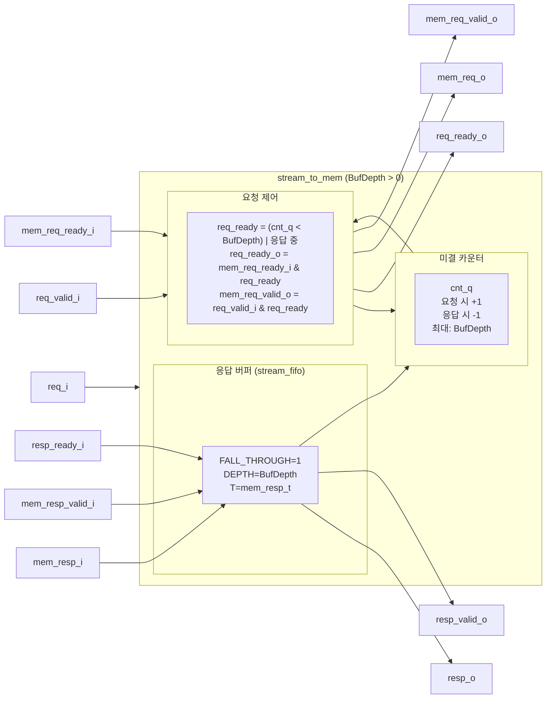
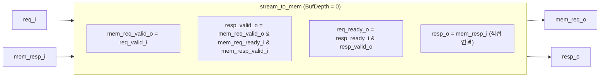

# stream_to_mem.sv

## 개요

`stream_to_mem`은 요청에는 흐름 제어(valid/ready)를 지원하지만 응답 데이터에는 흐름 제어가 없는 메모리 인터페이스를, 요청과 응답 모두 흐름 제어를 갖는 스트림 인터페이스로 연결해주는 브리지 모듈이다.

`BufDepth` 파라미터로 미결(outstanding) 요청 수의 최대치를 설정한다. `BufDepth=0`이면 메모리가 동일 사이클에 응답해야 하고, `BufDepth>=1`이면 응답을 FIFO에 버퍼링하여 파이프라인 처리를 지원한다.

## 블록 다이어그램

## 포트/파라미터

### 파라미터

| 파라미터 | 타입 | 기본값 | 설명 |
|----------|------|--------|------|
| `mem_req_t` | type | `logic` | 메모리 요청 페이로드 타입 (쓰기 활성화, 쓰기 데이터 등) |
| `mem_resp_t` | type | `logic` | 메모리 응답 페이로드 타입 (읽기 데이터 등) |
| `BufDepth` | `int unsigned` | `1` | 미결 요청 최대 수 (응답 버퍼 깊이). 동일 사이클 응답 메모리는 0, 지연 응답 메모리는 >= 1 설정 |

### 포트

| 포트명 | 방향 | 타입 | 설명 |
|--------|------|------|------|
| `clk_i` | input | `logic` | 클록 신호 |
| `rst_ni` | input | `logic` | 비동기 리셋 (active low) |
| `req_i` | input | `mem_req_t` | 요청 스트림 페이로드 |
| `req_valid_i` | input | `logic` | 요청 스트림 valid |
| `req_ready_o` | output | `logic` | 요청 스트림 ready |
| `resp_o` | output | `mem_resp_t` | 응답 스트림 페이로드 |
| `resp_valid_o` | output | `logic` | 응답 스트림 valid |
| `resp_ready_i` | input | `logic` | 응답 스트림 ready |
| `mem_req_o` | output | `mem_req_t` | 메모리 요청 페이로드 |
| `mem_req_valid_o` | output | `logic` | 메모리 요청 valid |
| `mem_req_ready_i` | input | `logic` | 메모리 요청 ready |
| `mem_resp_i` | input | `mem_resp_t` | 메모리 응답 페이로드 |
| `mem_resp_valid_i` | input | `logic` | 메모리 응답 valid (흐름 제어 없음) |

## 동작 설명

### BufDepth > 0 모드 (파이프라인 메모리)

1. **미결 카운터**: 요청 핸드셰이크 시 증가, 응답 핸드셰이크 시 감소한다.
2. **요청 허용 조건**: `cnt_q < BufDepth` 또는 현재 사이클에 응답이 반환되는 경우에 새 요청을 허용한다.
3. **응답 버퍼**: `stream_fifo`(FALL_THROUGH 모드)를 사용하여 메모리 응답을 버퍼링한다. 추가 레이턴시 없이 즉시 통과 가능하다.

### BufDepth = 0 모드 (동일 사이클 응답 메모리)

메모리가 요청과 동일한 사이클에 응답을 반환해야 한다. 버퍼 없이 신호를 직접 연결한다.
- `mem_req_valid_o = req_valid_i`
- `resp_valid_o = mem_req_valid_o & mem_req_ready_i & mem_resp_valid_i`
- `req_ready_o = resp_ready_i & resp_valid_o`

### 어서션

| 어서션 | BufDepth | 검증 내용 |
|--------|----------|-----------|
| `memory_response_lost` | > 0 | 메모리 응답이 발생할 때 FIFO가 준비됨을 보장 |
| `counter_underflowed` | > 0 | 카운터 언더플로우 방지 |
| `counter_overflowed` | > 0 | 카운터 오버플로우 방지 |
| `no_memory_response` | = 0 | 요청 핸드셰이크 시 메모리 응답이 반드시 동일 사이클에 있음을 가정 |

## 의존성 및 관계

| 항목 | 설명 |
|------|------|
| 헤더 | `common_cells/registers.svh`, `common_cells/assertions.svh` |
| 사용하는 모듈 | `stream_fifo` (BufDepth > 0 시 응답 버퍼로 사용) |
| 관련 모듈 | `stream_throttle` (미결 전송 수 제한 유사 패턴) |
