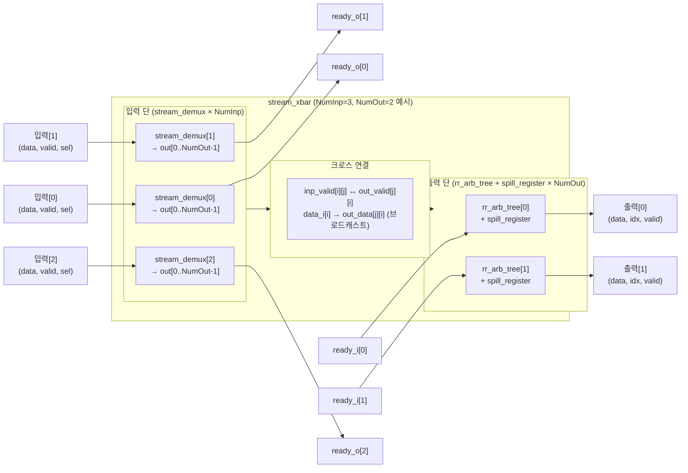

# stream_xbar.sv

## 개요

`stream_xbar`는 `NumInp`개의 입력과 `NumOut`개의 출력을 완전 연결(fully connected)하는 스트림 크로스바(crossbar) 모듈이다. 각 입력은 `sel_i` 신호로 목적지 출력 포트를 지정하며, 여러 입력이 동일한 출력을 목표로 할 경우 라운드 로빈 중재(`rr_arb_tree`)로 충돌을 해결한다.

AMBA AXI 표준 핸드셰이크 규칙을 기본으로 지원하며, 각 출력에 선택적으로 스필 레지스터(`spill_register`)를 추가할 수 있다.

## 블록 다이어그램



## 포트/파라미터

### 파라미터

| 파라미터 | 타입 | 기본값 | 설명 |
|----------|------|--------|------|
| `NumInp` | `int unsigned` | `0` | 입력 포트 수 |
| `NumOut` | `int unsigned` | `0` | 출력 포트 수 |
| `DataWidth` | `int unsigned` | `1` | 데이터 비트 폭 (payload_t 미사용 시) |
| `payload_t` | type | `logic[DataWidth-1:0]` | 페이로드 데이터 타입 |
| `OutSpillReg` | `bit` | `0` | 출력에 스필 레지스터 추가 여부 |
| `ExtPrio` | `int unsigned` | `0` | 외부 우선순위 사용 여부 |
| `AxiVldRdy` | `int unsigned` | `1` | AXI valid-ready 핸드셰이크 준수 모드 |
| `LockIn` | `int unsigned` | `1` | 중재 결정 잠금 여부 |
| `AxiVldMask` | `payload_t` | `'1` | valid 입력 안정성 검증 대상 비트 마스크 |
| `SelWidth` | `int unsigned` | (파생) | 출력 선택 신호 폭 (`$clog2(NumOut)`) |
| `sel_oup_t` | type | (파생) | 출력 선택 신호 타입 |
| `IdxWidth` | `int unsigned` | (파생) | 입력 인덱스 폭 (`$clog2(NumInp)`) |
| `idx_inp_t` | type | (파생) | 입력 인덱스 타입 |

### 포트

| 포트명 | 방향 | 폭 | 설명 |
|--------|------|----|------|
| `clk_i` | input | 1 | 클록 (positive edge) |
| `rst_ni` | input | 1 | 비동기 리셋 (active low) |
| `flush_i` | input | 1 | rr_arb_tree 상태 초기화 |
| `rr_i` | input | NumOut × IdxWidth | 외부 라운드 로빈 우선순위 |
| `data_i` | input | NumInp × payload_t | 입력 데이터 |
| `sel_i` | input | NumInp × SelWidth | 각 입력의 목적지 출력 선택 |
| `valid_i` | input | NumInp | 입력 valid |
| `ready_o` | output | NumInp | 입력 ready |
| `data_o` | output | NumOut × payload_t | 출력 데이터 |
| `idx_o` | output | NumOut × IdxWidth | 출력 데이터의 원본 입력 인덱스 |
| `valid_o` | output | NumOut | 출력 valid |
| `ready_i` | input | NumOut | 출력 ready |

## 동작 설명

### 입력 단: stream_demux

각 입력 포트 `i`에 `stream_demux`를 인스턴스화한다. `sel_i[i]`로 지정된 출력 포트 `j`에만 valid를 전달하고, 해당 출력의 ready를 입력 ready로 반환한다.

### 크로스 연결

모든 입력의 데이터가 모든 출력 중재기로 브로드캐스트된다:
```
out_data[j][i]  = data_i[i]    (입력 i의 데이터를 출력 j의 후보로)
out_valid[j][i] = inp_valid[i][j]  (입력 i가 출력 j를 선택했을 때의 valid)
```

### 출력 단: rr_arb_tree + spill_register

각 출력 포트 `j`에:
1. `rr_arb_tree`: `NumInp`개의 후보 중 라운드 로빈으로 하나를 선택하고 중재한다.
2. `spill_register`: `OutSpillReg=1`이면 1사이클 버퍼를 추가하여 출력 타이밍을 개선한다 (`Bypass=!OutSpillReg`).

중재 결과로 데이터(`data_o`)와 원본 입력 인덱스(`idx_o`)가 출력된다.

### 어서션

AXI 프로토콜 준수 확인을 위해 valid 동안 data, sel, valid 신호의 안정성을 검증한다.

## 의존성 및 관계

| 항목 | 설명 |
|------|------|
| 헤더 | `common_cells/assertions.svh` |
| 사용하는 모듈 | `stream_demux`, `rr_arb_tree`, `spill_register` |
| 사용되는 곳 | `stream_omega_net` (스위치 포인트로 사용) |
| 관련 모듈 | `stream_omega_net` (다단계 크로스바), `stream_mux` (단방향 멀티플렉서) |
