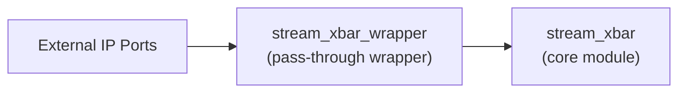

# stream_xbar_wrapper (`stream_xbar_wrapper.sv`)

## 개요

`stream_xbar_wrapper`는 AMD Custom IP Packaging용 패스스루(wrapper) 모듈로, 내부에서 원본 `stream_xbar` 모듈을 1:1로 인스턴스화합니다. Wrapper 자체의 기능 로직은 없고, 파라미터/포트를 외부에 노출하는 목적입니다.

## 블록 다이어그램

## 포트 목록

| 포트명 | 방향 | 타입/폭 | 설명 |
|--------|------|---------|------|
| `clk_i` | `input` | `logic` | 원본 모듈 `stream_xbar`로 전달되는 포트 |
| `rst_ni` | `input` | `logic` | 원본 모듈 `stream_xbar`로 전달되는 포트 |
| `flush_i` | `input` | `logic` | 원본 모듈 `stream_xbar`로 전달되는 포트 |
| `rr_i` | `input` | `logic [idx_inp_t_WIDTH-1:0] [NumOut-1:0]` | 원본 모듈 `stream_xbar`로 전달되는 포트 |
| `data_i` | `input` | `logic [payload_t_WIDTH-1:0] [NumInp-1:0]` | 원본 모듈 `stream_xbar`로 전달되는 포트 |
| `sel_i` | `input` | `logic [sel_oup_t_WIDTH-1:0] [NumInp-1:0]` | 원본 모듈 `stream_xbar`로 전달되는 포트 |
| `valid_i` | `input` | `logic [NumInp-1:0]` | 원본 모듈 `stream_xbar`로 전달되는 포트 |
| `ready_o` | `output` | `logic [NumInp-1:0]` | 원본 모듈 `stream_xbar`로 전달되는 포트 |
| `data_o` | `output` | `logic [payload_t_WIDTH-1:0] [NumOut-1:0]` | 원본 모듈 `stream_xbar`로 전달되는 포트 |
| `idx_o` | `output` | `logic [idx_inp_t_WIDTH-1:0] [NumOut-1:0]` | 원본 모듈 `stream_xbar`로 전달되는 포트 |
| `valid_o` | `output` | `logic [NumOut-1:0]` | 원본 모듈 `stream_xbar`로 전달되는 포트 |
| `ready_i` | `input` | `logic [NumOut-1:0]` | 원본 모듈 `stream_xbar`로 전달되는 포트 |

## 파라미터

| 파라미터 | 선언 | 설명 |
|----------|------|------|
| `parameter int unsigned NumInp      = 32'd0` | `parameter int unsigned NumInp      = 32'd0` | Wrapper에서 동일 이름으로 core에 전달 |
| `parameter int unsigned NumOut      = 32'd0` | `parameter int unsigned NumOut      = 32'd0` | Wrapper에서 동일 이름으로 core에 전달 |
| `parameter int unsigned DataWidth   = 32'd1` | `parameter int unsigned DataWidth   = 32'd1` | Wrapper에서 동일 이름으로 core에 전달 |
| `parameter int unsigned payload_t_WIDTH = 1` | `parameter int unsigned payload_t_WIDTH = 1` | Wrapper에서 동일 이름으로 core에 전달 |
| `parameter bit          OutSpillReg = 1'b0` | `parameter bit          OutSpillReg = 1'b0` | Wrapper에서 동일 이름으로 core에 전달 |
| `parameter int unsigned ExtPrio     = 1'b0` | `parameter int unsigned ExtPrio     = 1'b0` | Wrapper에서 동일 이름으로 core에 전달 |
| `parameter int unsigned AxiVldRdy   = 1'b1` | `parameter int unsigned AxiVldRdy   = 1'b1` | Wrapper에서 동일 이름으로 core에 전달 |
| `parameter int unsigned LockIn      = 1'b1` | `parameter int unsigned LockIn      = 1'b1` | Wrapper에서 동일 이름으로 core에 전달 |
| `parameter payload_t    AxiVldMask  = '1` | `parameter payload_t    AxiVldMask  = '1` | Wrapper에서 동일 이름으로 core에 전달 |
| `parameter int unsigned SelWidth = (NumOut > 32'd1) ? unsigned'($clog2(NumOut)) : 32'd1` | `parameter int unsigned SelWidth = (NumOut > 32'd1) ? unsigned'($clog2(NumOut)) : 32'd1` | Wrapper에서 동일 이름으로 core에 전달 |
| `parameter int unsigned sel_oup_t_WIDTH = 1` | `parameter int unsigned sel_oup_t_WIDTH = 1` | Wrapper에서 동일 이름으로 core에 전달 |
| `parameter int unsigned IdxWidth = (NumInp > 32'd1) ? unsigned'($clog2(NumInp)) : 32'd1` | `parameter int unsigned IdxWidth = (NumInp > 32'd1) ? unsigned'($clog2(NumInp)) : 32'd1` | Wrapper에서 동일 이름으로 core에 전달 |
| `parameter int unsigned idx_inp_t_WIDTH = 1` | `parameter int unsigned idx_inp_t_WIDTH = 1` | Wrapper에서 동일 이름으로 core에 전달 |

## 연결 방식

- Wrapper 인스턴스는 core 모듈과 명시적 named port 매핑(`.port(port)`)을 사용합니다.
- Wrapper 내부 추가 연산/레지스터/조합 로직은 없습니다.
