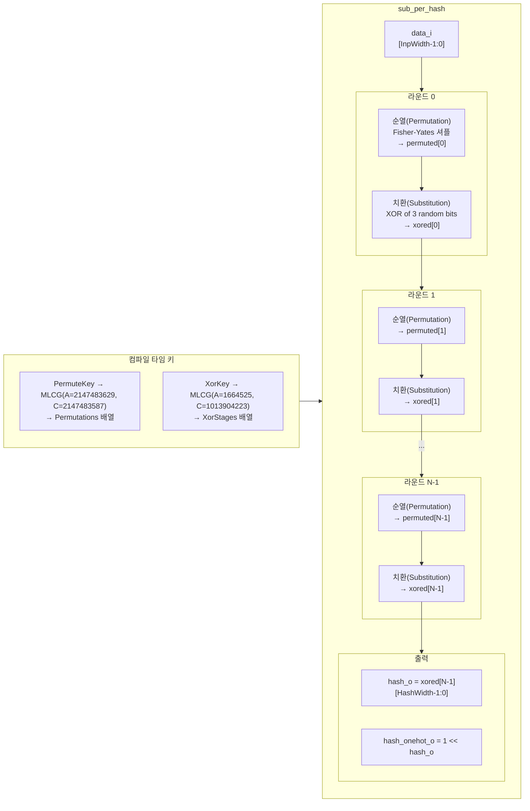

# sub_per_hash.sv

## 개요

`sub_per_hash`는 완전히 파라미터화 가능한 치환-순열 해시 함수(Substitution-Permutation Hash)를 구현하는 순수 조합 논리 모듈이다. 입력 비트 벡터를 여러 라운드의 순열(Permutation)과 치환(Substitution) 처리를 거쳐 해시값으로 변환한다.

- **순열**: Fisher-Yates 변형 알고리즘으로 비트를 셔플한다.
- **치환**: 셔플된 벡터에서 3개의 의사 난수 비트를 XOR하여 각 비트를 대체한다.
- 순열과 치환에 사용되는 의사 난수는 **MLCG(Multiplicative Linear Congruential Generator)**로 컴파일 타임에 생성된다.
- 암호학적으로 안전하지 않다.

## 블록 다이어그램



## 포트/파라미터

### 파라미터

| 파라미터 | 타입 | 기본값 | 설명 |
|----------|------|--------|------|
| `InpWidth` | `int unsigned` | `11` | 입력 데이터 비트 폭 |
| `HashWidth` | `int unsigned` | `5` | 출력 해시 비트 폭 |
| `NoRounds` | `int unsigned` | `1` | 순열-치환 라운드 수 |
| `PermuteKey` | `int unsigned` | `299034753` | 순열 생성용 MLCG 시드 |
| `XorKey` | `int unsigned` | `4094834` | XOR 치환 생성용 MLCG 시드 |

### 포트

| 포트명 | 방향 | 폭 | 설명 |
|--------|------|----|------|
| `data_i` | input | InpWidth | 해시 입력 데이터 |
| `hash_o` | output | HashWidth | 해시 출력값 |
| `hash_onehot_o` | output | 2^HashWidth | 해시 출력의 원핫 인코딩 (`1 << hash_o`) |

## 동작 설명

### 순열 생성 (get_permutations 함수)

컴파일/정교화 시 `PermuteKey`를 시드로 MLCG를 사용하여 Fisher-Yates 변형 셔플로 각 라운드의 순열 인덱스 배열을 생성한다.

```
MLCG: X(n+1) = (2147483629 * X(n) + 2147483587) mod (2^31 - 1)
```

생성된 `Permutations[r][i]`는 라운드 `r`에서 비트 `i`가 이전 단계의 어떤 비트 위치에서 오는지를 나타낸다.

### XOR 치환 생성 (get_xor_stages 함수)

`XorKey`를 시드로 별도의 MLCG를 사용하여 각 라운드, 각 비트에 대해 XOR 연산에 사용할 3개의 비트 인덱스를 생성한다.

```
MLCG: X(n+1) = (1664525 * X(n) + 1013904223) mod 2^32
```

### 라운드 연산

각 라운드 `r`, 각 비트 `i`에 대해:

```
permuted[r][i] = (r==0) ? data_i[Permutations[r][i]]
                        : permuted[r-1][Permutations[r][i]]

xored[r][i]    = permuted[r][XorStages[r][i][0]] ^
                 permuted[r][XorStages[r][i][1]] ^
                 permuted[r][XorStages[r][i][2]]
```

### 출력

마지막 라운드 `xored[NoRounds-1]`의 하위 `HashWidth` 비트가 `hash_o`로 출력된다. `hash_onehot_o`는 `1 << hash_o`로 디코더 역할을 한다.

### 분포 특성

XOR과 시프팅은 신호의 분포를 변경하지 않으므로 출력 해시의 분포는 입력 데이터의 분포와 동일하다.

## 의존성 및 관계

| 항목 | 설명 |
|------|------|
| 사용하는 모듈 | 없음 (순수 조합 논리, 컴파일 타임 함수 사용) |
| 관련 용도 | 해시 테이블, 캐시 인덱스 생성, 분산 접근 패턴 생성 등 |
| 주의사항 | `PermuteKey`와 `XorKey`의 GCD가 1이 되도록 선택 권장 |
