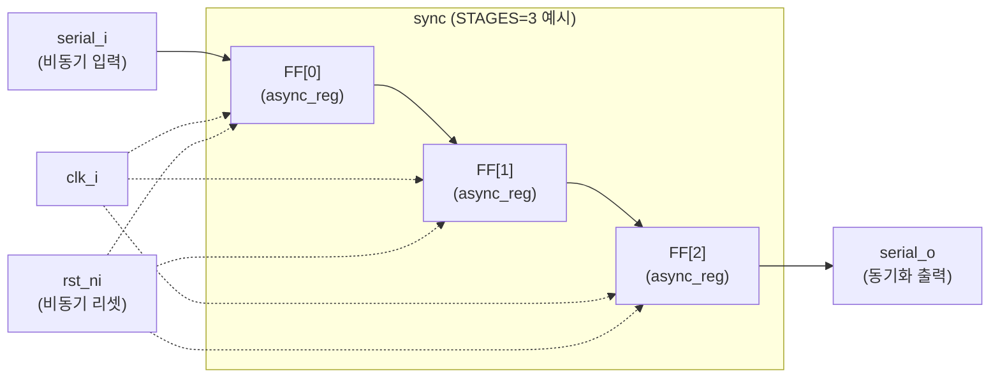
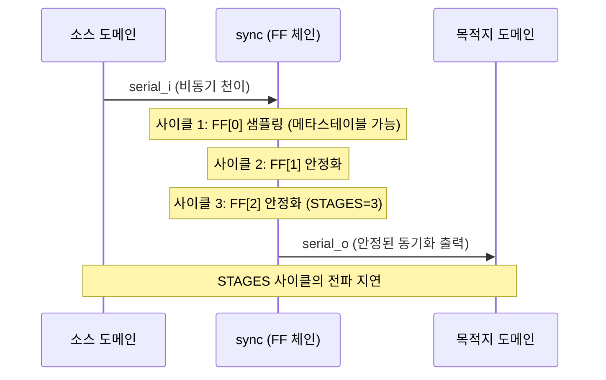

# sync.sv

## 개요

`sync`는 비동기 신호를 목적지 클록 도메인으로 안전하게 동기화하는 멀티 플립플롭 동기화기(Multi-Flip-Flop Synchronizer) 모듈이다. 메타스테이빌리티(metastability)를 해결하기 위해 `STAGES`개의 플립플롭 체인을 사용한다.

합성 어트리뷰트 `dont_touch = "true"`와 `async_reg = "true"`를 통해 툴이 레지스터를 최적화하거나 재배치하지 않도록 강제한다.

## 블록 다이어그램





## 포트/파라미터

### 파라미터

| 파라미터 | 타입 | 기본값 | 설명 |
|----------|------|--------|------|
| `STAGES` | `int unsigned` | `2` | 동기화 플립플롭 체인 단계 수 (최소 2 권장) |
| `ResetValue` | `bit` | `1'b0` | 리셋 시 레지스터 초기값 |

### 포트

| 포트명 | 방향 | 폭 | 설명 |
|--------|------|----|------|
| `clk_i` | input | 1 | 목적지 클록 도메인 클록 |
| `rst_ni` | input | 1 | 비동기 리셋 (active low) |
| `serial_i` | input | 1 | 동기화할 비동기 입력 신호 |
| `serial_o` | output | 1 | 동기화된 출력 신호 |

## 동작 설명

### 플립플롭 체인

```
reg_q <= {reg_q[STAGES-2:0], serial_i}   // 클록마다 시프트
serial_o = reg_q[STAGES-1]               // 마지막 플립플롭 출력
```

입력 신호가 체인을 통해 `STAGES`개의 클록 사이클을 지나면서 메타스테이빌리티가 해소된다.

### 합성 어트리뷰트

| 어트리뷰트 | 효과 |
|------------|------|
| `dont_touch = "true"` | 합성 툴이 레지스터를 최적화/제거하지 않도록 보호 |
| `async_reg = "true"` | Xilinx/Vivado에서 비동기 레지스터로 인식하여 적절한 배치 수행 |

### 리셋 동작

비동기 리셋(`negedge rst_ni`)이 발생하면 모든 레지스터가 `ResetValue`로 초기화된다.

### STAGES 설정 가이드

| STAGES | 특성 |
|--------|------|
| 2 | 최소 권장 값. 대부분의 설계에서 사용 |
| 3 | 고주파수 클록 또는 더 엄격한 메타스테이빌리티 요구 사항 |
| 4+ | 매우 높은 신뢰도 요구 시 |

## 의존성 및 관계

| 항목 | 설명 |
|------|------|
| 사용하는 모듈 | 없음 |
| 사용되는 곳 | `sync_wedge` (내부에서 인스턴스화) |
| 관련 모듈 | `sync_wedge` (엣지 감지 기능 추가 버전) |
| CDC 적용 대상 | 단일 비트 신호의 클록 도메인 크로싱 (CDC) |
