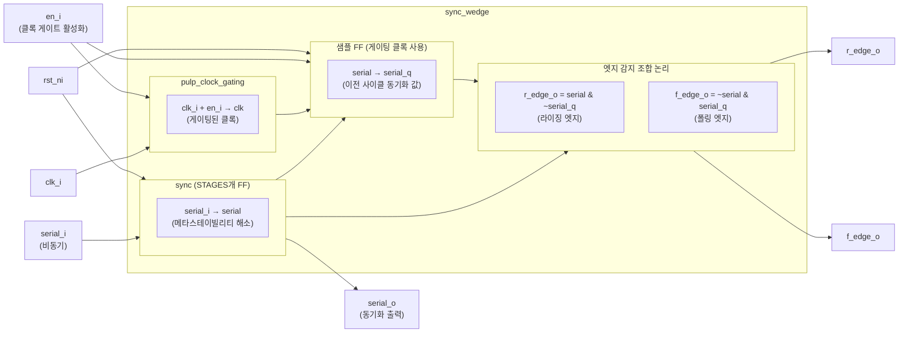
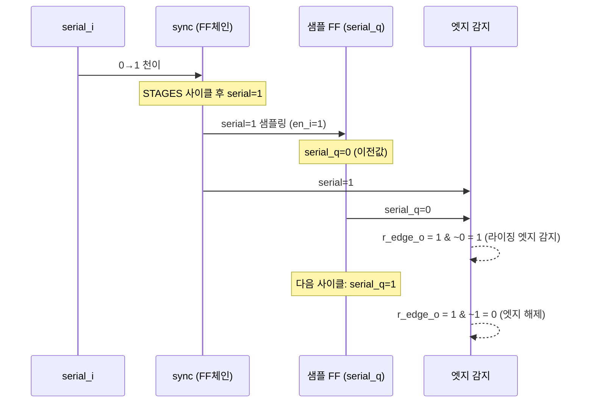

# sync_wedge.sv

## 개요

`sync_wedge`는 비동기 입력 신호를 동기화하면서 동시에 라이징 엣지(rising edge)와 폴링 엣지(falling edge)를 감지하는 모듈이다. 내부에 `sync` 모듈을 사용하여 메타스테이빌리티를 해결하고, 클록 게이팅(`pulp_clock_gating`)으로 이전 동기화 값을 샘플링하여 엣지를 감지한다.

## 블록 다이어그램





## 포트/파라미터

### 파라미터

| 파라미터 | 타입 | 기본값 | 설명 |
|----------|------|--------|------|
| `STAGES` | `int unsigned` | `2` | 동기화 플립플롭 체인 단계 수 |

### 포트

| 포트명 | 방향 | 폭 | 설명 |
|--------|------|----|------|
| `clk_i` | input | 1 | 목적지 클록 도메인 클록 |
| `rst_ni` | input | 1 | 비동기 리셋 (active low) |
| `en_i` | input | 1 | 클록 게이트 활성화 및 샘플링 인에이블 |
| `serial_i` | input | 1 | 동기화할 비동기 입력 신호 |
| `r_edge_o` | output | 1 | 라이징 엣지 감지 (1 사이클 펄스) |
| `f_edge_o` | output | 1 | 폴링 엣지 감지 (1 사이클 펄스) |
| `serial_o` | output | 1 | 동기화된 출력 신호 (= serial_q, 이전 사이클 샘플) |

## 동작 설명

### 신호 흐름

| 신호 | 설명 |
|------|------|
| `serial` | `sync` 모듈 출력, 현재 사이클의 동기화된 값 |
| `serial_q` | 게이팅 클록(`clk`)으로 샘플링된 이전 사이클의 `serial` 값 |
| `serial_o` | `serial_q`와 동일 (`serial_o = serial_q`) |

### 엣지 감지 로직

```
r_edge_o =  serial & (~serial_q)   // 이전=0, 현재=1: 라이징 엣지
f_edge_o = (~serial) & serial_q    // 이전=1, 현재=0: 폴링 엣지
```

엣지 출력은 1 사이클 동안만 assert되는 펄스 신호이다.

### 클록 게이팅

`pulp_clock_gating`으로 `en_i`에 의해 제어되는 게이팅 클록 `clk`을 생성한다. 샘플링 FF는 이 게이팅 클록에 동작하므로, `en_i = 0`이면 `serial_q`가 갱신되지 않아 엣지 감지가 억제된다.

### 리셋 동작

`rst_ni` = 0이면:
- `sync` 내부 레지스터 → 0으로 초기화
- `serial_q` → 0으로 초기화

## 의존성 및 관계

| 항목 | 설명 |
|------|------|
| 사용하는 모듈 | `sync` (멀티 FF 동기화기), `pulp_clock_gating` (클록 게이팅 셀) |
| 관련 모듈 | `sync` (엣지 감지 없는 기본 동기화기) |
| 주요 용도 | 비동기 입력 신호의 동기화 및 엣지 이벤트 감지, CDC 인터페이스 |
