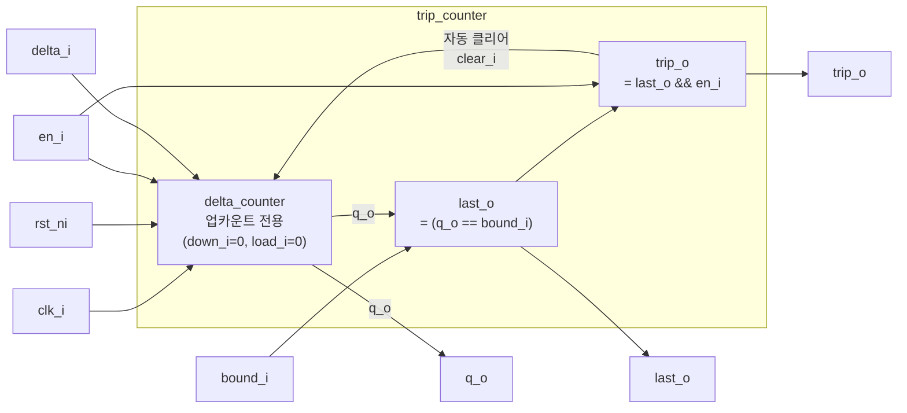

# trip_counter (`trip_counter.sv`)

## 개요

지정된 경계값(`bound_i`)에 도달하면 자동으로 0으로 리셋되는 카운터입니다. "트립(trip)"이란 카운터가 경계에 도달하여 자동 리셋되는 동작을 의미합니다. 하드웨어 루프(loop) 제어, 주기적 이벤트 생성, 타임슬롯 분배 등에 유용합니다. `delta_counter`를 내부적으로 사용하며, `trip_o` 신호가 `clear_i`에 연결되어 자동 리셋을 구현합니다.

## 블록 다이어그램



## 포트 목록

| 포트명 | 방향 | 비트폭 | 설명 |
|--------|------|--------|------|
| `clk_i` | input | 1 | 클록 신호 |
| `rst_ni` | input | 1 | 비동기 액티브-로우 리셋 |
| `en_i` | input | 1 | 카운터 인에이블 |
| `delta_i` | input | WIDTH | 증감량 |
| `bound_i` | input | WIDTH | 리셋 경계값 |
| `q_o` | output | WIDTH | 카운터 현재 값 |
| `last_o` | output | 1 | 현재 값이 경계값과 같음 (`q_o == bound_i`) |
| `trip_o` | output | 1 | 트립 발생 (`last_o && en_i`) |

## 파라미터

| 파라미터명 | 기본값 | 설명 |
|-----------|--------|------|
| `WIDTH` | 4 | 카운터 비트 폭 |

## 동작 설명

### 자동 리셋 메커니즘

`trip_o = last_o && en_i`가 `delta_counter`의 `clear_i`에 연결됩니다. 따라서 카운터가 `bound_i`에 도달한 사이클에 `en_i`가 어서트되어 있으면, 동일 사이클에 `trip_o`가 어서트되고, 다음 클록에서 카운터는 0으로 리셋됩니다.

### 동작 시퀀스 예시 (delta_i=1, bound_i=3)

| 사이클 | `q_o` | `last_o` | `trip_o` | 다음 `q_o` |
|--------|-------|----------|----------|-----------|
| 0 | 0 | 0 | 0 | 1 |
| 1 | 1 | 0 | 0 | 2 |
| 2 | 2 | 0 | 0 | 3 |
| 3 | 3 | 1 | 1 | 0 (리셋) |
| 4 | 0 | 0 | 0 | 1 |

### 어서션

`ASSERT(CounterExceedsBound, !(en_i && (q_o + delta_i) > bound_i))`: 한 스텝으로 경계를 초과하는 잘못된 `delta_i`를 시뮬레이션 중에 감지합니다. 따라서 `delta_i`는 `bound_i`보다 크지 않아야 하며, `bound_i`는 `delta_i`의 정수배여야 올바르게 동작합니다.

## 내부 구조

- `delta_counter` 인스턴스: `down_i=0`, `load_i=0`으로 업카운트만 수행
- `clear_i = trip_o`: 조합 피드백으로 자동 리셋 구현 (동기식으로 다음 클록에 적용)
- `last_o`, `trip_o`: 순수 조합 논리 신호

## 의존성

- `delta_counter` (`src/delta_counter.sv`)
- `common_cells/assertions.svh` (ASSERT 매크로)

## 사용 예시

```systemverilog
// 하드웨어 루프: 0~7까지 1씩 증가 후 자동 리셋
trip_counter #(
    .WIDTH (4)
) u_loop_cnt (
    .clk_i   (clk),
    .rst_ni  (rst_n),
    .en_i    (loop_en),
    .delta_i (4'd1),
    .bound_i (4'd7),
    .q_o     (loop_idx),
    .last_o  (last_iter),
    .trip_o  (loop_done)
);
```
