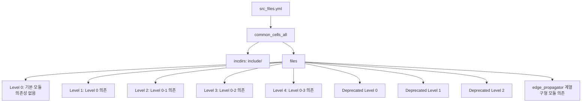
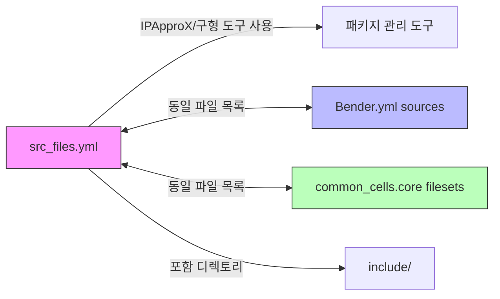

# src_files.yml

## 개요

`src_files.yml`은 `common_cells` 패키지의 소스 파일 목록을 정의하는 YAML 파일입니다. IPApproX(ip_packager) 도구와 같은 구형 패키지 관리 시스템에서 사용되며, 포함 디렉토리와 모든 소스 파일(현행 모듈 + 구형 모듈)을 계층적 레벨 구조로 나열합니다. Bender.yml의 `sources` 섹션과 유사한 역할을 하지만, 타겟 조건 없이 모든 파일을 단일 목록으로 제공합니다.

## 블록 다이어그램



## 상세 내용

### 최상위 구조

```yaml
common_cells_all:
  incdirs:
    - include
  files:
    - ...
```

| 항목 | 값 | 설명 |
|------|-----|------|
| 최상위 키 | `common_cells_all` | 소스 그룹 이름 |
| `incdirs` | `include` | 컴파일러에 전달할 헤더 파일 탐색 디렉토리 |
| `files` | 파일 목록 | 컴파일 순서에 따른 SV 소스 파일 목록 |

### Level 0 파일 (기본 모듈)

패키지 내 다른 파일에 의존하지 않는 독립적인 기본 모듈들입니다.

| 파일 | 기능 |
|------|------|
| `src/binary_to_gray.sv` | 바이너리→그레이 코드 변환기 |
| `src/cb_filter_pkg.sv` | Content-Based 필터 패키지 정의 |
| `src/cc_onehot.sv` | One-hot 인코더/검사기 |
| `src/cf_math_pkg.sv` | 수학 함수 패키지 (log2 등) |
| `src/clk_int_div.sv` | 클럭 정수 분주기 (동적) |
| `src/credit_counter.sv` | 크레딧 기반 카운터 |
| `src/delta_counter.sv` | 델타(증감) 카운터 |
| `src/ecc_pkg.sv` | ECC 관련 타입/함수 패키지 |
| `src/edge_propagator_tx.sv` | 에지 전파기 송신부 |
| `src/exp_backoff.sv` | 지수 백오프 생성기 |
| `src/fifo_v3.sv` | FIFO 버전 3 (현행 권장) |
| `src/gray_to_binary.sv` | 그레이→바이너리 코드 변환기 |
| `src/heaviside.sv` | 헤비사이드 함수 (단위 계단) |
| `src/isochronous_4phase_handshake.sv` | 등시성 4-phase 핸드셰이크 |
| `src/isochronous_spill_register.sv` | 등시성 스필 레지스터 |
| `src/lfsr.sv` | LFSR (선형 피드백 시프트 레지스터) |
| `src/lfsr_16bit.sv` | 16비트 LFSR |
| `src/lfsr_8bit.sv` | 8비트 LFSR |
| `src/multiaddr_decode.sv` | 다중 주소 디코더 |
| `src/mv_filter.sv` | 이동 평균 필터 |
| `src/onehot_to_bin.sv` | One-hot→바이너리 변환기 |
| `src/plru_tree.sv` | PLRU(Pseudo-LRU) 트리 |
| `src/passthrough_stream_fifo.sv` | 패스스루 스트림 FIFO |
| `src/popcount.sv` | 팝카운트(비트 1 개수 계산) |
| `src/ring_buffer.sv` | 링 버퍼 |
| `src/rr_arb_tree.sv` | 라운드로빈 중재 트리 |
| `src/rstgen_bypass.sv` | 리셋 생성기 (바이패스 포함) |
| `src/serial_deglitch.sv` | 시리얼 디글리치 필터 |
| `src/shift_reg.sv` | 시프트 레지스터 |
| `src/shift_reg_gated.sv` | 게이티드 시프트 레지스터 |
| `src/spill_register_flushable.sv` | 플러시 가능한 스필 레지스터 |
| `src/stream_demux.sv` | 스트림 디멀티플렉서 |
| `src/stream_filter.sv` | 스트림 필터 |
| `src/stream_fork.sv` | 스트림 포크 (1→N) |
| `src/stream_intf.sv` | 스트림 인터페이스 정의 |
| `src/stream_join.sv` | 스트림 조인 (N→1) |
| `src/stream_join_dynamic.sv` | 동적 스트림 조인 |
| `src/stream_mux.sv` | 스트림 멀티플렉서 |
| `src/stream_throttle.sv` | 스트림 쓰로틀 |
| `src/sub_per_hash.sv` | 구독자당 해시 |
| `src/sync.sv` | 2-플립플롭 동기화기 |
| `src/sync_wedge.sv` | 쐐기형 동기화기 |
| `src/unread.sv` | 미읽음 신호 처리 |
| `src/read.sv` | 읽음 신호 처리 |
| `src/cdc_reset_ctrlr_pkg.sv` | CDC 리셋 컨트롤러 패키지 |

### Level 1 파일 (Level 0 의존)

| 파일 | 기능 |
|------|------|
| `src/addr_decode_dync.sv` | 동적 주소 디코더 |
| `src/boxcar.sv` | 박스카 평균 필터 |
| `src/cdc_2phase.sv` | 2-phase CDC (Clock Domain Crossing) |
| `src/cdc_4phase.sv` | 4-phase CDC |
| `src/cb_filter.sv` | Content-Based 필터 |
| `src/cdc_fifo_2phase.sv` | 2-phase CDC FIFO |
| `src/counter.sv` | 일반 카운터 |
| `src/ecc_decode.sv` | ECC 디코더 |
| `src/ecc_encode.sv` | ECC 인코더 |
| `src/edge_detect.sv` | 에지 감지기 |
| `src/lzc.sv` | 선행 0 카운터 (Leading Zero Count) |
| `src/max_counter.sv` | 최대값 카운터 |
| `src/rstgen.sv` | 리셋 생성기 |
| `src/spill_register.sv` | 스필 레지스터 |
| `src/stream_delay.sv` | 스트림 지연기 |
| `src/stream_fifo.sv` | 스트림 FIFO |
| `src/stream_fork_dynamic.sv` | 동적 스트림 포크 |
| `src/trip_counter.sv` | 트립 카운터 |
| `src/clk_mux_glitch_free.sv` | 글리치 프리 클럭 MUX |

### Level 2 파일 (Level 0-1 의존)

| 파일 | 기능 |
|------|------|
| `src/addr_decode.sv` | 주소 디코더 |
| `src/addr_decode_napot.sv` | NAPOT(자연 정렬 2의 거듭제곱) 주소 디코더 |
| `src/cdc_reset_ctrlr.sv` | CDC 리셋 컨트롤러 |
| `src/cdc_fifo_gray.sv` | 그레이 코드 기반 CDC FIFO |
| `src/fall_through_register.sv` | 폴스루 레지스터 |
| `src/id_queue.sv` | ID 큐 (Out-of-Order 응답 추적) |
| `src/stream_to_mem.sv` | 스트림→메모리 인터페이스 |
| `src/stream_arbiter_flushable.sv` | 플러시 가능한 스트림 중재기 |
| `src/stream_fifo_optimal_wrap.sv` | 최적화된 스트림 FIFO 래퍼 |
| `src/stream_register.sv` | 스트림 레지스터 |
| `src/stream_xbar.sv` | 스트림 크로스바 |

### Level 3 파일 (Level 0-2 의존)

| 파일 | 기능 |
|------|------|
| `src/cdc_fifo_gray_clearable.sv` | 클리어 가능한 그레이 코드 CDC FIFO |
| `src/cdc_2phase_clearable.sv` | 클리어 가능한 2-phase CDC |
| `src/mem_to_banks_detailed.sv` | 메모리→뱅크 상세 매핑 모듈 |
| `src/stream_arbiter.sv` | 스트림 중재기 |
| `src/stream_omega_net.sv` | 오메가 네트워크 인터커넥트 |

### Level 4 파일 (Level 0-3 의존)

| 파일 | 기능 |
|------|------|
| `src/mem_to_banks.sv` | 메모리→뱅크 매핑 모듈 |

### 구형(Deprecated) 모듈

신규 설계에는 사용을 권장하지 않으며, 하위 호환성을 위해 유지됩니다.

#### Deprecated Level 0

| 파일 | 권장 대체 모듈 |
|------|-------------|
| `src/deprecated/clock_divider.sv` | `clk_int_div.sv` |
| `src/deprecated/clock_divider_counter.sv` | `clk_int_div.sv` |
| `src/deprecated/find_first_one.sv` | `lzc.sv` |
| `src/deprecated/generic_LFSR_8bit.sv` | `lfsr_8bit.sv` |
| `src/deprecated/generic_fifo.sv` | `fifo_v3.sv` |
| `src/deprecated/generic_fifo_adv.sv` | `fifo_v3.sv` |
| `src/deprecated/pulp_sync.sv` | `sync.sv` |
| `src/deprecated/pulp_sync_wedge.sv` | `sync_wedge.sv` |
| `src/deprecated/sram.sv` | (플랫폼별 SRAM 사용) |

#### Deprecated Level 1

| 파일 | 권장 대체 모듈 |
|------|-------------|
| `src/deprecated/fifo_v2.sv` | `fifo_v3.sv` |
| `src/deprecated/prioarbiter.sv` | `rr_arb_tree.sv` |
| `src/deprecated/rrarbiter.sv` | `rr_arb_tree.sv` |

#### Deprecated Level 2

| 파일 | 권장 대체 모듈 |
|------|-------------|
| `src/deprecated/fifo_v1.sv` | `fifo_v3.sv` |

#### 구형 모듈 의존 파일

| 파일 | 설명 |
|------|------|
| `src/edge_propagator_ack.sv` | 에지 전파기 ACK (구형 모듈 의존) |
| `src/edge_propagator.sv` | 에지 전파기 (구형 모듈 의존) |
| `src/edge_propagator_rx.sv` | 에지 전파기 수신부 (구형 모듈 의존) |

## 의존성 및 관계



## 사용 방법

`src_files.yml`은 주로 IPApproX 도구 또는 커스텀 스크립트에서 파싱하여 사용합니다.

```python
import yaml

with open('src_files.yml') as f:
    data = yaml.safe_load(f)

# 포함 디렉토리 추출
incdirs = data['common_cells_all']['incdirs']

# 소스 파일 목록 추출
src_files = data['common_cells_all']['files']
```

### Bender.yml과의 비교

| 특성 | src_files.yml | Bender.yml |
|------|--------------|------------|
| 타겟 조건 | 없음 (모든 파일 포함) | target 조건으로 선택적 포함 |
| 의존성 관리 | 없음 | dependencies 섹션 포함 |
| 도구 호환성 | IPApproX, 레거시 도구 | Bender 전용 |
| 파일 수 | 더 많음 (구형 모듈 포함) | 타겟별 필터링 가능 |
