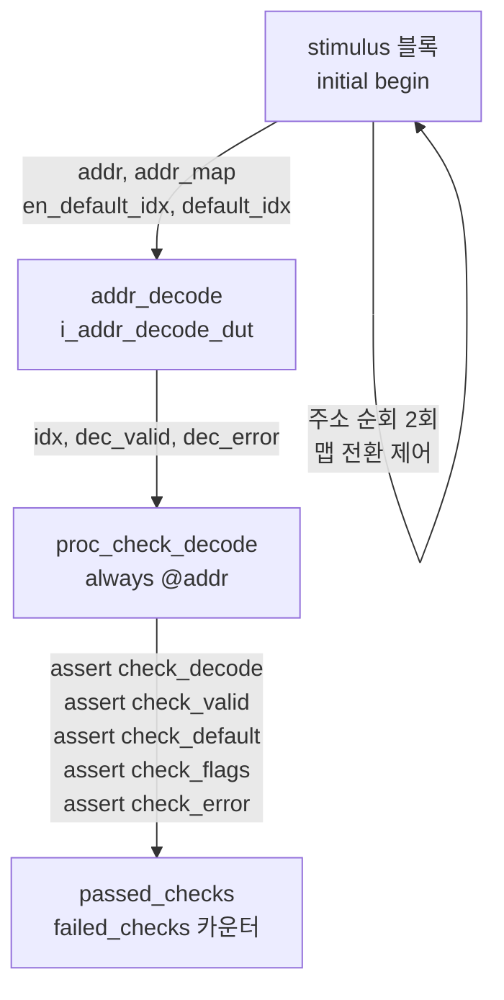

# addr_decode 테스트벤치 (`addr_decode_tb.sv`)

## 개요

`addr_decode` 모듈에 대한 테스트벤치입니다. 주소 디코더는 입력 주소를 주어진 규칙 맵(address map)과 비교하여 해당 인덱스와 유효성 플래그를 출력합니다. 이 테스트벤치는 모든 가능한 주소 값을 순회하면서 디코더가 정확한 인덱스와 플래그를 출력하는지 검증합니다.

테스트 대상: `addr_decode`
- 일반 맵(비중첩) 상태에서의 정상 디코딩
- 중첩 맵(overlapping map) 경고 확인
- 기본 인덱스(default index) 활성화 시 디코딩

## 테스트 구조 다이어그램



## 테스트 파라미터

| 파라미터명 | 기본값 | 설명 |
|-----------|--------|------|
| `NoIndices` | 2 | 디코딩 결과 인덱스 수 |
| `NoRules` | 3 | 주소 맵 규칙의 수 |
| `AddrWidth` | 12 | 입력 주소 비트 폭 (0x000 ~ 0xFFF) |

## 테스트 시나리오

### 시나리오 1: 일반 맵 (`map_0`)에서 전체 주소 순회
- 규칙 구성:
  - Rule 0: `0x000` ~ `0x010` → index 0
  - Rule 1: `0x010` ~ `0x020` → index 1
  - Rule 2: `0xF00` ~ `0xFFF` → index 0
- `en_default_idx = 0`, `default_idx = 1`
- 주소 `0x000`부터 `0xFFF`까지 1 타임유닛 간격으로 모든 값 인가

### 시나리오 2: 중첩 맵 (`map_1`) 전환
- 규칙 구성:
  - Rule 0: `0x000` ~ `0x010` → index 0
  - Rule 1: `0x00D` ~ `0x020` → index 1  (0x00D ~ 0x010 구간 중첩)
  - Rule 2: `0x100` ~ `0xFFF` → index 1
- 중첩 구간 존재 → 시뮬레이터 경고 발생 확인

### 시나리오 3: 기본 인덱스 활성화 후 전체 주소 순회
- `map_0` 복구 후 `en_default_idx = 1` 설정
- 규칙에 매칭되지 않는 주소에서 `default_idx`로 디코딩되는지 확인
- 주소 `0x000`부터 `0xFFF`까지 재순회

## 검증 방법

`always @(addr)` 블록이 주소 변경마다 즉시(#0 지연) 실행되며 황금 모델(golden model) 역할을 수행합니다.

| 어서션 이름 | 검증 내용 |
|------------|---------|
| `check_decode` | 주소가 규칙 범위 내에 있을 때 `idx` 출력이 규칙의 인덱스와 일치 |
| `check_valid` | 유효한 디코딩 시 `dec_valid == 1`, `dec_error == 0` |
| `check_default` | 기본 인덱스 활성화 시 `idx == default_idx` |
| `check_flags` | 기본 인덱스 사용 시 `dec_error == 0` |
| `check_error` | 규칙 불일치 + 기본 인덱스 비활성화 시 `dec_error == 1` |

- `passed_checks` / `failed_checks` 카운터로 전체 통과/실패 수 추적
- 시뮬레이션 종료 시 `$display`로 결과 출력 후 `$stop()`

## 커버리지 포인트

| 커버리지 포인트 | 설명 |
|---------------|------|
| 모든 주소 값 순회 | 12비트 주소 공간 4096개 값 전체 |
| 맵 정상 동작 | 규칙 범위 내 주소 디코딩 |
| 맵 오류(중첩) | 중첩 규칙에 대한 경고 처리 |
| 기본 인덱스 비활성화 | 범위 외 주소에서 에러 플래그 |
| 기본 인덱스 활성화 | 범위 외 주소에서 기본 인덱스 출력 |

## 실행 방법

### QuestaSim
```bash
vlog -sv test/addr_decode_tb.sv src/addr_decode.sv
vsim -c addr_decode_tb -do "run -all; quit"
```

### Verilator
```bash
verilator --binary -sv --top addr_decode_tb \
  test/addr_decode_tb.sv src/addr_decode.sv \
  -o sim_addr_decode
./obj_dir/sim_addr_decode
```
