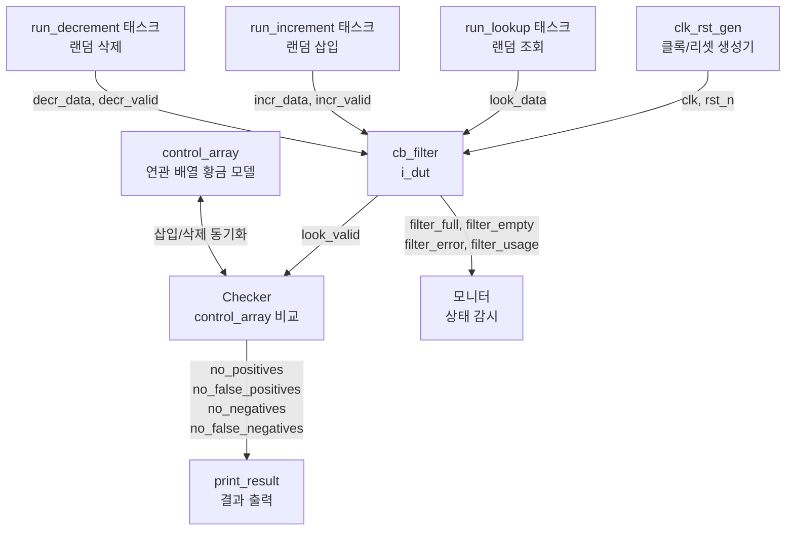

# cb_filter 테스트벤치 (`cb_filter_tb.sv`)

## 개요

카운팅 블룸 필터(Counting Bloom Filter) 모듈 `cb_filter`에 대한 테스트벤치입니다. 블룸 필터는 데이터 아이템의 존재 여부를 확률적으로 검사하는 자료구조로, 해시 충돌로 인한 거짓 양성(false positive)은 허용되지만 거짓 음성(false negative)은 절대 발생하지 않아야 합니다.

테스트 대상: `cb_filter`
- 랜덤 데이터 삽입(increment), 삭제(decrement), 조회(lookup)의 동시 실행
- 거짓 음성 발생 여부 확인 (0이어야 정상)
- 필터 포화(full), 공백(empty) 상태 검증

## 테스트 구조 다이어그램



## 테스트 파라미터

| 파라미터명 | 기본값 | 설명 |
|-----------|--------|------|
| `TCycle` | 10 ns | 클록 주기 |
| `TAppli` | 2 ns | 신호 인가 지연 (클록 상승 후) |
| `TTest` | 8 ns | 신호 샘플링 시점 (클록 상승 전) |
| `RunCycles` | 10,000,000 | 총 시뮬레이션 사이클 수 |
| `NoHashes` | 3 | 해시 함수 개수 (K) |
| `HashWidth` | 6 | 해시 폭 (버킷 수 = 2^6 = 64) |
| `HashRounds` | 1 | 해시 라운드 수 |
| `DataWidth` | 11 | 입력 데이터 비트 폭 |
| `BucketWidth` | 3 | 버킷 카운터 비트 폭 |

## 테스트 시나리오

시뮬레이션은 `fork...join`으로 4개의 병렬 스레드를 실행합니다.

### 스레드 1: 시뮬레이션 제어
- `max_items = 10`, `min_items = 3` 설정
- 리셋 해제 후 `RunCycles` 사이클 카운트
- 완료 시 `sim_done = 1` 설정

### 스레드 2: `run_lookup` - 조회 실행
- 매 사이클 랜덤 데이터(`$urandom_range(0, 2^DataWidth-1)`) 생성
- 0~6 사이클 랜덤 대기 후 `look_data` 인가
- `control_array`와 `look_valid` 결과 비교
  - 배열에 존재 + `look_valid=1` → 참 양성(positive)
  - 배열에 존재 + `look_valid=0` → **거짓 음성(false negative) - 오류**
  - 배열에 없음 + `look_valid=1` → 거짓 양성(false positive, 허용)
  - 배열에 없음 + `look_valid=0` → 참 음성(negative)

### 스레드 3: `run_increment` - 삽입 실행
- `control_array`에 없는 랜덤 데이터 선택
- `filter_full` 또는 `control_array.num() > max_items`이면 대기
- `incr_valid` 활성화로 필터에 삽입, `control_array`에도 동기 등록

### 스레드 4: `run_decrement` - 삭제 실행
- `control_array`에 존재하는 데이터 중 랜덤 선택
- `control_array.num() > min_items` 조건에서만 삭제
- `decr_valid` 활성화로 필터에서 삭제, `control_array`에서도 동기 제거

### 종료 후: `empty_filter` 태스크
- 남은 모든 항목 순차 삭제
- `filter_empty` 플래그 최종 확인

## 검증 방법

- `control_array` (SystemVerilog 연관 배열)가 황금 모델 역할
- 조회 결과를 `control_array`와 실시간 비교
- 결과 카운터:
  - `no_tests`: 총 조회 횟수
  - `no_positives`: 참 양성 횟수
  - `no_false_positives`: 거짓 양성 횟수 (해시 충돌, 허용)
  - `no_negatives`: 참 음성 횟수
  - `no_false_negatives`: 거짓 음성 횟수 (**반드시 0이어야 성공**)
- `print_result` 태스크에서 `no_false_negatives == 0` 시 `***SUCCESS***` 출력

## 커버리지 포인트

| 커버리지 포인트 | 설명 |
|---------------|------|
| 삽입/조회/삭제 동시 실행 | 3개 스레드 병렬 동작 |
| 필터 포화 상태 | `filter_full` 활성 시 삽입 대기 |
| 최소 항목 유지 | `min_items` 이하에서 삭제 억제 |
| 거짓 음성 검출 | 블룸 필터의 핵심 불변성 확인 |
| 필터 공백 확인 | `empty_filter` 후 `filter_empty` 상태 |

## 실행 방법

### QuestaSim
```bash
vlog -sv test/cb_filter_tb.sv src/cb_filter.sv src/cb_filter_pkg.sv
vsim -c cb_filter_tb -do "run -all; quit"
```

### Verilator
```bash
verilator --binary -sv --top cb_filter_tb \
  test/cb_filter_tb.sv src/cb_filter.sv \
  -o sim_cb_filter
./obj_dir/sim_cb_filter
```
