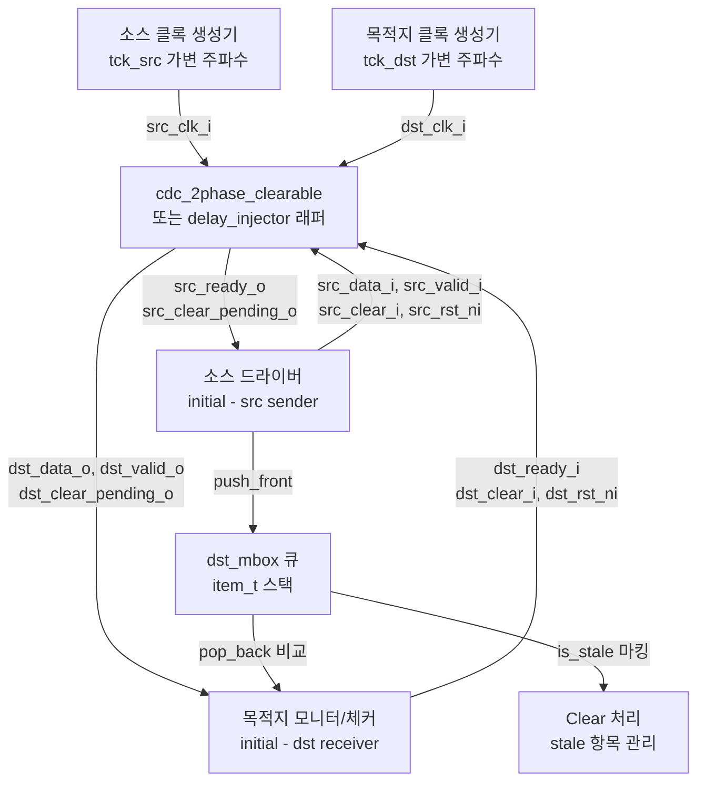

# cdc_2phase_clearable 테스트벤치 (`cdc_2phase_clearable_tb.sv`)

## 개요

클리어 기능이 추가된 2-Phase 핸드셰이크 CDC(Clock Domain Crossing) 모듈 `cdc_2phase_clearable`에 대한 테스트벤치입니다. 소스 측(`src`)과 목적지 측(`dst`)이 각각 독립적인 클록으로 동작하며, 전송 중 언제든지 동기식 clear 신호 또는 비동기 리셋으로 CDC를 초기화할 수 있는 기능을 검증합니다.

테스트 대상: `cdc_2phase_clearable` (및 분리된 `cdc_2phase_src_clearable`, `cdc_2phase_dst_clearable`, `cdc_reset_ctrlr`)
- 정상 CDC 전송 검증 (데이터 무결성)
- 랜덤 시점의 clear 동작 검증 (동기 clear / 비동기 리셋)
- 소스/목적지 양측에서 독립적으로 clear 가능

## 테스트 구조 다이어그램



## 테스트 파라미터

| 파라미터명 | 기본값 | 설명 |
|-----------|--------|------|
| `UNTIL` | 100,000 | 소스에서 전송할 총 트랜잭션 수 |
| `INJECT_DELAYS` | 1 | 비동기 신호 경로에 랜덤 지연 주입 여부 |
| `CLEAR_PPM` | 2,000 | 매 사이클 clear 발생 확률 (백만분율, 0.2%) |
| `SYNC_STAGES` | 3 | CDC 동기화 스테이지 수 |

## 테스트 시나리오

### 시나리오 1: 정상 전송
- 소스 드라이버가 랜덤 32비트 데이터를 `src_valid_i`와 함께 인가
- `src_ready_o` 확인 후 핸드셰이크 완료
- 목적지 드라이버가 `dst_valid_o` 대기 후 `dst_ready_i` 활성화
- 수신 데이터를 `dst_mbox`의 기대값과 비교

### 시나리오 2: 소스 측 Clear (동기 방식)
- `CLEAR_PPM` 확률로 clear 발동 (`src_clear_pending_o`가 비활성일 때만)
- `src_clear_i = 1`을 1 사이클 인가 후 해제
- `dst_mbox`의 미처리 항목을 `is_stale = 1`로 마킹
- `num_sent` 카운터에서 stale 항목 수 감산

### 시나리오 3: 소스 측 Clear (비동기 리셋 방식)
- `src_rst_ni = 0`을 1 사이클 인가하여 비동기 리셋
- 동기 방식과 동일한 mailbox 처리

### 시나리오 4: 목적지 측 Clear
- 목적지 드라이버도 `CLEAR_PPM` 확률로 clear 발동
- `dst_clear_i` 또는 `dst_rst_ni`로 초기화
- `SYNC_STAGES` 소스 클록 사이클 대기 후 mailbox 처리
- 마지막 1개 항목은 보존 (전파 완료 전 수신 가능)

### 클록 주파수 변조
- 매 10 아이템마다 `tck_src`, `tck_dst`를 `1 ns ~ 10 ns` 범위로 랜덤 변경
- 다양한 주파수 비율에서의 CDC 동작 검증

### 지연 주입 (`INJECT_DELAYS = 1`)
- `cdc_2phase_clearable_tb_delay_injector` 래퍼 사용
- `async_req`, `async_ack`, `async_data` 신호에 최대 0.8 ns 랜덤 지연
- 실제 금속 배선 지연 모의

## 검증 방법

- `dst_mbox` (SystemVerilog 큐): 소스에서 전송한 데이터 순서 기록
  - `item_t` 구조체: `data` (32-bit 값), `is_stale` (무효화 여부)
- 목적지 수신 시 `dst_mbox.pop_back()`과 실제 데이터 비교
- stale 항목은 연속으로 건너뛰면서 유효 항목 탐색
- 오류 발생 시 `$error` 출력, `num_failed` 증가
- 전송/수신 완료(`src_done & dst_done`) 후 최종 검사 결과 보고

## 커버리지 포인트

| 커버리지 포인트 | 설명 |
|---------------|------|
| 정상 전송 | 다양한 클록 비율에서 데이터 무결성 |
| 소스 동기 clear | `src_clear_i` 신호 처리 |
| 소스 비동기 리셋 | `src_rst_ni` 신호 처리 |
| 목적지 동기 clear | `dst_clear_i` 신호 처리 |
| 목적지 비동기 리셋 | `dst_rst_ni` 신호 처리 |
| Clear 전파 지연 | `src_clear_pending_o`, `dst_clear_pending_o` 상태 |
| Stale 데이터 수신 | Clear 전파 완료 전 수신된 잔여 데이터 허용 |

## 실행 방법

### QuestaSim
```bash
vlog -sv test/cdc_2phase_clearable_tb.sv \
  src/cdc_2phase_clearable.sv \
  src/cdc_reset_ctrlr.sv
vsim -c cdc_2phase_clearable_tb \
  -G UNTIL=100000 -G INJECT_DELAYS=1 \
  -do "run -all; quit"
```

### Verilator
```bash
# INJECT_DELAYS=0 으로만 실행 가능 (지연 주입 비활성화)
verilator --binary -sv --top cdc_2phase_clearable_tb \
  -GUNTIL=100000 -GINJECT_DELAYS=0 \
  test/cdc_2phase_clearable_tb.sv \
  src/cdc_2phase_clearable.sv \
  -o sim_cdc_2phase_clearable
./obj_dir/sim_cdc_2phase_clearable
```
