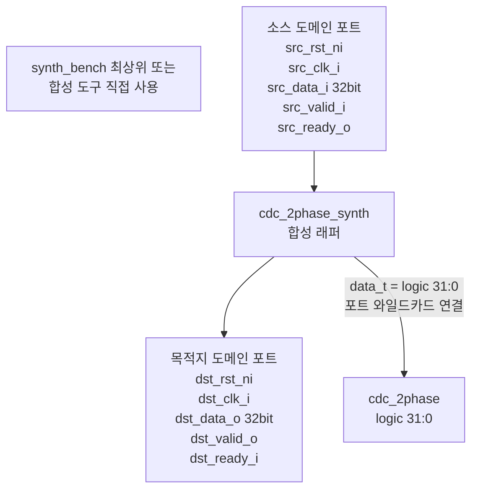

# cdc_2phase 합성 래퍼 (`cdc_2phase_synth.sv`)

## 개요

`cdc_2phase` 모듈에 대한 합성용 래퍼(synthesis wrapper)입니다. 데이터 타입 파라미터를 `logic [31:0]`으로 고정하여 합성 도구(Synopsys Design Compiler, Cadence Genus 등)가 처리하기 쉬운 형태의 정적 포트 인터페이스를 제공합니다. 시뮬레이션 목적보다는 합성 플로우 검증 및 타이밍 분석에 사용됩니다.

테스트 대상: `cdc_2phase #(logic [31:0])`
- 합성 가능성(synthesizability) 확인
- 포트 인터페이스의 정적 정의 제공
- `synth_bench.sv`의 최상위 합성 래퍼에서 참조됨

## 테스트 구조 다이어그램



## 포트 매핑

| 방향 | 포트명 | 비트 폭 | 설명 |
|------|--------|---------|------|
| input | `src_rst_ni` | 1 | 소스 도메인 비동기 리셋 (active-low) |
| input | `src_clk_i` | 1 | 소스 도메인 클록 |
| input | `src_data_i` | 32 | 소스 측 전송 데이터 |
| input | `src_valid_i` | 1 | 소스 측 valid (핸드셰이크) |
| output | `src_ready_o` | 1 | 소스 측 ready (핸드셰이크) |
| input | `dst_rst_ni` | 1 | 목적지 도메인 비동기 리셋 (active-low) |
| input | `dst_clk_i` | 1 | 목적지 도메인 클록 |
| output | `dst_data_o` | 32 | 목적지 측 수신 데이터 |
| output | `dst_valid_o` | 1 | 목적지 측 valid (핸드셰이크) |
| input | `dst_ready_i` | 1 | 목적지 측 ready (핸드셰이크) |

## 합성 래퍼 역할

- `cdc_2phase #(logic [31:0]) i_cdc (.*)` 방식으로 포트 와일드카드 연결
- `logic [31:0]` 타입을 파라미터로 고정하여 제네릭 파라미터 없이 합성 진행
- 합성 도구가 CDC 경계의 `false path` 또는 `multicycle path` 제약 조건을 적용할 때 이 래퍼를 최상위 모듈로 사용

## 실행 방법

### 합성 (Synopsys Design Compiler 예시)
```tcl
read_verilog -format sverilog cdc_2phase_synth.sv
read_verilog -format sverilog src/cdc_2phase.sv
elaborate cdc_2phase_synth
set_false_path -from [get_clocks src_clk_i] -to [get_clocks dst_clk_i]
set_false_path -from [get_clocks dst_clk_i] -to [get_clocks src_clk_i]
compile_ultra
```

### 합성 시뮬레이션 (게이트 레벨)
```bash
# cdc_2phase_tb.sv 에서 POST_SYNTHESIS=1 파라미터 사용
vsim -c cdc_2phase_tb \
  -G POST_SYNTHESIS=1 \
  -do "run -all; quit"
```
