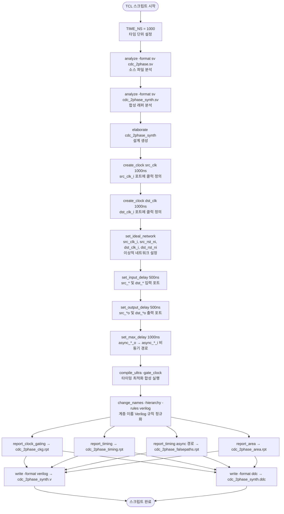

# cdc_2phase_synth.tcl

## 개요

Synopsys Design Compiler(DC)를 사용하여 `cdc_2phase` 모듈을 합성하는 TCL 스크립트입니다. 소스 파일 분석(analyze), 설계 생성(elaborate), 클럭 및 타이밍 제약 설정, 합성 최적화(`compile_ultra`), 보고서 생성, 결과 파일 저장까지의 전체 합성 흐름을 담당합니다. 비동기 신호(`async_*`) 경로에 대해 false path로 처리하는 제약을 포함합니다.

## 실행 흐름 다이어그램



## 사용 방법

```bash
# synth.sh를 통해 간접 실행 (권장)
bash test/synth.sh

# Synopsys DC에서 직접 실행
# ROOT 환경변수 설정 후 실행 (소스 파일 경로에 사용됨)
dc_shell -64 -f test/cdc_2phase_synth.tcl

# dc_shell 인터랙티브 모드에서 실행
dc_shell> source test/cdc_2phase_synth.tcl
```

## 주요 변수 / 설정

| 변수명 | 기본값 | 설명 |
|--------|--------|------|
| `TIME_NS` | `1000` | 타이밍 제약의 기준 단위 (ps 단위, 1000ps = 1ns에 해당) |
| `$ROOT` | (외부 설정) | 소스 파일의 루트 경로 (`analyze` 명령에서 사용) |

### 클럭 제약

| 클럭 이름 | 포트 | 주기 |
|----------|------|------|
| `src_clk` | `src_clk_i` | `1 × TIME_NS` (1000ps) |
| `dst_clk` | `dst_clk_i` | `1 × TIME_NS` (1000ps) |

### 타이밍 제약

| 제약 종류 | 값 | 적용 대상 |
|----------|-----|----------|
| 입력 지연 (`set_input_delay`) | `0.5 × TIME_NS` (500ps) | `src_*i` (클럭/리셋 제외), `dst_*i` (클럭/리셋 제외) |
| 출력 지연 (`set_output_delay`) | `0.5 × TIME_NS` (500ps) | `src_*o`, `dst_*o` |
| 최대 지연 (`set_max_delay`) | `1 × TIME_NS` (1000ps) | `async_*_o` → `async_*_i` 비동기 경로 |

## 실행 단계 상세 설명

### 1단계: 소스 파일 분석 (analyze)

- `$ROOT/src/cdc_2phase.sv`: CDC 2-phase 핸드셰이크 RTL 구현 파일
- `$ROOT/test/cdc_2phase_synth.sv`: 합성 검증을 위한 래퍼(wrapper) 모듈

### 2단계: 설계 생성 (elaborate)

`cdc_2phase_synth` 최상위 모듈을 DC 데이터베이스에 생성합니다.

### 3단계: 클럭 및 이상적 네트워크 설정

`src_clk_i`, `src_rst_ni`, `dst_clk_i`, `dst_rst_ni`를 이상적 네트워크(`set_ideal_network`)로 설정하여 클럭/리셋 경로에 버퍼 삽입 및 타이밍 분석을 제외합니다.

### 4단계: 비동기 경로 제약 (set_max_delay)

`async_*_o`에서 `async_*_i`로 향하는 비동기 CDC 경로에 `set_max_delay`를 적용합니다. 이는 동기 경로 타이밍 분석에서 해당 경로를 false path로 처리하는 관용적 방법입니다.

### 5단계: 합성 최적화 (compile_ultra)

`-gate_clock` 옵션을 사용하여 클럭 게이팅 최적화를 포함한 고품질 합성을 수행합니다.

### 6단계: 이름 정규화 (change_names)

계층 구조 전체에 Verilog 네이밍 규칙을 적용하여 출력 네트리스트의 호환성을 확보합니다.

### 7단계: 보고서 생성

| 출력 파일 | 내용 |
|----------|------|
| `cdc_2phase_ckg.rpt` | 클럭 게이팅 보고서 |
| `cdc_2phase_timing.rpt` | 전체 타이밍 보고서 |
| `cdc_2phase_falsepaths.rpt` | `async_*` 경로 타이밍 보고서 (false path 확인용) |
| `cdc_2phase_area.rpt` | 면적(Area) 보고서 |

### 8단계: 결과 파일 저장

| 출력 파일 | 형식 | 설명 |
|----------|------|------|
| `cdc_2phase_synth.v` | Verilog 네트리스트 | 합성 후 게이트 레벨 넷리스트 |
| `cdc_2phase_synth.ddc` | DC Database | Synopsys DC 전용 바이너리 형식 |

## 지원 도구

| 도구 | 용도 |
|------|------|
| **Synopsys Design Compiler** (`dc_shell`) | RTL 합성 및 최적화 |

- Synopsys DC의 `compile_ultra` 명령과 `report_clock_gating` 기능이 필요합니다.
- `$ROOT` 환경변수가 올바르게 설정되어 있어야 소스 파일 경로가 정상 동작합니다.
