# cdc_2phase_tb.sv

## 개요

`cdc_2phase_tb`는 2-phase 핸드셰이크 방식의 클록 도메인 교차(Clock Domain Crossing, CDC) 모듈인 `cdc_2phase`를 검증하는 테스트벤치입니다. 소스(src)와 목적지(dst) 두 개의 독립적인 클록 도메인 사이에서 데이터가 정확하게 전달되는지를 확인합니다. 지연 주입(delay injection) 및 합성 후(post-synthesis) 시뮬레이션 모드를 지원합니다.

## 테스트 구조 다이어그램

```mermaid
flowchart TD
    subgraph TB["cdc_2phase_tb"]
        subgraph SRC_CLK["소스 클록 생성기 (initial)"]
            SC[tck_src 클록 생성\n주파수 랜덤 변조]
        end
        subgraph DST_CLK["목적지 클록 생성기 (initial)"]
            DC[tck_dst 클록 생성\n주파수 랜덤 변조]
        end
        subgraph SENDER["소스 송신기 (initial)"]
            S1[리셋 해제 대기]
            S2[랜덤 stimulus 생성]
            S3[src_data_i / src_valid_i 구동]
            S4[src_ready_o 대기]
            S5[dst_mbox 에 expected 값 저장]
            S1 --> S2 --> S3 --> S4 --> S5 --> S2
        end
        subgraph RECEIVER["목적지 수신기 (initial)"]
            R1[리셋 해제 대기]
            R2[dst_ready_i = 1 구동]
            R3[dst_valid_o 대기]
            R4[dst_data_o 수신]
            R5{dst_mbox 비교}
            R6[오류 카운트 증가]
            R7[랜덤 cooldown 삽입]
            R1 --> R2 --> R3 --> R4 --> R5
            R5 -- 불일치 --> R6 --> R7 --> R2
            R5 -- 일치 --> R7
        end

        subgraph DUT_SEL["DUT 선택"]
            D1{POST_SYNTHESIS?}
            D2{INJECT_DELAYS?}
            D3[cdc_2phase_synth]
            D4[cdc_2phase_tb_delay_injector]
            D5[cdc_2phase]
            D1 -- Yes --> D3
            D1 -- No --> D2
            D2 -- Yes --> D4
            D2 -- No --> D5
        end

        MBOX[(mailbox\ndst_mbox)]
        SENDER -- put --> MBOX
        RECEIVER -- get --> MBOX
    end

    subgraph DELAY_INJ["cdc_2phase_tb_delay_injector"]
        SRC_HALF[cdc_2phase_src]
        DST_HALF[cdc_2phase_dst]
        ASYNC[비동기 신호에\n랜덤 지연 삽입\nasync_req / async_ack / async_data]
        SRC_HALF -- async_req_o\nasync_data_o --> ASYNC
        ASYNC -- async_req_i\nasync_data_i --> DST_HALF
        DST_HALF -- async_ack_o --> ASYNC
        ASYNC -- async_ack_i --> SRC_HALF
    end

    DUT_SEL --> DELAY_INJ
```

## 테스트 시나리오

### 1. 초기화 및 리셋
- 시뮬레이션 시작 후 10ns 뒤 `src_rst_ni`와 `dst_rst_ni`를 각각 순차적으로 Low → High로 토글하여 소스/목적지 도메인을 독립적으로 리셋합니다.
- 리셋 해제 후 3클록 사이클 대기 후 송수신을 시작합니다.

### 2. 랜덤 데이터 전송 검증 (`UNTIL` 반복)
- 소스 측에서 `$random()`으로 생성된 32비트 정수를 `src_data_i`에 인가하고 `src_valid_i`를 어서트합니다.
- 전송할 데이터를 먼저 `dst_mbox` 메일박스에 저장합니다.
- `src_ready_o`가 High가 될 때까지 대기하여 핸드셰이크 완료를 확인합니다.
- 목적지 측에서는 `dst_ready_i`를 어서트하고 `dst_valid_o`가 High가 되면 `dst_data_o`를 읽습니다.
- `dst_mbox`에서 꺼낸 expected 값과 실제 수신값을 비교하여 불일치 시 `$error`를 출력합니다.

### 3. 가변 클록 주파수 테스트
- 소스 및 목적지 클록 주기(`tck_src`, `tck_dst`)를 1ns~10ns 범위에서 매 10아이템마다 랜덤하게 변경합니다.
- 비동기 클록 쌍(빠른/느린 다양한 조합)에서도 CDC가 정상 동작함을 검증합니다.

### 4. 지연 주입 모드 (`INJECT_DELAYS=1`)
- `cdc_2phase_tb_delay_injector`를 통해 `async_req`, `async_ack`, `async_data` 비동기 신호에 최대 0.8ns의 랜덤 지연을 삽입합니다.
- 실제 배선 지연(wire delay)이 있는 환경에서도 2-phase 핸드셰이크가 올바르게 동작하는지 검증합니다.

### 5. 수신 측 랜덤 cooldown
- 수신 후 0~40 클록 중 랜덤 횟수만큼 대기하여 백프레셔(backpressure) 상황을 모사합니다.

### 6. 최종 검증
- 전송 완료 후 `num_sent`와 `num_received`가 일치하는지 확인합니다.
- `num_failed` > 0이면 오류 요약을 출력합니다.

## 포트/파라미터

| 파라미터 | 타입 | 기본값 | 설명 |
|---------|------|--------|------|
| `UNTIL` | `int` | `100000` | 전송할 총 아이템 수 |
| `INJECT_DELAYS` | `bit` | `1` | 비동기 신호에 랜덤 지연 삽입 여부 |
| `POST_SYNTHESIS` | `bit` | `0` | 합성 후 넷리스트(`cdc_2phase_synth`) 사용 여부 |

| 신호 | 방향 | 설명 |
|------|------|------|
| `src_clk_i` | input | 소스 도메인 클록 |
| `src_rst_ni` | input | 소스 도메인 액티브-로우 리셋 |
| `src_data_i [31:0]` | input | 소스 전송 데이터 |
| `src_valid_i` | input | 소스 유효 신호 |
| `src_ready_o` | output | 소스 준비 신호 |
| `dst_clk_i` | input | 목적지 도메인 클록 |
| `dst_rst_ni` | input | 목적지 도메인 액티브-로우 리셋 |
| `dst_data_o [31:0]` | output | 목적지 수신 데이터 |
| `dst_valid_o` | output | 목적지 유효 신호 |
| `dst_ready_i` | input | 목적지 준비 신호 |

### `cdc_2phase_tb_delay_injector` 파라미터

| 파라미터 | 타입 | 기본값 | 설명 |
|---------|------|--------|------|
| `MAX_DELAY` | `time` | `0ns` | 비동기 신호에 삽입할 최대 지연 시간 |

## 의존성

| 모듈 | 설명 |
|------|------|
| `cdc_2phase` | 2-phase CDC 전체 모듈 (기본 DUT) |
| `cdc_2phase_src` | 2-phase CDC 소스 측 서브모듈 |
| `cdc_2phase_dst` | 2-phase CDC 목적지 측 서브모듈 |
| `cdc_2phase_synth` | 합성 후 넷리스트 (POST_SYNTHESIS 모드) |
