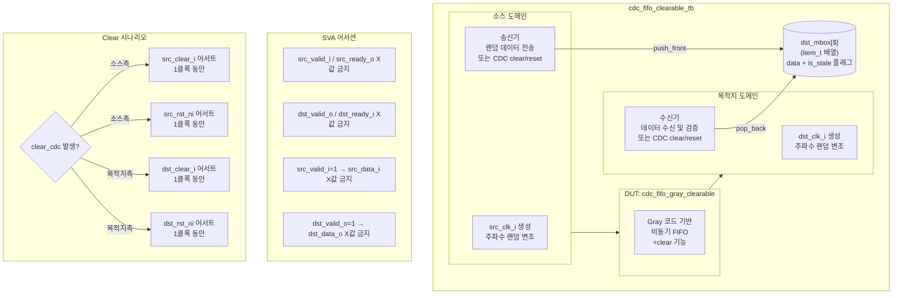

# cdc_fifo_clearable_tb.sv

## 개요

`cdc_fifo_clearable_tb`는 클리어(clear) 기능이 있는 CDC FIFO 모듈인 `cdc_fifo_gray_clearable`을 검증하는 테스트벤치입니다. 소스/목적지 두 클록 도메인 간의 데이터 전달 정확성뿐만 아니라, 동기적 clear 신호 및 비동기 리셋을 통한 FIFO 초기화 동작의 정확성을 검증합니다. clear 이후 전파 지연 동안 수신될 수 있는 stale(오래된) 아이템 처리 로직도 포함합니다.

## 테스트 구조 다이어그램

## 테스트 시나리오

### 1. 초기화 및 리셋
- 시뮬레이션 시작 10ns 후 소스/목적지 리셋(`src_rst_ni`, `dst_rst_ni`)을 각각 Low → High로 토글합니다.
- 리셋 해제 후 3클록 대기 후 송수신을 시작합니다.

### 2. 정상 데이터 전송 검증
- 소스 측에서 `$random()`으로 생성된 데이터를 FIFO에 전송합니다.
- 전송한 데이터를 `item_t` 구조체(`data`, `is_stale` 필드)로 `dst_mbox` 큐의 앞쪽에 삽입합니다.
- 목적지 측에서 데이터 수신 후 `dst_mbox` 뒤쪽에서 꺼내어 비교합니다.
- 데이터 불일치 시 `$error`를 출력하고 `num_failed`를 증가시킵니다.

### 3. 랜덤 CDC Clear 시나리오 (`CLEAR_PPM=2000` 기준 약 0.2% 확률)
- **소스 측 동기 clear**: `src_clear_i`를 1클록 동안 High로 어서트합니다.
- **소스 측 비동기 리셋**: `src_rst_ni`를 1클록 동안 Low로 어서트합니다.
- **목적지 측 동기 clear**: `dst_clear_i`를 1클록 동안 High로 어서트합니다.
- **목적지 측 비동기 리셋**: `dst_rst_ni`를 1클록 동안 Low로 어서트합니다.
- Clear 발생 시 `dst_mbox` 내 아직 전달되지 않은 아이템들을 `is_stale = 1`로 표시하고 `num_sent`를 감소시킵니다.

### 4. Stale 아이템 처리
- Clear 전파 지연으로 인해 Clear 이후에도 일부 아이템이 목적지 측에 도달할 수 있습니다.
- 수신된 아이템이 expected와 불일치할 경우, stale 아이템들을 순서대로 pop하면서 매칭을 시도합니다.
- stale 아이템으로 표시된 경우 경고 메시지(`$info`)를 출력하고 오류로 처리하지 않습니다.

### 5. 목적지 측 Clear 후 전파 대기
- 목적지 측 Clear 발생 후 1 dst 클록 + `DEPTH` src 클록 동안 대기하여 Clear 요청이 소스 측까지 전파되도록 합니다.
- 이후 `dst_mbox`를 완전히 비우고 `num_sent`를 조정합니다.

### 6. SVA(SystemVerilog Assertion) 검증
- 소스 클록에서 `src_valid_i`, `src_ready_o` X값 여부를 매 클록 확인합니다.
- 목적지 클록에서 `dst_valid_o`, `dst_ready_i` X값 여부를 매 클록 확인합니다.
- `src_valid_i=1`일 때 `src_data_i`에 X값이 없음을 확인합니다.

### 7. 가변 클록 주파수 테스트
- 소스 클록 초기 주기: 10ns, 목적지 클록 초기 주기: 27ns (비대칭 설정)
- 매 10아이템마다 1ns~10ns 범위에서 랜덤하게 클록 주기를 변경합니다.

## 포트/파라미터

| 파라미터 | 타입 | 기본값 | 설명 |
|---------|------|--------|------|
| `INJECT_SRC_STALLS` | `bit` | `0` | 소스 측 랜덤 전송 지연 삽입 여부 |
| `INJECT_DST_STALLS` | `bit` | `0` | 목적지 측 랜덤 수신 지연 삽입 여부 |
| `UNTIL` | `int` | `100000` | 총 전송 시도 횟수 |
| `DEPTH` | `int` | `3` | FIFO 로그 깊이 (실제 깊이 = 2^DEPTH) |
| `CLEAR_PPM` | `int` | `2000` | clear 발생 확률 (백만분율, 0.2%) |

| 신호 | 방향 | 설명 |
|------|------|------|
| `src_clk_i` | input | 소스 도메인 클록 |
| `src_rst_ni` | input | 소스 도메인 액티브-로우 비동기 리셋 |
| `src_clear_i` | input | 소스 측 동기 클리어 |
| `src_clear_pending_o` | output | 소스 측 클리어 진행 중 표시 |
| `src_data_i [31:0]` | input | 소스 전송 데이터 |
| `src_valid_i` | input | 소스 유효 신호 |
| `src_ready_o` | output | 소스 준비 신호 |
| `dst_clk_i` | input | 목적지 도메인 클록 |
| `dst_rst_ni` | input | 목적지 도메인 액티브-로우 비동기 리셋 |
| `dst_clear_i` | input | 목적지 측 동기 클리어 |
| `dst_clear_pending_o` | output | 목적지 측 클리어 진행 중 표시 |
| `dst_data_o [31:0]` | output | 목적지 수신 데이터 |
| `dst_valid_o` | output | 목적지 유효 신호 |
| `dst_ready_i` | input | 목적지 준비 신호 |

## 의존성

| 모듈 | 설명 |
|------|------|
| `cdc_fifo_gray_clearable` | Gray 코드 기반 클리어 가능 CDC FIFO (DUT) |
