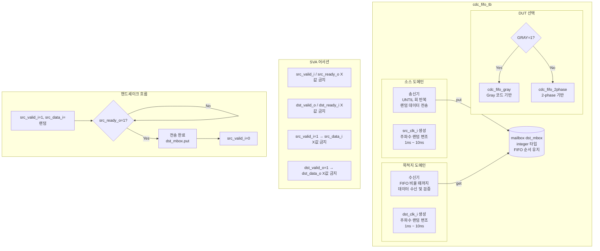

# cdc_fifo_tb.sv

## 개요

`cdc_fifo_tb`는 CDC FIFO 모듈을 검증하는 테스트벤치입니다. `GRAY` 파라미터에 따라 Gray 코드 기반 FIFO(`cdc_fifo_gray`)와 2-phase 핸드셰이크 기반 FIFO(`cdc_fifo_2phase`) 중 하나를 DUT로 선택하여 검증합니다. 소스와 목적지 두 독립적인 클록 도메인 사이에서 데이터가 순서대로 정확하게 전달되는지, 그리고 랜덤 클록 주파수 변조 및 백프레셔 조건에서도 정상 동작하는지 검증합니다.

## 테스트 구조 다이어그램

## 테스트 시나리오

### 1. 초기화 및 독립 리셋
- 시뮬레이션 시작 10ns 후 소스(`src_rst_ni`)와 목적지(`dst_rst_ni`) 리셋을 각각 독립적으로 Low → High로 토글합니다.
- 리셋 해제 후 각 도메인에서 3클록 사이클을 대기합니다.

### 2. 정상 데이터 전송 및 순서 검증 (`UNTIL` 반복)
- 소스 측에서 `$random()`으로 생성된 32비트 데이터를 FIFO에 순서대로 전송합니다.
- 전송 전 해당 데이터를 `dst_mbox`(FIFO 순서 mailbox)에 저장합니다.
- `src_ready_o`가 High가 될 때까지 대기하여 핸드셰이크 완료를 확인합니다.
- 목적지 측에서 `dst_valid_o`가 High가 되면 `dst_data_o`를 읽고, `dst_mbox`에서 꺼낸 expected 값과 FIFO 순서대로 비교합니다.
- 데이터 순서 및 값 불일치 시 `$error`를 출력합니다.

### 3. 가변 클록 주파수 테스트
- 소스 및 목적지 클록 주기를 초기 10ns에서 매 10아이템마다 1ns~10ns 범위로 랜덤하게 변경합니다.
- 빠른 소스 → 느린 목적지, 느린 소스 → 빠른 목적지 등 다양한 주파수 비율에서 동작을 검증합니다.

### 4. 소스 측 랜덤 전송 지연 (`INJECT_SRC_STALLS=1`)
- 각 아이템 전송 후 0~40 클록 중 랜덤 횟수만큼 지연을 삽입합니다.
- FIFO 버스트/드리블 전송 패턴을 모사합니다.

### 5. 목적지 측 랜덤 수신 지연 (`INJECT_DST_STALLS=1`)
- 각 아이템 수신 후 0~40 클록 중 랜덤 횟수만큼 지연을 삽입합니다.
- 목적지 측 백프레셔(backpressure) 상황을 모사합니다.

### 6. 최종 정합성 검증
- 전송 완료 후 `num_sent`와 `num_received`가 일치하는지 확인합니다.
- `num_failed` > 0이면 오류 요약을 출력합니다.

### 7. SVA 검증
- 소스 및 목적지 클록 도메인 각각에서 핸드셰이크 신호의 X값을 매 클록 사이클 검사합니다.

## 포트/파라미터

| 파라미터 | 타입 | 기본값 | 설명 |
|---------|------|--------|------|
| `INJECT_SRC_STALLS` | `bit` | `0` | 소스 측 랜덤 전송 지연 삽입 여부 |
| `INJECT_DST_STALLS` | `bit` | `0` | 목적지 측 랜덤 수신 지연 삽입 여부 |
| `UNTIL` | `int` | `100000` | 총 전송 아이템 수 |
| `DEPTH` | `int` | `0` | FIFO 로그 깊이 (실제 깊이 = 2^DEPTH) |
| `GRAY` | `bit` | `0` | Gray 코드 FIFO 사용 여부 (0: 2-phase) |

| 신호 | 방향 | 설명 |
|------|------|------|
| `src_clk_i` | input | 소스 도메인 클록 |
| `src_rst_ni` | input | 소스 도메인 액티브-로우 리셋 |
| `src_data_i [31:0]` | input | 소스 전송 데이터 |
| `src_valid_i` | input | 소스 유효 신호 |
| `src_ready_o` | output | 소스 준비 신호 (FIFO 여유 공간 있음) |
| `dst_clk_i` | input | 목적지 도메인 클록 |
| `dst_rst_ni` | input | 목적지 도메인 액티브-로우 리셋 |
| `dst_data_o [31:0]` | output | 목적지 수신 데이터 |
| `dst_valid_o` | output | 목적지 유효 신호 (FIFO 데이터 있음) |
| `dst_ready_i` | input | 목적지 준비 신호 |

## 의존성

| 모듈 | 설명 |
|------|------|
| `cdc_fifo_gray` | Gray 코드 기반 CDC FIFO (`GRAY=1` 시 DUT) |
| `cdc_fifo_2phase` | 2-phase 핸드셰이크 기반 CDC FIFO (`GRAY=0` 시 DUT) |
