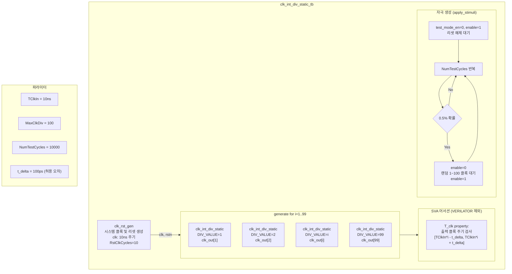

# clk_int_div_static_tb.sv

## 개요

`clk_int_div_static_tb`는 정적 정수 클록 분주기 모듈인 `clk_int_div_static`을 검증하는 테스트벤치입니다. 분주 비율(DIV_VALUE)이 컴파일 시간에 고정된 클록 분주기 1번부터 99번(`MaxClkDiv-1`)까지 총 99개의 인스턴스를 동시에 생성하여, 각 인스턴스의 출력 클록 주기가 기대값 범위 내에 있는지를 SVA(SystemVerilog Assertion)로 검증합니다.

## 테스트 구조 다이어그램

## 테스트 시나리오

### 1. 다중 인스턴스 생성
- `genvar i = 1`부터 `MaxClkDiv-1 = 99`까지 각 분주 비율에 대해 `clk_int_div_static` 인스턴스를 생성합니다.
- 모든 인스턴스는 동일한 시스템 클록(`clk`)과 리셋(`rstn`)을 공유합니다.
- 각 인스턴스는 `clk_out[i]`에 출력 클록을 생성합니다.

### 2. 출력 클록 주기 검증 (SVA, Verilator 제외)
- 각 `clk_out[i]`의 상승 에지에서 `T_clk` 프로퍼티를 평가합니다.
- 출력 주기가 `TClkIn * i ± t_delta` 범위(즉 `10ns * i ± 100ps`) 내에 있는지를 검사합니다.
- `rstn=0` 또는 `enable=0` 동안에는 검사를 비활성화합니다(`disable iff` 사용).
- 위반 시 `$error`로 해당 분주 비율과 기대 범위를 출력합니다.

### 3. 랜덤 Enable/Disable 자극
- 리셋 해제 후 `NumTestCycles = 10000` 클록 동안 반복합니다.
- 매 클록마다 0.5%(1000분의 5) 확률로 `enable`을 0으로 설정합니다.
- `enable=0` 상태로 1~100 클록 동안 랜덤하게 유지한 후 다시 `enable=1`로 복원합니다.
- 클록 enable/disable 전환 시에도 출력 클록에 글리치가 발생하지 않는지 검증합니다.

### 4. 테스트 종료
- `NumTestCycles` 반복 완료 후 `$info("Test finished")`를 출력하고 `$stop()`으로 시뮬레이션을 종료합니다.

## 포트/파라미터

| 파라미터 | 타입 | 기본값 | 설명 |
|---------|------|--------|------|
| `NumTestCycles` | `int unsigned` | `10000` | 총 테스트 클록 사이클 수 |
| `TClkIn` | `realtime` | `10ns` | 입력 클록 주기 |
| `RstClkCycles` (localparam) | `int unsigned` | `10` | 리셋 유지 클록 수 |
| `MaxClkDiv` (localparam) | `int unsigned` | `100` | 최대 분주 비율 (1~99 검증) |
| `t_delta` | `realtime` | `100ps` | 클록 주기 허용 오차 |

| 신호 | 방향 | 설명 |
|------|------|------|
| `clk` | 내부 | 시스템 클록 (10ns 주기) |
| `rstn` | 내부 | 액티브-로우 리셋 |
| `test_mode_en` | input to DUT | 테스트 모드 활성화 |
| `enable` | input to DUT | 출력 클록 활성화 |
| `clk_out[MaxClkDiv]` | output from DUT | 각 분주 비율의 출력 클록 배열 |

### `clk_int_div_static` DUT 파라미터

| 파라미터 | 설명 |
|---------|------|
| `DIV_VALUE` | 정수 분주 비율 (고정값, genvar i로 결정) |
| `ENABLE_CLOCK_IN_RESET` | 리셋 중 클록 출력 활성화 여부 (`1'b1` 고정) |

## 의존성

| 모듈 | 설명 |
|------|------|
| `clk_int_div_static` | 정적 정수 클록 분주기 (DUT, 99개 인스턴스) |
| `clk_rst_gen` | 시스템 클록 및 리셋 생성기 |
