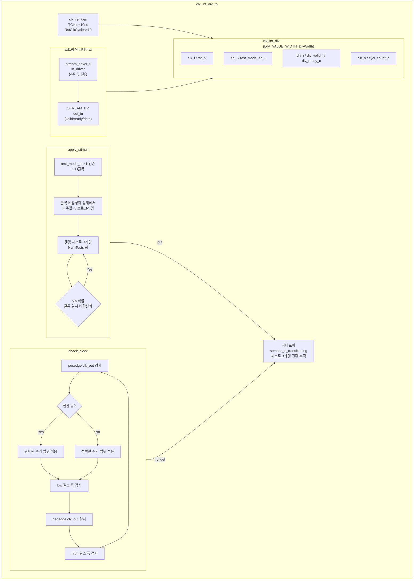

# clk_int_div_tb.sv

## 개요

`clk_int_div_tb`는 동적으로 분주 비율을 변경할 수 있는 정수 클록 분주기 모듈 `clk_int_div`를 검증하는 테스트벤치입니다. 분주 비율을 스트림 인터페이스(valid/ready 핸드셰이크)로 런타임에 재프로그래밍할 수 있으며, 재프로그래밍 중/후 출력 클록의 주기, 듀티 사이클, 글리치 여부를 실시간으로 측정하고 검증합니다. `stream_test` 패키지의 `stream_driver`와 세마포어를 이용한 전환 상태 추적 메커니즘이 특징입니다.

## 테스트 구조 다이어그램

## 테스트 시나리오

### 1. 테스트 바이패스 모드 검증
- `test_mode_en = 1`로 설정하여 100 클록 동안 바이패스 모드를 활성화합니다.
- 바이패스 모드에서 출력 클록이 입력 클록과 동일하게 동작하는지 확인합니다.
- 세마포어에 신호를 넣어 전환 상태를 체크 로직에 알립니다.

### 2. 클록 비활성화 상태 재프로그래밍
- `enable = 0`으로 클록을 먼저 비활성화합니다.
- `next_div_value = 3`을 스트림 드라이버로 전송합니다.
- 충분한 대기 후 `enable = 1`로 재활성화하고 새 분주 비율이 적용되는지 확인합니다.

### 3. 동적 재프로그래밍 스트레스 테스트 (`NumTests = 10000`)
- 랜덤 분주값(`1 ~ 2^DivWidth - 1`, 0은 1로 클램핑)을 생성합니다.
- `in_driver.send(div_value_temp)`로 스트림 인터페이스를 통해 전송합니다.
- 세마포어(`semphr_is_transitioning.put`)로 전환 상태를 알립니다.
- 0~`MaxWaitCycles` 클록 대기 후 다음 분주값으로 변경합니다.

### 4. 랜덤 클록 일시 비활성화 (5% 확률)
- 재프로그래밍 후 5% 확률로 `enable = 0`을 4 출력 클록 후에 어서트합니다.
- `5*current_div_value ~ MaxWaitCycles*current_div_value` 입력 클록 동안 비활성화 유지 후 재활성화합니다.
- 클록 재활성화 후 정상 주기로 복원되는지 확인합니다.

### 5. 출력 클록 주기 및 듀티 사이클 실시간 검증
- `check_clock` 프로세스가 `clk_out`의 모든 에지를 감시합니다.
- **전환 중**: `max(current_div, next_div)` 기준 완화된 범위로 검사합니다.
- **안정 상태**: `current_div_value * TClkIn / 2 ± t_delta` 범위로 low/high 펄스 폭을 검사합니다.
- 글리치(너무 짧은 펄스) 또는 잘못된 듀티 사이클 감지 시 `$error`를 출력하고 `error_count`를 증가시킵니다.

## 포트/파라미터

| 파라미터 | 타입 | 기본값 | 설명 |
|---------|------|--------|------|
| `NumTests` | `int unsigned` | `10000` | 총 재프로그래밍 테스트 횟수 |
| `TClkIn` | `time` | `10ns` | 입력 클록 주기 |
| `DivWidth` | `int` | `3` | 분주 비율 값의 비트 폭 (최대 분주 = 2^DivWidth - 1) |
| `MaxWaitCycles` | `int` | `20` | 재프로그래밍 간 최대 대기 클록 수 |
| `t_delta` (localparam) | `time` | `1ns` | 클록 주기 허용 오차 |
| `TA` (localparam) | `time` | `TClkIn * 0.2` | 신호 인가 지연 (Apply time) |
| `TT` (localparam) | `time` | `TClkIn * 0.8` | 신호 획득 시간 (Test time) |
| `clock_disable_probability` | `int` | `5` | 클록 일시 비활성화 확률 (%) |

| 신호 | 설명 |
|------|------|
| `clk` | 시스템 입력 클록 |
| `rstn` | 액티브-로우 리셋 |
| `test_mode_en` | 테스트 바이패스 모드 |
| `enable` | 출력 클록 활성화 |
| `clk_out` | 분주된 출력 클록 |
| `dut_in` (`STREAM_DV`) | 분주 값 스트림 인터페이스 |
| `semphr_is_transitioning` | 전환 상태 추적 세마포어 |

## 의존성

| 모듈/패키지 | 설명 |
|------------|------|
| `clk_int_div` | 동적 정수 클록 분주기 (DUT) |
| `clk_rst_gen` | 시스템 클록 및 리셋 생성기 |
| `stream_test` | 스트림 드라이버 패키지 (`stream_driver`, `STREAM_DV`) |
