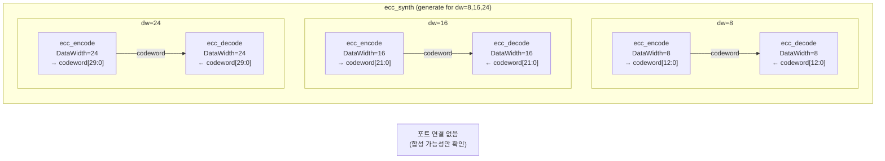

# ecc_synth.sv

## 개요

`ecc_synth`는 ECC(Error Correcting Code) 인코더/디코더 모듈의 합성 가능성(synthesizability)을 검증하기 위한 합성 테스트 모듈입니다. 동작 시뮬레이션 테스트벤치가 아니라, 다양한 데이터 폭(`DataWidth`)에 대해 `ecc_encode`와 `ecc_decode`를 인스턴스화하여 합성 도구가 각 구성에서 오류 없이 합성하는지 확인하는 목적으로 사용됩니다. `ecc_pkg::get_cw_width()` 함수를 통해 코드워드 폭을 자동으로 계산합니다.

## 테스트 구조 다이어그램

## 테스트 시나리오

### 1. 다중 DataWidth 합성 테스트
- `genvar dw`를 8, 16, 24 (8씩 증가, 32 미만) 세 가지 데이터 폭에 대해 반복합니다.
- 각 데이터 폭에 대해 `ecc_encode`와 `ecc_decode` 인스턴스를 쌍으로 생성합니다.
- 코드워드 폭은 `ecc_pkg::get_cw_width(dw) + 1` 비트로 자동 계산됩니다 (코드워드 + 패리티 비트 1개 추가).

### 2. 인코더-디코더 직결 연결
- `ecc_encode`의 출력(`data_o` = 코드워드)을 `ecc_decode`의 입력(`data_i`)에 직접 연결합니다.
- 모든 입력 포트(`data_i`는 인코더, 디코더 출력 포트들)는 의도적으로 미연결 상태입니다.
- 이 구조는 합성 도구가 ECC 모듈의 조합 논리를 올바르게 추론할 수 있는지 확인합니다.

### 3. 합성 도구 검증 항목
- 각 DataWidth에서 인코더/디코더 로직이 합성 오류 없이 처리되는지 확인합니다.
- `ecc_pkg::get_cw_width()` 파라미터 함수가 합성 시간에 올바른 폭을 계산하는지 확인합니다.
- 비트 폭 계산 및 포트 연결의 타입 일치 여부를 암묵적으로 검증합니다.

## 포트/파라미터

이 모듈은 최상위 포트가 없는 합성 전용 모듈입니다.

### 내부 인스턴스 파라미터

| 파라미터 | 적용 대상 | 값 (generate 반복) | 설명 |
|---------|---------|-------------------|------|
| `DataWidth` | `ecc_encode`, `ecc_decode` | 8, 16, 24 | 데이터 폭 (비트) |

### 코드워드 폭 계산

| DataWidth | codeword 비트 폭 | 비고 |
|-----------|----------------|------|
| 8 | `ecc_pkg::get_cw_width(8) + 1` | 약 13비트 (Hamming + 추가 패리티) |
| 16 | `ecc_pkg::get_cw_width(16) + 1` | 약 22비트 |
| 24 | `ecc_pkg::get_cw_width(24) + 1` | 약 30비트 |

### `ecc_decode` 출력 포트 (미연결)

| 포트 | 설명 |
|------|------|
| `data_o` | 디코딩된 데이터 |
| `parity_error_o` | 전체 패리티 오류 플래그 |
| `syndrome_o` | 오류 위치 신드롬 |
| `single_error_o` | 단일 비트 오류 감지 |
| `double_error_o` | 이중 비트 오류 감지 |

## 의존성

| 모듈/패키지 | 설명 |
|------------|------|
| `ecc_encode` | ECC 인코더 (SECDED Hamming 코드) |
| `ecc_decode` | ECC 디코더 (SECDED Hamming 코드) |
| `ecc_pkg` | ECC 관련 파라미터 및 함수 패키지 (`get_cw_width`) |
