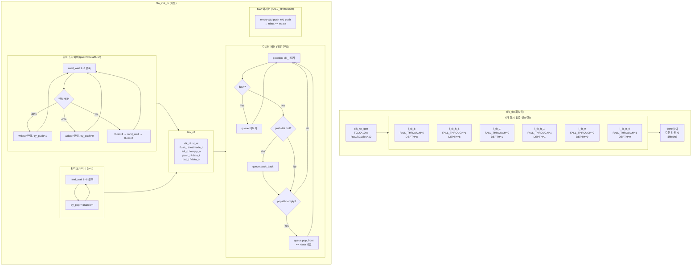

# fifo_tb.sv

## 개요

`fifo_tb`는 범용 FIFO 모듈 `fifo_v3`를 검증하는 테스트벤치입니다. 두 개의 계층 구조로 구성되어 있으며, `fifo_inst_tb`는 단일 FIFO 구성(fall-through 여부, 깊이)을 검증하는 서브 테스트벤치이고, `fifo_tb`는 6가지 서로 다른 FIFO 구성을 동시에 검증하는 최상위 모듈입니다. 입력 드라이버, 출력 드라이버, 참조 모델(큐 기반) 모니터가 독립적으로 동작하며 데이터 정확성을 검증합니다.

## 테스트 구조 다이어그램

## 테스트 시나리오

### 1. 6가지 FIFO 구성 동시 검증
`fifo_tb`는 다음 6개의 `fifo_inst_tb` 인스턴스를 동시에 실행합니다:

| 인스턴스 | FALL_THROUGH | DEPTH | 설명 |
|---------|-------------|-------|------|
| `i_tb_8` | 0 | 8 | 일반 FIFO, 깊이 8 |
| `i_tb_ft_8` | 1 | 8 | Fall-through FIFO, 깊이 8 |
| `i_tb_1` | 0 | 1 | 일반 FIFO, 깊이 1 (최소) |
| `i_tb_ft_1` | 1 | 1 | Fall-through FIFO, 깊이 1 |
| `i_tb_9` | 0 | 9 | 일반 FIFO, 깊이 9 |
| `i_tb_ft_9` | 1 | 9 | Fall-through FIFO, 깊이 9 |

모든 인스턴스의 `done_o`가 High가 되면 `$finish()`로 시뮬레이션을 종료합니다.

### 2. 랜덤 입력 드라이버
- 매 1~8 클록(`rand_wait`) 대기 후 다음 액션 중 하나를 랜덤하게 선택합니다:
  - **40% 확률**: 랜덤 데이터와 `try_push=1` 어서트 (FIFO가 full이 아니면 실제 push)
  - **40% 확률**: 랜덤 데이터 변경만 (push 없음)
  - **2% 확률**: `flush=1`을 1~8 클록 동안 유지 후 해제
- 실제 `push = try_push & ~full` 조건으로 결정됩니다.

### 3. 랜덤 출력 드라이버
- 매 1~8 클록 대기 후 `try_pop`을 랜덤하게 설정합니다.
- 실제 `pop = try_pop & ~empty` 조건으로 결정됩니다.

### 4. 참조 모델 기반 데이터 검증
- SystemVerilog `queue[$]`를 참조 모델로 사용합니다.
- 매 클록 상승 에지에서 TT 시간 후(신호 안정화 후):
  - `flush`가 활성화되면 참조 큐를 비웁니다.
  - `push && !full`이면 `wdata`를 참조 큐에 추가합니다.
  - `pop && !empty`이면 참조 큐에서 데이터를 꺼내 `rdata`와 비교합니다.
  - 불일치 시 `$error`를 출력합니다.

### 5. Fall-through 모드 검증 (SVA, Verilator 제외)
- FIFO가 비어 있고 push가 없었다가 다음 사이클에 push가 발생할 때, 출력(`rdata`)이 즉시 입력(`wdata`)과 같아야 합니다.
- `empty && !push ##1 push |-> rdata == wdata` 프로퍼티로 검증합니다.

### 6. 테스트 종료 조건
- `n_checks >= N_CHECKS`(기본값 100,000회 pop 검증) 달성 시 `done_o = 1`을 설정합니다.

## 포트/파라미터

### `fifo_tb` 파라미터

| 파라미터 | 타입 | 기본값 | 설명 |
|---------|------|--------|------|
| `N_CHECKS` | `int unsigned` | `100000` | 인스턴스당 검증 횟수 |
| `TCLK` | `time` | `10ns` | 클록 주기 |
| `TA` | `time` | `TCLK * 1/4` | 신호 인가 지연 |
| `TT` | `time` | `TCLK * 3/4` | 신호 획득 시간 |

### `fifo_inst_tb` 파라미터

| 파라미터 | 타입 | 기본값 | 설명 |
|---------|------|--------|------|
| `FALL_THROUGH` | `bit` | - | Fall-through 모드 활성화 여부 |
| `DEPTH` | `int unsigned` | - | FIFO 깊이 (엔트리 수) |
| `DATA_WIDTH` | `int unsigned` | `8` | 데이터 비트 폭 |
| `N_CHECKS` | `int unsigned` | - | 검증 횟수 |
| `TA` | `time` | - | 신호 인가 지연 |
| `TT` | `time` | - | 신호 획득 시간 |

## 의존성

| 모듈/패키지 | 설명 |
|------------|------|
| `fifo_v3` | 검증 대상 범용 FIFO 모듈 (DUT) |
| `clk_rst_gen` | 클록 및 리셋 생성기 |
| `rand_verif_pkg` | 랜덤 대기 함수 패키지 (`rand_wait`) |
