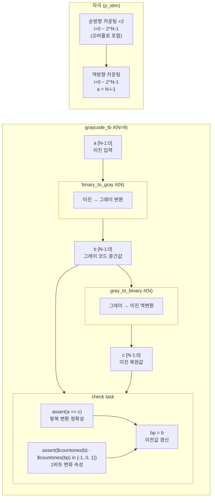

# graycode_tb.sv

## 개요

`graycode_tb`는 이진-그레이 코드 변환기(`binary_to_gray`)와 그레이-이진 코드 역변환기(`gray_to_binary`)를 함께 검증하는 테스트벤치입니다. 두 모듈을 직렬로 연결하여 이진 → 그레이 → 이진 변환 후 원래 값으로 복원되는지 확인하고, 그레이 코드의 핵심 속성인 인접 코드 간 1비트 변화(Hamming distance = 1) 특성을 자동으로 검증합니다. 클록이 없는 순수 조합 논리 테스트벤치입니다.

## 테스트 구조 다이어그램

## 테스트 시나리오

### 1. 순방향 카운팅 (2회 반복)
- `a`를 0부터 `2^N - 1`까지 순서대로 증가시킵니다.
- 각 값에서 #1 딜레이 후 `check()` 태스크를 호출합니다.
- 2회 반복하여 `2^N`에서 다시 0으로 오버플로우될 때도 그레이 코드 속성이 유지되는지 검증합니다 (순환 특성 확인).

### 2. 역방향 카운팅
- `a = N - i - 1`로 설정하여 내림차순 시퀀스를 생성합니다.
- 역방향에서도 이진-그레이 변환이 정확하게 동작하는지 확인합니다.

### 3. 왕복 변환 정합성 검증 (`check task`)
- **이진 왕복 변환**: `assert(a == c)` - 이진 → 그레이 → 이진 변환 후 원래 값과 동일한지 검사합니다.
- **단위 해밍 거리(Hamming distance) 검증**: `assert($signed($countones(b) - $countones(bp)) inside {-1, 0, 1})` - 연속된 두 그레이 코드 값 사이에 1비트 이하의 변화만 있는지 확인합니다.
- 검증 후 `bp = b`로 이전 그레이 코드 값을 갱신합니다.

## 포트/파라미터

| 파라미터 | 타입 | 기본값 | 설명 |
|---------|------|--------|------|
| `N` | `int` | `9` | 이진/그레이 코드 비트 폭 |

| 신호 | 설명 |
|------|------|
| `a [N-1:0]` | 이진 입력값 (테스트 자극) |
| `b [N-1:0]` | 그레이 코드 중간값 (`binary_to_gray` 출력) |
| `c [N-1:0]` | 이진 복원값 (`gray_to_binary` 출력) |
| `bp [N-1:0]` | 이전 클록의 그레이 코드 값 (Hamming distance 검사용) |

## 의존성

| 모듈 | 설명 |
|------|------|
| `binary_to_gray` | 이진 → 그레이 코드 변환기 (DUT) |
| `gray_to_binary` | 그레이 → 이진 코드 역변환기 (DUT) |
