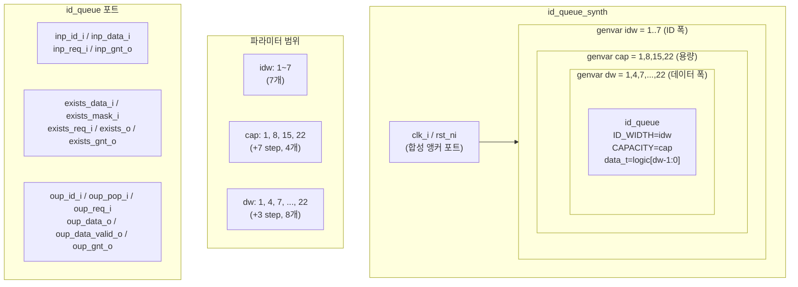

# id_queue_synth.sv

## 개요

`id_queue_synth`는 ID 기반 순서 큐 모듈 `id_queue`의 합성 가능성(synthesizability)을 검증하기 위한 합성 테스트 모듈입니다. 세 가지 파라미터(ID 폭, 용량, 데이터 폭)의 다양한 조합에 대해 `id_queue` 인스턴스를 생성하여 합성 도구가 모든 파라미터 조합에서 오류 없이 처리할 수 있는지 확인합니다. 총 7 × 4 × 8 = 224개의 인스턴스를 생성합니다.

## 테스트 구조 다이어그램

## 테스트 시나리오

### 1. 3중 generate 루프로 다양한 파라미터 조합 생성

다음 범위의 파라미터에 대해 모든 조합을 생성합니다:

| 파라미터 | 범위 | 간격 | 개수 |
|---------|------|------|------|
| `idw` (ID 폭) | 1 ~ 7 | 1 | 7개 |
| `cap` (용량) | 1 ~ 22 | 7 | 4개 (1, 8, 15, 22) |
| `dw` (데이터 폭) | 1 ~ 22 | 3 | 8개 (1, 4, 7, ..., 22) |

총 **224개**의 `id_queue` 인스턴스를 생성합니다.

### 2. 합성 도구 검증 항목
- 각 파라미터 조합에서 `id_queue` 모듈이 합성 오류 없이 처리되는지 확인합니다.
- `typedef logic [idw-1:0] id_t`와 `typedef logic [dw-1:0] data_t`의 타입 파라미터가 올바르게 전달되는지 확인합니다.
- 마스크 타입(`mask_t`)이 데이터 타입과 동일한 폭으로 처리되는지 확인합니다.
- 입력/출력/존재 검사 등 세 가지 포트 그룹이 모두 올바르게 연결되는지 검증합니다.

### 3. 포트 연결
- 모든 포트는 각 인스턴스 스코프 내에 선언된 로컬 신호에 연결됩니다.
- 신호들은 합성 도구에서 최적화될 수 있으나, 구조적 올바름을 확인하는 것이 목적입니다.

## 포트/파라미터

### 최상위 포트

| 포트 | 방향 | 설명 |
|------|------|------|
| `clk_i` | input | 시스템 클록 (합성 앵커) |
| `rst_ni` | input | 액티브-로우 리셋 (합성 앵커) |

### `id_queue` 인스턴스 파라미터

| 파라미터 | 범위 | 설명 |
|---------|------|------|
| `ID_WIDTH` | 1 ~ 7 | ID 비트 폭 |
| `CAPACITY` | 1, 8, 15, 22 | 큐 최대 엔트리 수 |
| `data_t` | `logic[1:0]` ~ `logic[22:0]` | 데이터 타입 |

### `id_queue` 포트 (각 인스턴스)

| 포트 | 설명 |
|------|------|
| `inp_id_i` | 삽입할 항목의 ID |
| `inp_data_i` | 삽입할 데이터 |
| `inp_req_i` | 삽입 요청 |
| `inp_gnt_o` | 삽입 허가 |
| `exists_data_i` | 존재 검사 데이터 |
| `exists_mask_i` | 존재 검사 마스크 |
| `exists_req_i` | 존재 검사 요청 |
| `exists_o` | 존재 검사 결과 |
| `exists_gnt_o` | 존재 검사 허가 |
| `oup_id_i` | 출력할 항목의 ID |
| `oup_pop_i` | 팝(pop) 활성화 |
| `oup_req_i` | 출력 요청 |
| `oup_data_o` | 출력 데이터 |
| `oup_data_valid_o` | 출력 데이터 유효 신호 |
| `oup_gnt_o` | 출력 허가 |

## 의존성

| 모듈 | 설명 |
|------|------|
| `id_queue` | ID 기반 순서 큐 (DUT, 224개 인스턴스) |
