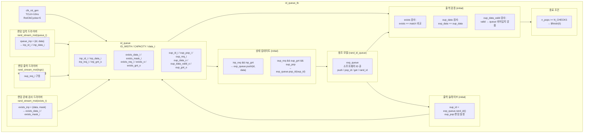

# id_queue_tb.sv

## 개요

`id_queue_tb`는 ID 기반 순서 큐 모듈 `id_queue`를 검증하는 테스트벤치입니다. `id_queue`는 여러 ID에 대해 독립적인 FIFO 순서를 유지하면서 ID별 데이터 삽입, 조회, 팝(pop)을 지원합니다. 테스트벤치는 `rand_stream_mst`를 이용한 랜덤 입력/출력/존재 검사 드라이버와, `rand_id_queue` 소프트웨어 참조 모델을 함께 사용하여 DUT의 동작 정확성을 검증합니다.

## 테스트 구조 다이어그램

## 테스트 시나리오

### 1. 랜덤 입력 드라이버
- `rand_stream_mst`를 사용하여 `queue_t` 구조체(`{id, data}`)를 랜덤 생성합니다.
- `INP_MIN_WAIT_CYCLES ~ INP_MAX_WAIT_CYCLES` 사이의 랜덤 대기 후 `inp_req_i`를 어서트합니다.
- `inp_gnt_o` 핸드셰이크 완료 시 `{inp_id, inp_data}`를 DUT에 전달합니다.

### 2. 랜덤 출력 드라이버
- `rand_stream_mst`를 사용하여 `oup_req_i` 신호를 랜덤하게 구동합니다.
- `OUP_MIN_WAIT_CYCLES ~ OUP_MAX_WAIT_CYCLES` 사이의 랜덤 대기를 삽입합니다.

### 3. 랜덤 존재 검사 드라이버
- `rand_stream_mst`를 사용하여 `exists_t` 구조체(`{data, mask}`)를 랜덤 생성합니다.
- `exists_req_i`와 함께 검사할 데이터 및 마스크를 전달합니다.

### 4. 참조 모델 상태 동기화
- `inp_req && inp_gnt` 발생 시: `exp_queue.push(inp_id, inp_data)`로 소프트웨어 참조 모델에 삽입합니다.
- `oup_req && oup_gnt && oup_pop` 발생 시: `exp_queue.pop_id(oup_id)`로 참조 모델에서 해당 ID 항목을 제거합니다.

### 5. 존재 검사 검증
- `exists_req && exists_gnt` 발생 후 TT 시간에 참조 모델의 모든 큐를 순회합니다.
- `(entry & mask) == (exists_data & mask)` 조건으로 매칭 여부를 확인합니다.
- DUT의 `exists_o` 출력과 참조 모델 결과가 일치하는지 `assert`로 검사합니다.

### 6. 출력 데이터 검증
- `oup_req && oup_gnt` 발생 후 TT 시간에 검사합니다.
- `oup_data_valid_o = 1`이면: `exp_queue.get(oup_id)`와 `oup_data`를 비교합니다.
- `oup_data_valid_o = 0`이면: `exp_queue.queues[oup_id].size() == 0`인지 확인합니다 (해당 ID에 데이터 없음이 맞는지 검증).

### 7. 출력 슬레이브 제어
- 참조 모델 큐가 비어있으면 `oup_pop = 0`을 유지합니다.
- 큐에 항목이 있으면 `exp_queue.rand_id()`로 랜덤 ID를 선택하고 `oup_pop`을 랜덤 설정합니다.

### 8. 테스트 종료
- `oup_req && oup_gnt && oup_pop && oup_data_valid` 조건의 성공적인 팝 횟수(`n_pops`)를 셉니다.
- `n_pops >= N_CHECKS` 달성 시 완료 메시지 출력 후 `$finish(0)`으로 종료합니다.

## 포트/파라미터

| 파라미터 | 타입 | 기본값 | 설명 |
|---------|------|--------|------|
| `ID_WIDTH` | `int` | `10` | ID 비트 폭 |
| `CAPACITY` | `int` | `30` | 큐 최대 엔트리 수 |
| `INP_MIN_WAIT_CYCLES` | `int unsigned` | `0` | 입력 최소 대기 사이클 |
| `INP_MAX_WAIT_CYCLES` | `int unsigned` | `40` | 입력 최대 대기 사이클 |
| `OUP_MIN_WAIT_CYCLES` | `int unsigned` | `0` | 출력/존재 최소 대기 사이클 |
| `OUP_MAX_WAIT_CYCLES` | `int unsigned` | `INP_MAX_WAIT_CYCLES/2` | 출력/존재 최대 대기 사이클 |
| `N_CHECKS` | `int unsigned` | `10000` | 성공적인 팝 검증 목표 횟수 |
| `VERBOSE` | `bit` | `1'b0` | 상세 로그 출력 여부 |
| `data_t` | `type` | `logic[3:0]` | 데이터 타입 |

| 신호 | 설명 |
|------|------|
| `clk` | 시스템 클록 |
| `rst_n` | 액티브-로우 리셋 |
| `inp_id` | 삽입 ID |
| `inp_data` | 삽입 데이터 |
| `inp_req` | 삽입 요청 |
| `inp_gnt` | 삽입 허가 |
| `exists_inp.data` | 존재 검사 데이터 |
| `exists_inp.mask` | 존재 검사 마스크 |
| `exists_req` | 존재 검사 요청 |
| `exists` | 존재 검사 결과 |
| `exists_gnt` | 존재 검사 허가 |
| `oup_id` | 출력 대상 ID |
| `oup_pop` | 팝 활성화 |
| `oup_req` | 출력 요청 |
| `oup_data` | 출력 데이터 |
| `oup_data_valid` | 출력 데이터 유효 |
| `oup_gnt` | 출력 허가 |

## 의존성

| 모듈/패키지 | 설명 |
|------------|------|
| `id_queue` | ID 기반 순서 큐 (DUT) |
| `clk_rst_gen` | 클록 및 리셋 생성기 |
| `rand_stream_mst` | 랜덤 스트림 마스터 드라이버 |
| `rand_id_queue_pkg` | 소프트웨어 참조 ID 큐 패키지 (`rand_id_queue`) |
