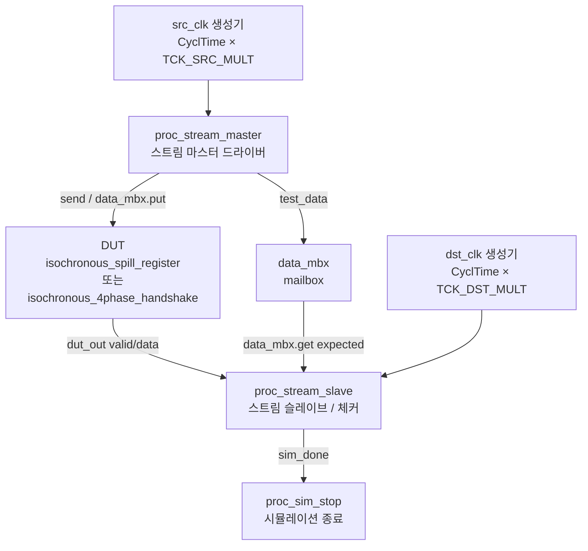

# 등시성 크로싱 테스트벤치 (`isochronous_crossing_tb.sv`)

## 개요

이 테스트벤치는 두 가지 등시성(isochronous) 크로싱 모듈을 검증한다.

- `isochronous_spill_register`: 소스 클록 도메인에서 목적지 클록 도메인으로 데이터를 전달하는 스필 레지스터
- `isochronous_4phase_handshake`: 4-위상 핸드셰이크 방식으로 크로싱을 수행하는 모듈

두 모듈 모두 서로 다른 주파수를 가지는 두 클록 도메인 사이에서 데이터를 무손실로 전달하는 것이 목적이다. 파라미터 `DUT`로 검증 대상 모듈을 선택하고, `TCK_SRC_MULT` 및 `TCK_DST_MULT`로 소스/목적지 클록의 배율을 조합하여 다양한 주파수 비율을 시험한다.

컴파일 시 `-timescale "1 ns / 1 ps"` 옵션이 반드시 필요하다.

## 테스트 구조 다이어그램



## 테스트 파라미터

| 파라미터명 | 기본값 | 설명 |
|-----------|--------|------|
| `NumReq` | `32'd10000` | 전송할 총 요청(패킷) 수 |
| `DUT` | `"spill_register"` | 검증 대상 선택: `"spill_register"` 또는 `"4phase_handshake"` |
| `TCK_SRC_MULT` | `2` | 최소 사이클 시간 대비 소스 클록 배율 (소스 클록 주기 = CyclTime × TCK_SRC_MULT) |
| `TCK_DST_MULT` | `6` | 최소 사이클 시간 대비 목적지 클록 배율 (목적지 클록 주기 = CyclTime × TCK_DST_MULT) |

기본 설정에서 소스 클록 주기는 `20 ns`, 목적지 클록 주기는 `60 ns`이며, 소스가 목적지보다 3배 빠르다.

### 주요 클록 비율 조합 예시

| `TCK_SRC_MULT` | `TCK_DST_MULT` | 소스 클록 주기 | 목적지 클록 주기 | 주파수 비율 (src:dst) |
|---|---|---|---|---|
| 1 | 1 | 10 ns | 10 ns | 1:1 |
| 2 | 6 | 20 ns | 60 ns | 3:1 (소스가 빠름) |
| 6 | 2 | 60 ns | 20 ns | 1:3 (목적지가 빠름) |
| 3 | 5 | 30 ns | 50 ns | 5:3 |

드라이버의 Application Time(TA)과 Test Time(TT)도 각 클록 주기에 맞게 자동 계산된다.

- 소스 드라이버: `TA = TCK_SRC_MULT × CyclTime × 0.2`, `TT = TCK_SRC_MULT × CyclTime × 0.8`
- 목적지 드라이버: `TA = TCK_DST_MULT × CyclTime × 0.2`, `TT = TCK_DST_MULT × CyclTime × 0.8`

## 테스트 시나리오

### 1. 리셋 초기화 (`src_rst_n`, `dst_rst_n`)

소스 클록 기준 10 사이클(posedge 기준) 동안 리셋 신호를 어서트한 후 해제한다. 두 리셋은 동일한 소스 클록을 기준으로 생성되므로 동시에 해제된다.

### 2. 스트림 마스터 (`proc_stream_master`)

리셋 해제 후 5 사이클 대기한 뒤, `NumReq`번 반복하여 다음 동작을 수행한다.

- `$urandom()`으로 16비트 랜덤 페이로드(`payload_t`) 생성
- `$urandom_range(0, 5)` 사이클 랜덤 스톨(backpressure 시뮬레이션)
- `in_driver.send(test_data)`로 DUT 입력으로 전송
- `data_mbx.put(test_data)`로 예측 데이터를 메일박스에 저장

### 3. 스트림 슬레이브 / 검증 (`proc_stream_slave`)

리셋 해제 후 5 사이클 대기한 뒤, `NumReq`번 반복하여 다음 동작을 수행한다.

- `$urandom_range(0, 5)` 사이클 랜덤 스톨(ready 지연 시뮬레이션)
- `out_driver.recv(actual)`로 DUT 출력 수신
- `data_mbx.get(expected)`로 기대 데이터 취득
- 수신 데이터와 기대 데이터 비교 검증
- 모든 요청 처리 후 50 사이클 대기 후 `sim_done` 어서트

### 4. 핸드셰이크 카운터 검증

`handshake_mst`(마스터 전송 횟수)와 `handshake_slv`(슬레이브 수신 횟수)가 `NumReq`로 동일한지 최종 확인한다.

### 5. `4phase_handshake` 특이사항

데이터 경로가 별도로 없으므로 `always_ff`를 사용하여 핸드셰이크 완료 시 소스 데이터를 목적지 데이터 레지스터로 직접 복사하는 로직을 테스트벤치 내에 구현한다.

## 검증 방법

| 검증 항목 | 방법 |
|---------|------|
| 데이터 정합성 | `assert(expected === actual)`: 메일박스에서 꺼낸 기대값과 DUT 출력값을 `===` 연산자로 비교 |
| 핸드셰이크 횟수 | `assert(handshake_mst == handshake_slv)`: 마스터 전송 횟수와 슬레이브 수신 횟수 일치 확인 |
| 순서 보장 | mailbox(`data_mbx`)가 FIFO 방식으로 동작하므로 데이터 순서 자동 검증 |

오류 발생 시 `$error`를 통해 기대값과 실제값을 16진수로 출력한다.

## 실행 방법

### QuestaSim

```bash
# spill_register 검증 (기본, 소스 2x / 목적지 6x)
vlog -timescale "1 ns / 1 ps" stream_test.sv isochronous_crossing_tb.sv
vsim -GNumReq=10000 -GDUT=spill_register -GTCK_SRC_MULT=2 -GTCK_DST_MULT=6 \
     isochronous_crossing_tb

# 4-위상 핸드셰이크 검증
vsim -GDUT=4phase_handshake -GTCK_SRC_MULT=1 -GTCK_DST_MULT=3 \
     isochronous_crossing_tb

# 클록 비율 역전 (목적지가 더 빠른 경우)
vsim -GDUT=spill_register -GTCK_SRC_MULT=6 -GTCK_DST_MULT=2 \
     isochronous_crossing_tb
```

### Verilator

```bash
verilator --binary --timing -CFLAGS "-DVL_TIME_PRECISION_STR='\"1ps\"'" \
  -GTCK_SRC_MULT=2 -GTCK_DST_MULT=6 \
  stream_test.sv isochronous_crossing_tb.sv \
  -top isochronous_crossing_tb
./obj_dir/Visochronous_crossing_tb
```

> 주의: Verilator 사용 시 `fork/join` 구문 지원 여부를 확인하고, 타임스케일 설정을 컴파일 옵션으로 명시해야 한다.
