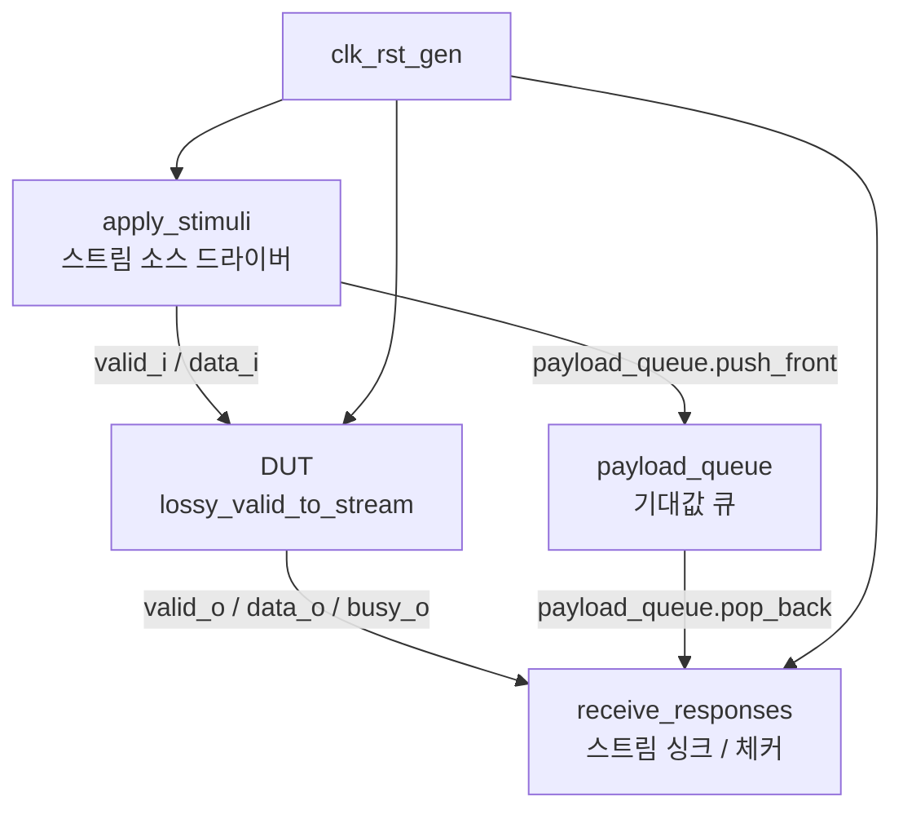

# 손실 허용 Valid-to-Stream 변환 테스트벤치 (`lossy_valid_to_stream_tb.sv`)

## 개요

이 테스트벤치는 `lossy_valid_to_stream` 모듈을 검증한다.

`lossy_valid_to_stream`은 단순한 valid 신호를 AXI4-Stream(valid/ready 핸드셰이크) 인터페이스로 변환하는 모듈이다. "손실 허용(lossy)"이라는 이름에서 알 수 있듯이, 다운스트림이 바쁜(busy) 상태에서 새로운 데이터가 도착하면 이전 데이터를 덮어쓴다. 테스트벤치는 이 덮어쓰기 동작이 올바르게 이루어지는지, 그리고 수신 측에서 받은 데이터가 항상 최신 전송 데이터와 일치하는지 검증한다.

## 테스트 구조 다이어그램



> `dut_in.ready`는 상수 `1'b1`로 고정되어 있어, 소스 드라이버는 항상 즉시 수용된다.

## 테스트 파라미터

| 파라미터명 | 기본값 | 설명 |
|-----------|--------|------|
| `NumReq` | `32'd10000` | 전송할 총 요청(패킷) 수 |
| `CyclTime` | `20ns` | 클록 주기 |

페이로드 타입은 `logic [$clog2(NumReq)-1:0]`으로 자동 결정된다. `NumReq = 10000`일 경우 14비트 페이로드가 사용된다.

## 테스트 시나리오

### 1. 초기화

`clk_rst_gen` 인스턴스가 `CyclTime` 주기 클록과 5 사이클 리셋을 자동 생성한다. 리셋 해제 후 스트림 소스와 싱크 드라이버가 각각 초기화된다.

### 2. 자극 인가 (`apply_stimuli`)

리셋 해제 후 `NumReq`번 반복하여 다음 동작을 수행한다.

- `$urandom_range(0, 5)` 사이클 랜덤 대기
- `stream_source.send(i)`로 순차 증가하는 정수 값 전송 (`i = 0 ... NumReq-1`)
- 기대값 큐 갱신:
  - `payload_queue.size() == 2`이고 `dut_out.ready`가 낮은 경우(DUT가 바쁜 상태): 큐의 첫 번째 항목(가장 오래된 대기 중인 값)을 현재 값으로 교체 → 손실 덮어쓰기 시뮬레이션
  - 그 외: `payload_queue.push_front(i)`로 최신 데이터를 큐 앞에 삽입

### 3. 응답 수신 및 검증 (`receive_responses`)

리셋 해제 후 무한 루프로 다음 동작을 수행한다.

- `$urandom_range(0, 5)` 사이클 랜덤 대기 (backpressure 시뮬레이션)
- `stream_sink.recv(data)`로 DUT 출력 수신
- 수신된 데이터와 `payload_queue.pop_back()`으로 꺼낸 기대값 비교
- 큐가 비어 있는 상태에서 수신 발생 시 오류 출력

### 손실 동작 상세

DUT 내부에서는 최대 2개의 항목을 버퍼링할 수 있으며, 버퍼가 가득 찬 상태(`busy_o = 1`)에서 새 데이터가 도착하면 오래된 항목이 최신 데이터로 교체된다. 테스트벤치의 `payload_queue`는 이 덮어쓰기 로직을 소프트웨어 참조 모델로 구현하여 DUT 동작의 정확성을 비교 검증한다.

## 검증 방법

| 검증 항목 | 방법 |
|---------|------|
| 수신 데이터 정합성 | `assert(data == expected_data)`: 수신 데이터와 참조 모델 큐의 값 비교 |
| 유효하지 않은 수신 방지 | `assert(payload_queue.size() > 0)`: 전송 없이 수신이 발생하는 경우 오류 출력 |

오류 발생 시 `$error`를 통해 수신된 값과 기대값을 10진수로 출력한다.

## 실행 방법

### QuestaSim

```bash
vlog stream_test.sv lossy_valid_to_stream_tb.sv
vsim -GNumReq=10000 -GCyclTime=20ns lossy_valid_to_stream_tb
run -all
```

### Verilator

```bash
verilator --binary --timing \
  stream_test.sv lossy_valid_to_stream_tb.sv \
  -top lossy_valid_to_stream_tb
./obj_dir/Vlossy_valid_to_stream_tb
```
