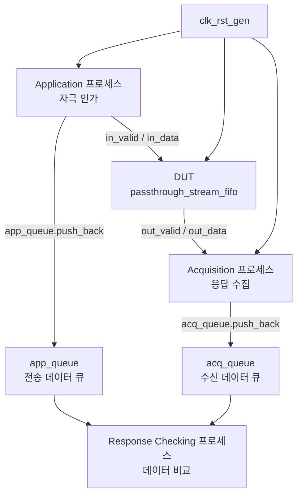

# 패스스루 스트림 FIFO 테스트벤치 (`passthrough_stream_fifo_tb.sv`)

## 개요

이 테스트벤치는 `passthrough_stream_fifo` 모듈의 기본 동작을 검증한다.

`passthrough_stream_fifo`는 일반 스트림 FIFO와 달리, FIFO가 비어 있을 때 입력 데이터가 출력으로 즉시 통과(패스스루)될 수 있는 기능을 가진다. `SameCycleRW` 파라미터로 동일 사이클에 읽기와 쓰기가 동시에 가능한지 여부를 제어한다. 테스트벤치는 세 개의 병렬 프로세스(자극 인가, 응답 수집, 응답 검증)로 구성되며, 두 개의 독립 큐를 통해 순서 보존 및 데이터 정합성을 확인한다.

## 테스트 구조 다이어그램



## 테스트 파라미터

| 파라미터명 | 기본값 | 설명 |
|-----------|--------|------|
| `TCK` | `10` | 클록 주기 (단위: ns, `timescale 1ns/1ns` 기준) |
| `DataWidth` | `8` | 데이터 비트 폭 |
| `Depth` | `10` | FIFO 깊이 (최대 저장 가능 항목 수) |
| `NumStims` | `1000` | 총 자극 수 |
| `WriteProbability` | `10` | 쓰기 확률 제어값 (`$urandom_range(0, WriteProbability) == 0`이면 유효) |
| `ReadProbability` | `10` | 읽기 확률 제어값 (`$urandom_range(0, ReadProbability) == 0`이면 유효) |
| `SameCycleRW` | `1'b1` | `1`: 동일 사이클 읽기/쓰기 허용, `0`: 비허용 |

쓰기 확률은 약 `1 / (WriteProbability + 1)`, 읽기 확률은 약 `1 / (ReadProbability + 1)`이다. 기본값에서 각 11분의 1 확률로 이벤트가 발생한다.

## 테스트 시나리오

### 1. 초기화

`clk_rst_gen`이 `TCK` 주기의 클록과 1 사이클 리셋을 생성한다. 리셋 해제(`rst_n` 상승) 후 모든 프로세스가 활성화된다.

DUT는 `flush_i = 1'b0`, `testmode_i = 1'b0`으로 고정하여 정상 동작 모드로만 테스트한다.

DUT 입력 연결 방식:
- `data_i`: `(in_valid && in_ready) ? in_data : 'x` — 핸드셰이크가 성립될 때만 유효 데이터 전달
- `valid_i`: `in_valid && in_ready` — 실제 수용된 경우에만 valid 어서트
- `ready_i`: `out_ready && out_valid` — 출력 측이 유효하고 준비된 경우에만 read

### 2. 자극 인가 (Application 프로세스)

`NumStims`번 반복하여 다음 동작을 수행한다.

- 클록 하강 에지에서 `$urandom_range(0, WriteProbability) == 0`이면 `in_valid` 어서트, 아니면 디어서트
- `in_data`를 `$urandom()`으로 랜덤 설정
- 다음 클록 상승 에지에서 핸드셰이크 성공(`in_valid && in_ready`) 여부 확인
- 핸드셰이크 성공 시 `app_queue`에 전송 데이터 기록 및 카운터 증가

### 3. 응답 수집 (Acquisition 프로세스)

무한 루프로 다음 동작을 수행한다.

- 클록 하강 에지에서 `$urandom_range(0, ReadProbability) == 0`이면 `out_ready` 어서트
- 다음 클록 상승 에지에서 핸드셰이크 성공(`out_valid && out_ready`) 여부 확인
- 핸드셰이크 성공 시 `acq_queue`에 수신 데이터 기록 및 카운터 증가

### 4. 응답 검증 (Response Checking 프로세스)

`app_queue`와 `acq_queue` 양쪽에 데이터가 있을 때마다 각각 하나씩 꺼내 비교한다.

- `acquired_stims < NumStims` 또는 `applied_stims < NumStims`인 동안 반복
- 양 큐 모두 비어 있지 않을 때 `app_queue.pop_front()`와 `acq_queue.pop_front()`를 비교
- 불일치 발생 시 `$display`로 오류 내용 출력 및 오류 카운터 증가
- 최종적으로 오류 수 출력 후 `$stop()`

## 검증 방법

| 검증 항목 | 방법 |
|---------|------|
| 데이터 순서 보존 | `app_queue`와 `acq_queue`를 FIFO 방식(`push_back` / `pop_front`)으로 운영하여 전송 순서 검증 |
| 데이터 정합성 | `app_data != acq_data` 비교, 불일치 시 오류 카운터 증가 및 `$display` 출력 |
| 최종 오류 요약 | 시뮬레이션 종료 직전 총 전송 수, 수신 수, 오류 수 출력 |

SystemVerilog `assert` 대신 명시적 `if` 비교와 `$display`를 사용하여 오류를 보고한다.

## 실행 방법

### QuestaSim

```bash
vlog -timescale "1ns/1ns" passthrough_stream_fifo_tb.sv
vsim -GTCK=10 -GDataWidth=8 -GDepth=10 -GNumStims=1000 \
     -GWriteProbability=10 -GReadProbability=10 -GSameCycleRW=1 \
     passthrough_stream_fifo_tb
run -all
```

### Verilator

```bash
verilator --binary --timing -GTCK=10 -GDataWidth=8 -GDepth=10 \
  -GNumStims=1000 -GSameCycleRW=1 \
  passthrough_stream_fifo_tb.sv \
  -top passthrough_stream_fifo_tb
./obj_dir/Vpassthrough_stream_fifo_tb
```

### SameCycleRW 비활성화 테스트

```bash
# QuestaSim
vsim -GSameCycleRW=0 passthrough_stream_fifo_tb
```
