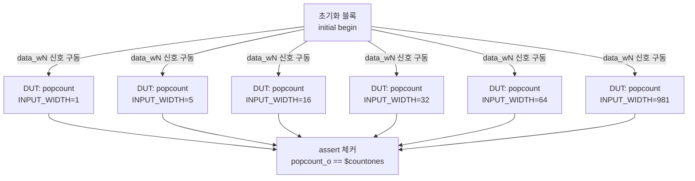

# 팝카운트 테스트벤치 (`popcount_tb.sv`)

## 개요

이 테스트벤치는 `popcount` 모듈의 여러 입력 비트 폭 인스턴스를 동시에 검증한다.

`popcount`는 입력 벡터에서 논리 '1'의 개수를 세는 조합 회로(팝카운트 또는 해밍 가중치 계산기)이다. 이 테스트벤치는 6가지 입력 폭(`INPUT_WIDTH` = 1, 5, 16, 32, 64, 981)의 DUT를 동시에 인스턴스화하고, 각각에 대해 경계값 및 무작위 입력을 인가하여 시스템 내장 함수 `$countones()`의 결과와 비교한다.

클록이나 리셋 없이 순수 조합 회로로 검증하며, `#5ns` 지연으로 입력 변화 후 출력이 안정될 시간을 준다.

## 테스트 구조 다이어그램



## 테스트 파라미터

테스트벤치 자체에는 파라미터가 없으며, 검증 대상 DUT 인스턴스의 입력/출력 폭은 아래와 같이 고정되어 있다.

| DUT 인스턴스명 | `INPUT_WIDTH` | 입력 신호 | 출력 신호 | 출력 비트 폭 |
|---|---|---|---|---|
| `i_popcount_w1` | 1 | `data_w1` (1비트) | `popcount_w1` | 1비트 |
| `i_popcount_w5` | 5 | `data_w5` (5비트) | `popcount_w5` | 4비트 (0~5) |
| `i_popcount_w16` | 16 | `data_w16` (16비트) | `popcount_w16` | 5비트 (0~16) |
| `i_popcount_w32` | 32 | `data_w32` (32비트) | `popcount_w32` | 6비트 (0~32) |
| `i_popcount_w64` | 64 | `data_w64` (64비트) | `popcount_w64` | 7비트 (0~64) |
| `i_popcount_w981` | 981 | `data_w981` (981비트) | `popcount_w981` | 11비트 (0~981) |

## 테스트 시나리오

각 입력 폭에 대해 동일한 구조로 테스트가 진행된다.

### 경계값 테스트 (5~16비트 이상 입력 폭)

입력 폭이 2비트 이상인 DUT에 대해 아래 3가지 경계값을 먼저 테스트한다.

| 테스트 벡터 | 의미 | 기대 출력 |
|---|---|---|
| `'0` (모두 0) | 모든 비트가 0 | 0 |
| `1` (LSB만 1) | 최하위 비트만 1 | 1 |
| `'1` (모두 1) | 모든 비트가 1 | `INPUT_WIDTH` |

### 무작위 테스트

각 DUT에 대해 100회 반복하여 무작위 입력을 인가한다.

- **QuestaSim / 표준 SV**: `randomize(data_wN)` 시스템 함수 사용
- **Verilator**: `$urandom()` 함수 사용 (64비트는 `{$urandom(), $urandom()}`, 981비트는 32비트 청크 반복 + 나머지 처리)

각 입력 인가 후 `#5ns` 지연 후 출력 확인.

### 입력 폭별 특이사항

- **1비트**: 경계값 테스트 없이 100회 무작위 테스트만 수행
- **64비트**: Verilator에서 두 개의 `$urandom()`을 연접하여 64비트 완전 무작위 값 생성
- **981비트**: Verilator에서 `for (j = 0; j < 31; j++) data_w981[j*32 +: 32] = $urandom()`로 960비트 채우고 나머지 `data_w981[980:960]`을 별도 처리

## 검증 방법

| 검증 항목 | 방법 |
|---------|------|
| 팝카운트 정확성 | `assert(popcount_wN == $countones(data_wN))`: 모든 입력에 대해 SystemVerilog 내장 함수와 비교 |
| 랜덤화 실패 감지 | `SV_RAND_CHECK` 매크로: `randomize()` 반환값이 0이면 `$display` 오류 출력 후 `$finish` |

`SV_RAND_CHECK` 매크로 정의:
```systemverilog
`define SV_RAND_CHECK(r) \
do begin \
  if (!(r)) begin \
    $display("%s:%0d: Randomization failed \"%s\"", `__FILE__, `__LINE__, `"r`"); \
    $finish;\
  end\
end while (0)
```

어서션 실패 시 `$error`를 통해 입력 벡터(`%b`)와 실제/기대 출력값을 출력한다.

## 실행 방법

### QuestaSim

```bash
vlog popcount_tb.sv
vsim popcount_tb
run -all
```

### Verilator

```bash
verilator --binary --timing -DVERILATOR \
  popcount_tb.sv \
  -top popcount_tb
./obj_dir/Vpopcount_tb
```

> Verilator에서는 `randomize()` 대신 `$urandom()` 경로가 `\`ifndef VERILATOR ... \`else`로 자동 선택된다.
