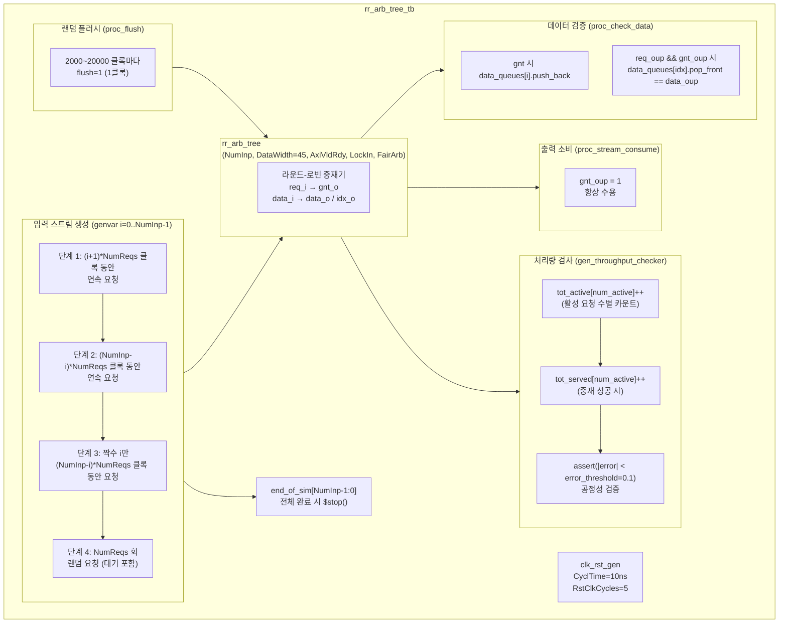

# rr_arb_tree_tb.sv

## 개요

`rr_arb_tree_tb`는 라운드-로빈 중재 트리 모듈 `rr_arb_tree`를 검증하는 테스트벤치입니다. 다수의 입력 스트림 요청을 공정하게 중재하는 동작을 검증하며, 특히 공정성(fairness) - 각 입력이 활성 요청 중 동등한 처리량을 얻는지 - 과 데이터 무결성을 정량적으로 측정합니다. 여러 단계의 고정 요청 패턴과 랜덤 요청 패턴을 조합하여 다양한 부하 조건을 테스트합니다.

## 테스트 구조 다이어그램

## 테스트 시나리오

### 1. 4단계 입력 스트림 패턴

각 입력 라인 `i`는 다음 4단계를 순서대로 실행합니다:

**단계 1 - 계단형 연속 요청:**
- 라인 `i`가 `(i+1) * NumReqs` 클록 동안 연속으로 요청을 유지합니다.
- 라인 번호에 비례한 요청 시간으로 중재 우선순위 편향을 테스트합니다.

**단계 2 - 역 계단형 연속 요청:**
- 모든 라인의 단계 1 완료를 기다린 후, `(NumInp - i) * NumReqs` 클록 동안 연속 요청합니다.
- 이전 단계와 반대 순서로 부하를 부여합니다.

**단계 3 - 짝수 라인 선택 요청:**
- 짝수 번호 라인(`i % 2 == 0`)만 `(NumInp - i) * NumReqs` 클록 동안 요청합니다.
- 홀수 라인이 없는 환경에서의 중재를 검증합니다.

**단계 4 - 랜덤 요청 패턴 (`NumReqs = 20000`회):**
- 랜덤 데이터(`data_t'` 45비트)로 요청합니다.
- `LockIn=1` 모드: `gnt_inp[i]`가 올 때까지 요청을 유지합니다.
- `LockIn=0` 모드: `1 ~ 2*NumInp` 클록 후 요청을 취소합니다.
- 중재 완료 후 `0 ~ NumInp` 클록의 랜덤 대기를 삽입합니다.

### 2. 출력 항상 수용
- `gnt_oup`을 항상 High로 유지하여 출력 측 백프레셔를 제거하고 최대 처리량으로 중재기를 테스트합니다.

### 3. 랜덤 플러시
- 2000~20000 클록마다 1클록 동안 `flush=1`을 어서트합니다.
- 플러시 후 중재기 상태가 올바르게 초기화되는지 확인합니다.

### 4. 처리량 공정성 검증 (`gen_throughput_checker`)
- 각 라인 `i`에 대해 동시에 활성화된 요청 수(`num_active`)별로 통계를 수집합니다:
  - `tot_active[num_active]`: `i`가 활성인 상태에서의 총 중재 기회
  - `tot_served[num_active]`: 그 중 `i`가 실제로 중재를 얻은 횟수
- 이상적인 처리량은 `1/num_active`이며, 측정값과의 오차가 `error_threshold = 0.1` 이내인지 `assert`로 검사합니다.
- `FairArb && LockIn`이 모두 활성화된 경우에만 공정성 어서션을 적용합니다.

### 5. 데이터 무결성 검증 (`proc_check_data`)
- 각 입력 라인별로 독립적인 `data_queues[i][$]`를 유지합니다.
- `req_inp[i] && gnt_inp[i]` 시 해당 라인의 큐에 전송 데이터를 저장합니다.
- `req_oup && gnt_oup` 시 `idx` (중재 결과 라인 번호)의 큐에서 데이터를 꺼내 `data_oup`과 비교합니다.
- 불일치 시 `assert`로 오류를 발생시킵니다.

### 6. 시뮬레이션 종료
- 모든 입력 라인의 `end_of_sim[i] = 1`이 되면 10 클록 대기 후 `$stop()`으로 종료합니다.

## 포트/파라미터

| 파라미터 | 타입 | 기본값 | 설명 |
|---------|------|--------|------|
| `NumInp` | `int unsigned` | `7` | 입력 스트림 수 |
| `NumReqs` | `int unsigned` | `20000` | 라인당 랜덤 요청 횟수 |
| `AxiVldRdy` | `bit` | `1'b1` | AXI valid/ready 핸드셰이크 모드 사용 여부 |
| `LockIn` | `bit` | `1'b1` | 요청 취소 금지 여부 (grant 전까지 유지) |
| `FairArb` | `bit` | `1'b1` | 공정 중재 활성화 여부 |
| `CyclTime` (localparam) | `time` | `10ns` | 클록 주기 |
| `ApplTime` (localparam) | `time` | `2ns` | 신호 인가 지연 |
| `TestTime` (localparam) | `time` | `8ns` | 신호 획득 시간 |
| `error_threshold` (localparam) | `real` | `0.1` | 처리량 공정성 허용 오차 |
| `DataWidth` (localparam) | `int unsigned` | `45` | 데이터 비트 폭 |

| 신호 | 설명 |
|------|------|
| `clk` | 시스템 클록 |
| `rst_n` | 액티브-로우 리셋 |
| `flush` | 중재기 플러시 |
| `req_inp [NumInp-1:0]` | 각 입력 라인의 요청 신호 |
| `gnt_inp [NumInp-1:0]` | 각 입력 라인에 대한 중재 허가 |
| `data_inp [NumInp-1:0]` | 각 입력 라인의 데이터 |
| `gnt_oup` | 출력 측 수용 신호 (항상 1) |
| `req_oup` | 출력 요청 신호 |
| `data_oup` | 중재된 출력 데이터 |
| `idx` | 중재된 입력 라인 인덱스 |
| `end_of_sim [NumInp-1:0]` | 각 라인의 시뮬레이션 완료 플래그 |

## 의존성

| 모듈 | 설명 |
|------|------|
| `rr_arb_tree` | 라운드-로빈 중재 트리 (DUT) |
| `clk_rst_gen` | 클록 및 리셋 생성기 |
