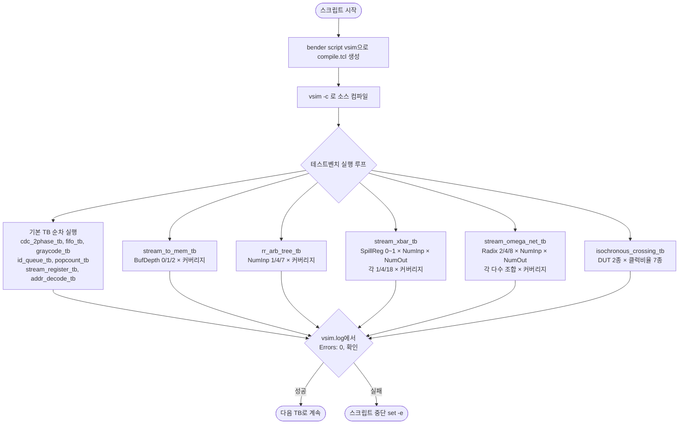

# simulate.sh

## 개요

QuestaSim(ModelSim) 기반의 통합 시뮬레이션 스크립트로, `common_cells` 저장소의 모든 테스트벤치를 순차적으로 실행하고 결과를 검증합니다. `bender` 도구를 사용하여 소스 목록을 자동 생성하고, 각 테스트벤치에 대해 다양한 파라미터 조합을 적용하여 커버리지까지 수집합니다.

## 실행 흐름 다이어그램



## 사용 방법

```bash
# 기본 실행 (VSIM 환경변수가 없으면 vsim 사용)
bash test/simulate.sh

# 특정 vsim 바이너리 지정
VSIM=/opt/questa/bin/vsim bash test/simulate.sh
```

## 주요 변수 / 설정

| 변수명 | 기본값 | 설명 |
|--------|--------|------|
| `VSIM` | `vsim` | QuestaSim 실행 파일 경로 |
| `compile.tcl` | (자동 생성) | bender가 생성하는 소스 목록 TCL |
| `vsim.log` | (자동 생성) | 각 TB 실행 시 출력 로그 |

## 실행 단계 상세 설명

### 1단계: 소스 목록 생성 및 컴파일

`bender script vsim -t test` 명령으로 `test` 태그가 붙은 소스 파일 목록을 `compile.tcl`로 생성하고, `vsim -c -quiet`로 전체 소스를 일괄 컴파일합니다.

### 2단계: `call_vsim` 함수

```bash
call_vsim <tb_name> [vsim_args...]
```

- `run -all` 명령을 vsim에 파이프로 전달하여 시뮬레이션을 실행합니다.
- 출력을 `vsim.log`에 저장하고, `grep "Errors: 0,"` 으로 오류 없음을 검증합니다.
- 오류 발생 시 `set -e` 에 의해 스크립트가 즉시 종료됩니다.

### 3단계: 기본 테스트벤치 실행

파라미터 없이 단순 실행하는 테스트벤치 목록입니다.

| 테스트벤치 | 설명 |
|-----------|------|
| `cdc_2phase_tb` | 2-phase CDC 핸드셰이크 검증 |
| `fifo_tb` | FIFO 기본 동작 검증 |
| `graycode_tb` | Gray 코드 변환 검증 |
| `id_queue_tb` | ID 큐 동작 검증 |
| `popcount_tb` | 팝카운트 연산 검증 |
| `stream_register_tb` | 스트림 레지스터 검증 |
| `addr_decode_tb` | 주소 디코더 검증 |

> 참고: `cdc_fifo_tb`는 현재 비활성화(broken) 상태입니다.

### 4단계: 파라미터 조합 테스트

**stream_to_mem_tb** — 버퍼 깊이 3종:

| 파라미터 | 값 |
|---------|-----|
| `BufDepth` | 0, 1, 2 |

**rr_arb_tree_tb** — 입력 수 3종:

| 파라미터 | 값 |
|---------|-----|
| `NumInp` | 1, 4, 7 |

**stream_xbar_tb** — 3중 중첩 루프 (총 18가지 조합):

| 파라미터 | 값 |
|---------|-----|
| `SpillReg` | 0, 1 |
| `NumInp` | 1, 4, 18 |
| `NumOut` | 1, 4, 18 |

**stream_omega_net_tb** — 3중 중첩 루프 (총 72가지 조합):

| 파라미터 | 값 |
|---------|-----|
| `DutRadix` | 2, 4, 8 |
| `DutNumInp` | 1, 2, 17, 64 |
| `DutNumOut` | 1, 2, 4, 16, 17, 64 |

**isochronous_crossing_tb** — DUT 2종 × 클럭비율 7종 (총 14가지 조합):

| 파라미터 | 값 |
|---------|-----|
| `DUT` | `spill_register`, `4phase_handshake` |
| `TCK_SRC_MULT:TCK_DST_MULT` | 1:1, 1:2, 2:1, 1:4, 5:1, 3:6, 8:4 |

## 지원 도구

| 도구 | 용도 |
|------|------|
| **QuestaSim / ModelSim** (`vsim`) | RTL 시뮬레이션 실행 |
| **bender** | 소스 파일 목록 및 컴파일 스크립트 자동 생성 |

- `vsim` 은 PATH에서 자동 탐색되며, `VSIM` 환경변수로 경로를 명시할 수 있습니다.
- `bender`는 프로젝트 루트에서 실행 가능해야 합니다(`Bender.yml` 필요).
