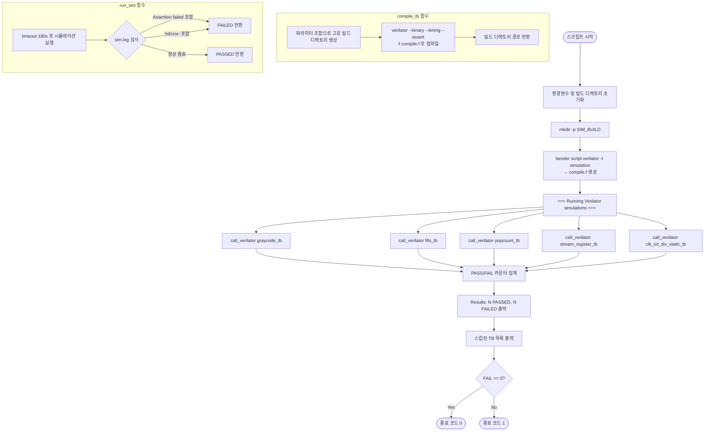

# simulate_verilator.sh

## 개요

Verilator 기반의 시뮬레이션 스크립트로, `simulate.sh`(QuestaSim)와 동일한 목적을 수행하되 오픈소스 시뮬레이터인 Verilator를 사용합니다. Verilator의 구조적 제약으로 인해 일부 테스트벤치는 지원되지 않으며, 지원 가능한 테스트벤치만 선별하여 실행합니다. 각 테스트벤치를 개별 바이너리로 컴파일한 뒤 실행하며, 최종적으로 PASSED/FAILED 요약 결과를 출력합니다.

## 실행 흐름 다이어그램



## 사용 방법

```bash
# 기본 실행 (빌드 디렉토리: sim_build_verilator)
bash test/simulate_verilator.sh

# 빌드 디렉토리 지정
bash test/simulate_verilator.sh /tmp/my_build

# 특정 Verilator 바이너리 지정
VERILATOR=/opt/verilator/bin/verilator bash test/simulate_verilator.sh
```

## 주요 변수 / 설정

| 변수명 | 기본값 | 설명 |
|--------|--------|------|
| `VERILATOR` | `verilator` | Verilator 실행 파일 경로 (환경변수로 재정의 가능) |
| `SIM_BUILD` | `sim_build_verilator` | 컴파일 결과물이 저장될 최상위 빌드 디렉토리 |
| `VLT_FLAGS` | `--binary --timing --assert -DVERILATOR` | Verilator 기본 컴파일 플래그 |
| `VLT_WARN` | `--Wno-WIDTHTRUNC` 등 | 불필요한 경고 억제 플래그 모음 |
| `SIM_TIMEOUT` | `180` | 시뮬레이션 타임아웃 (초) |
| `PASS` | `0` | 성공한 테스트 수 카운터 |
| `FAIL` | `0` | 실패한 테스트 수 카운터 |

### VLT_FLAGS 상세

| 플래그 | 설명 |
|--------|------|
| `--binary` | 실행 가능한 시뮬레이션 바이너리 직접 생성 |
| `--timing` | SystemVerilog 타이밍 제어(`#delay`, `@event`) 지원 |
| `--assert` | `$assert` 및 SVA 어서션 활성화 |
| `-DVERILATOR` | Verilator 전용 코드 분기를 위한 매크로 정의 |

### VLT_WARN 상세 (억제 경고 목록)

| 플래그 | 억제 대상 경고 |
|--------|---------------|
| `--Wno-WIDTHTRUNC` | 비트 폭 축소 경고 |
| `--Wno-WIDTHEXPAND` | 비트 폭 확장 경고 |
| `--Wno-TIMESCALEMOD` | 타임스케일 모듈 불일치 경고 |
| `--Wno-CASEINCOMPLETE` | case 문 불완전 경고 |
| `--Wno-CONSTRAINTIGN` | 제약 무시 경고 |
| `--Wno-INITIALDLY` | initial 블록 지연 경고 |
| `-Wno-fatal` | 경고를 치명적 오류로 처리하지 않음 |

## 실행 단계 상세 설명

### 1단계: 초기화

`SIM_BUILD` 디렉토리를 생성하고, `bender script verilator -t simulation` 명령으로 `-f` 방식의 소스 파일 목록(`compile.f`)을 생성합니다.

### 2단계: `compile_tb` 함수

파라미터 조합별로 고유한 빌드 디렉토리를 생성합니다. 예를 들어 `-GNumInp=4` 파라미터가 있으면 `{tb}_NumInp-4` 형태의 디렉토리가 만들어집니다. Verilator로 해당 테스트벤치를 컴파일하며, 결과 바이너리는 `V{tb_name}` 형태로 생성됩니다.

### 3단계: `run_sim` 함수

`timeout` 명령으로 180초 제한 내에 시뮬레이션 바이너리를 실행합니다. 종료 후 `sim.log`에서 아래 패턴을 검사합니다.

- `Assertion failed` 포함 시 → FAILED
- `%Error:` 포함 시 (단, `$stop` 제외) → FAILED
- 위 패턴 없을 시 → PASSED

`$finish`(종료 코드 0)와 `$stop`(SIGABRT, 종료 코드 134) 모두 정상 종료로 처리됩니다.

### 4단계: `call_verilator` 함수

`compile_tb`와 `run_sim`을 순서대로 호출하고, 55자 폭으로 정렬된 레이블과 함께 결과(`COMPILE FAILED` / `PASSED` / `FAILED`)를 출력합니다. PASS/FAIL 카운터를 갱신합니다.

## 지원 테스트벤치 목록

| 테스트벤치 | 분류 | 비고 |
|-----------|------|------|
| `graycode_tb` | 지원 | 순수 조합 논리, 타이밍 단순 |
| `fifo_tb` | 지원 | 기본 FIFO 동작 검증 |
| `popcount_tb` | 지원 | `VERILATOR` 매크로 하에 `$urandom()` 사용 |
| `stream_register_tb` | 지원 | Verilator 5.x의 clocking block 지원 활용 |
| `clk_int_div_static_tb` | 지원 | `$info`/`$stop` 기반 자체 검사 |

## 미지원 테스트벤치 목록

| 테스트벤치 | 미지원 이유 |
|-----------|------------|
| `cdc_2phase_tb` | `mailbox` 타입 미지원 |
| `cdc_fifo_tb` | `mailbox` 타입 미지원 |
| `id_queue_tb` | `rand_stream_mst.sv`의 클래스 내 `randomize()` 미지원 |
| `addr_decode_tb` | Verilator C++ 코드 생성 버그 (named assertion pass-action) |
| `stream_to_mem_tb` | `initial` 블록 내 딜레이 있는 비차단 대입 동작 차이 (INITIALDLY) |
| `rr_arb_tree_tb` | 스케줄링 차이로 인한 타이밍 민감 어서션 실패 |
| `stream_xbar_tb` | `stream_test` 패키지의 virtual interface 미지원 |
| `stream_omega_net_tb` | `stream_test` 패키지의 virtual interface 미지원 |
| `isochronous_crossing_tb` | `stream_test` 패키지의 virtual interface 미지원 |
| `cb_filter_tb` | 제약 조건이 있는 `randomize()` 미지원 |

## 지원 도구

| 도구 | 용도 |
|------|------|
| **Verilator** (5.x 권장) | SystemVerilog → C++ 변환 및 바이너리 컴파일/실행 |
| **bender** | 소스 파일 목록(`compile.f`) 자동 생성 |
| **timeout** (GNU coreutils) | 시뮬레이션 최대 실행 시간 제한 |

- Verilator 5.x 이상을 권장합니다 (clocking block 지원).
- `bender`는 프로젝트 루트에서 실행 가능해야 합니다(`Bender.yml` 필요).
