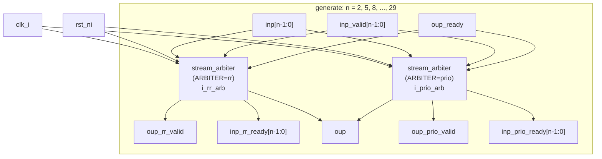

# stream_arbiter_synth.sv

## 개요

`stream_arbiter_synth`는 `stream_arbiter` 모듈의 합성 가능성(synthesizability)을 검증하기 위한 합성 벤치마크 모듈입니다. 다양한 입력 포트 수(`N_INP`)에 대해 라운드 로빈(round-robin) 방식과 우선순위(priority) 방식의 스트림 중재기를 동시에 인스턴스화하여, 합성 도구가 이들 구성을 올바르게 처리할 수 있는지 확인합니다.

`generate` 문을 사용하여 `N_INP`를 2부터 31까지 3씩 증가시키며 반복 인스턴스화하므로, 한 번의 합성으로 여러 크기의 중재기를 검증할 수 있습니다.

## 다이어그램



## 상세 내용

### 모듈 파라미터 및 포트

| 포트 | 방향 | 설명 |
|------|------|------|
| `clk_i` | input | 클럭 신호 |
| `rst_ni` | input | 액티브 로우 리셋 신호 |

### generate 블록 (`gen_n_inp`)

`for (genvar n = 2; n < 32; n += 3)` 반복문으로 다음 입력 크기에 대해 인스턴스를 생성합니다:

- n = 2, 5, 8, 11, 14, 17, 20, 23, 26, 29 (총 10가지 크기)

각 반복에서 선언되는 내부 신호:

| 신호 | 비트폭 | 설명 |
|------|--------|------|
| `inp` | `data_t [n-1:0]` | 입력 데이터 배열 |
| `inp_valid` | `logic [n-1:0]` | 입력 유효 신호 배열 |
| `inp_rr_ready` | `logic [n-1:0]` | RR 중재기 입력 준비 신호 |
| `inp_prio_ready` | `logic [n-1:0]` | 우선순위 중재기 입력 준비 신호 |
| `oup` | `data_t` | 출력 데이터 (공용) |
| `oup_rr_valid` | `logic` | RR 중재기 출력 유효 신호 |
| `oup_prio_valid` | `logic` | 우선순위 중재기 출력 유효 신호 |
| `oup_ready` | `logic` | 출력 준비 신호 (공용) |

### 인스턴스화된 모듈

#### `i_rr_arb` - 라운드 로빈 중재기

```
stream_arbiter #(
    .DATA_T  (data_t),
    .N_INP   (n),
    .ARBITER ("rr")
)
```

라운드 로빈 방식으로 여러 입력 스트림 중 하나를 선택합니다. 각 입력에게 공평하게 기회를 부여합니다.

#### `i_prio_arb` - 우선순위 중재기

```
stream_arbiter #(
    .DATA_T  (data_t),
    .N_INP   (n),
    .ARBITER ("prio")
)
```

우선순위 방식으로 입력 스트림을 선택합니다. 낮은 인덱스의 입력이 높은 우선순위를 가집니다.

### 데이터 타입

- `data_t`: `logic` (1비트 논리형) - 합성 검증이 목적이므로 최소 폭 사용

## 의존성 및 관계

| 항목 | 설명 |
|------|------|
| **의존 모듈** | `stream_arbiter` - 실제 검증 대상 모듈 |
| **상위 모듈** | `synth_bench.sv` - 이 모듈을 `i_stream_arbiter`로 인스턴스화함 |
| **라이선스** | Solderpad Hardware License v0.51 (ETH Zurich / University of Bologna) |

이 모듈은 독립적으로 실행 가능한 테스트벤치가 아니라, 합성 툴 플로우에서 합성 가능성 검증 목적으로 사용됩니다. 실제 기능 검증은 별도의 시뮬레이션 테스트벤치에서 수행합니다.
