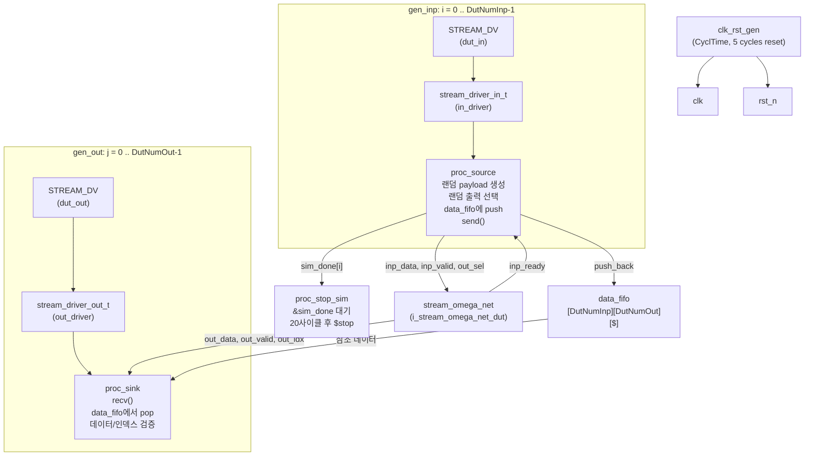

# stream_omega_net_tb.sv

## 개요

`stream_omega_net_tb`는 `stream_omega_net` 모듈(오메가 네트워크 기반 스트림 크로스바)에 대한 기능 검증 테스트벤치입니다. 다수의 입력 포트에서 임의의 출력 포트로 스트림 패킷을 전송하고, 수신 측에서 순서 및 데이터 일치 여부를 검증합니다.

`stream_test::stream_driver` 클래스를 사용하여 각 입력/출력 포트에 드라이버와 모니터를 연결하고, 참조 모델(골든 FIFO)을 통해 데이터 정확성을 확인합니다.

## 다이어그램



## 상세 내용

### 파라미터

| 파라미터 | 기본값 | 설명 |
|----------|--------|------|
| `NumReq` | 20000 | 총 요청(트랜잭션) 수 |
| `DutNumInp` | 10 | DUT 입력 포트 수 |
| `DutNumOut` | 10 | DUT 출력 포트 수 |
| `DutRadix` | 2 | 오메가 네트워크 기수(Radix) |
| `DutSpillReg` | 0 | 출력 스필 레지스터 사용 여부 |
| `CyclTime` | 20ns | 클럭 주기 |

### 내부 타입 정의

```systemverilog
typedef logic [OutSelWidth-1:0] sel_t;    // 출력 선택 신호 (log2(DutNumOut) 비트)
typedef logic [InpIdxWidth-1:0] idx_t;   // 입력 인덱스 (log2(DutNumInp) 비트)
typedef struct packed {
    logic [15:0] payload;   // 16비트 페이로드
    idx_t        index;     // 출처 입력 인덱스
} payload_t;
```

### 타이밍 설계

| 타이밍 상수 | 값 | 설명 |
|------------|-----|------|
| `TA` (Apply Time) | `CyclTime * 0.2` = 4ns | 자극 인가 시간 |
| `TT` (Test Time) | `CyclTime * 0.8` = 16ns | 샘플링 시간 |

### 주요 블록

#### `proc_source` (각 입력 포트별)
- 리셋 해제 후 활성화
- `NumReq / DutNumInp`회 반복
  - 0~5 클럭 랜덤 대기
  - 랜덤 페이로드 및 출력 선택 생성
  - 참조 FIFO(`data_fifo[i][out_sel]`)에 데이터 push
  - `in_driver.send(data)`로 스트림 전송
- 완료 시 `sim_done[i] = 1`

#### `proc_sink` (각 출력 포트별)
- 무한 루프로 데이터 수신
- `out_driver.recv(data)`로 스트림 수신
- `data_fifo[out_idx[j]][j]`에서 예상값 pop
- 두 가지 검증:
  1. 페이로드 데이터 일치 확인
  2. 페이로드 내 출처 인덱스와 `out_idx` 신호 일치 확인

#### `proc_stop_sim`
- 모든 `sim_done` 비트가 1이 될 때까지 대기
- 추가 20 클럭 후 시뮬레이션 종료

### DUT 파라미터 설정

| 파라미터 | 값 | 설명 |
|----------|-----|------|
| `ExtPrio` | 0 | 외부 우선순위 비활성화 (내부 라운드 로빈) |
| `AxiVldRdy` | 1 | AXI valid/ready 핸드셰이크 방식 사용 |
| `LockIn` | 1 | 입력 잠금 활성화 |
| `rr_i` | '0 | 라운드 로빈 초기값 0 |

## 의존성 및 관계

| 항목 | 설명 |
|------|------|
| **검증 대상** | `stream_omega_net` - 오메가 네트워크 토폴로지 스트림 크로스바 |
| **사용 패키지** | `stream_test::stream_driver` (`stream_test.sv`) |
| **사용 인터페이스** | `STREAM_DV` - 동적 검증용 스트림 인터페이스 |
| **사용 모듈** | `clk_rst_gen` - 클럭 및 리셋 생성기 |
| **유사 테스트벤치** | `stream_xbar_tb.sv` - 거의 동일한 구조, DUT만 `stream_xbar`로 다름 |
| **작성자** | Wolfgang Roenninger (ETH Zurich) |
| **라이선스** | Solderpad Hardware License v0.51 |
