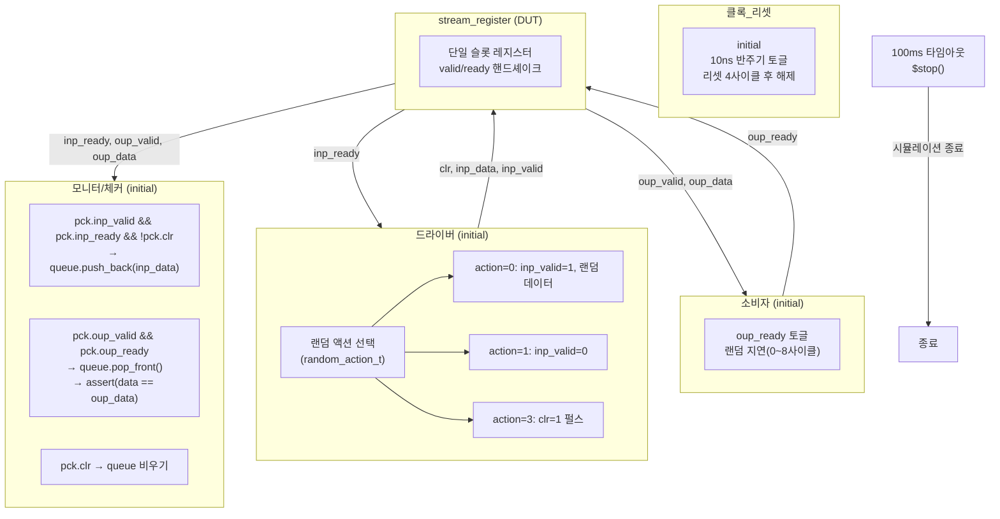

# stream_register_tb.sv

## 개요

`stream_register_tb`는 `stream_register` 모듈(스트림 인터페이스를 갖는 단일 레지스터/슬롯 버퍼)에 대한 기능 검증 테스트벤치입니다. 클로킹 블록(clocking block)과 랜덤 액션 클래스를 사용하여 입력 드라이버, 출력 소비자, 모니터/체커 세 가지 병렬 프로세스를 동시에 실행합니다.

소프트웨어 FIFO 큐(`queue`)를 참조 모델로 사용하여 입력된 데이터와 출력 데이터의 일치 여부를 검증하며, 클리어(`clr`) 동작도 함께 검증합니다.

## 다이어그램



## 상세 내용

### 파라미터

| 파라미터 | 기본값 | 설명 |
|----------|--------|------|
| `T` | `logic[7:0]` | 스트림 데이터 타입 (8비트 기본값) |

### DUT 포트 매핑

| DUT 포트 | TB 신호 | 설명 |
|----------|---------|------|
| `clk_i` | `clk` | 클럭 |
| `rst_ni` | `rst_n` | 액티브 로우 리셋 |
| `clr_i` | `clr` | 동기 클리어 |
| `testmode_i` | `1'b0` | 테스트 모드 비활성화 |
| `valid_i` | `inp_valid` | 입력 유효 |
| `ready_o` | `inp_ready` | 입력 준비 |
| `data_i` | `inp_data` | 입력 데이터 |
| `valid_o` | `oup_valid` | 출력 유효 |
| `ready_i` | `oup_ready` | 출력 준비 |
| `data_o` | `oup_data` | 출력 데이터 |

### 클럭 생성

- 초기 4 반주기(40ns) 동안 리셋 상태 유지
- 이후 10ns 반주기(20ns 주기)로 무한 토글
- 100ms 후 강제 종료 (`$stop`)

### 클로킹 블록

#### `cb` (드라이버/소비자용)
```systemverilog
clocking cb @(posedge clk);
    default input #2 output #4;  // 입력: 2ns 전 샘플, 출력: 4ns 후 인가
    output clr, inp_data, inp_valid, oup_ready;
    input  inp_ready, oup_valid, oup_data;
endclocking
```

#### `pck` (모니터용 패시브 클로킹)
```systemverilog
clocking pck @(posedge clk);
    default input #2 output #4;
    input clr, inp_data, inp_valid, inp_ready, oup_data, oup_valid, oup_ready;
endclocking
```

### 랜덤 액션 클래스 (`random_action_t`)

| action 값 | 가중치 | 동작 |
|-----------|--------|------|
| `0` | 40 | 랜덤 데이터와 함께 `inp_valid = 1` |
| `1` | 40 | `inp_valid = 0` (클리어 해제) |
| `3` | 2 | `clr = 1` 펄스 (1클럭) 후 `clr = 0` |

### 드라이버 동작

1. 리셋 해제 대기
2. 0~8 클럭 랜덤 지연
3. 랜덤 액션 선택 및 수행 (무한 반복)

### 소비자 동작

1. 리셋 해제 대기
2. `oup_ready = 1` 인가
3. 0~8 클럭 랜덤 지연
4. `oup_ready = 0` 인가
5. 무한 반복

### 모니터/체커 동작

매 클럭 상승 에지에서:
1. `inp_valid && inp_ready && !clr` 조건 시 큐에 데이터 추가
2. `oup_valid && oup_ready` 조건 시 큐에서 팝하여 비교
3. `clr` 조건 시 큐 비우기 (클리어 동작 반영)

## 의존성 및 관계

| 항목 | 설명 |
|------|------|
| **검증 대상** | `stream_register` - valid/ready 핸드셰이크 기반 단일 슬롯 레지스터 |
| **참조 모델** | `logic[7:0] queue[$]` - SystemVerilog 동적 배열 큐 |
| **라이선스** | Solderpad Hardware License v0.51 (ETH Zurich / University of Bologna) |

이 테스트벤치는 `stream_test.sv`의 `stream_driver` 클래스 대신 클로킹 블록 방식을 직접 사용하는 구형 스타일의 테스트벤치입니다.
