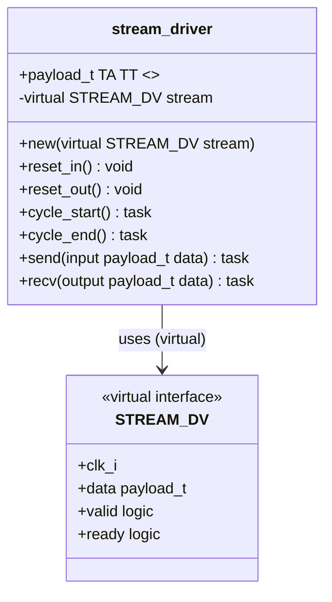
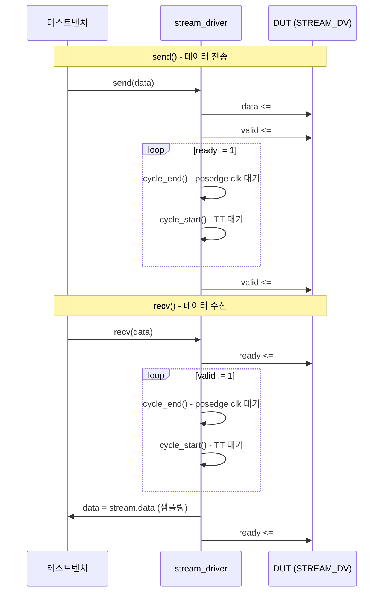

# stream_test.sv

## 개요

`stream_test.sv`는 스트림 인터페이스 검증에 사용되는 공통 드라이버/모니터 클래스를 포함하는 SystemVerilog 패키지 파일입니다. `stream_test` 패키지 안에 파라미터화된 `stream_driver` 클래스를 정의하며, 이 클래스는 `STREAM_DV` 가상 인터페이스를 통해 스트림 신호를 제어합니다.

테스트벤치에서 이 패키지를 임포트하면 일관된 타이밍과 핸드셰이크 로직을 재사용할 수 있어, `stream_xbar_tb`, `stream_omega_net_tb` 등 여러 테스트벤치에서 공통으로 활용됩니다.

## 다이어그램





## 상세 내용

### 패키지 구조

```
package stream_test;
    class stream_driver #(payload_t, TA, TT);
        ...
    endclass
endpackage
```

### `stream_driver` 클래스 파라미터

| 파라미터 | 기본값 | 설명 |
|----------|--------|------|
| `payload_t` | `logic` | 스트림 페이로드 데이터 타입 |
| `TA` | 2ns | 자극 인가 시간 (Apply Time) - 클럭 상승 에지로부터 신호 인가까지 지연 |
| `TT` | 8ns | 샘플링 시간 (Test Time) - 클럭 상승 에지로부터 샘플링까지 지연 |

### 메서드 설명

#### `new(virtual STREAM_DV stream)`
- 생성자: 가상 인터페이스 핸들을 멤버 변수에 저장

#### `reset_in()`
- 입력 드라이버 초기화: `valid = 0`으로 설정
- 소스(송신) 역할의 드라이버에서 사용

#### `reset_out()`
- 출력 드라이버 초기화: `ready = 0`으로 설정
- 싱크(수신) 역할의 드라이버에서 사용

#### `cycle_start()`
- `#TT` 지연으로 클럭 주기 내 샘플링 포인트까지 대기
- 핸드셰이크 신호 확인 전 호출

#### `cycle_end()`
- `@(posedge stream.clk_i)` 로 다음 클럭 상승 에지까지 대기

#### `send(input payload_t data)` [automatic task]
- `data`와 `valid`를 `TA` 지연 후 인가 (비블로킹 대입 `<=`)
- `ready`가 1이 될 때까지 클럭 대기 (핸드셰이크 완료 대기)
- 핸드셰이크 완료 후 `valid`를 `TA` 지연 후 0으로 해제

#### `recv(output payload_t data)` [automatic task]
- `ready`를 `TA` 지연 후 1로 인가
- `valid`가 1이 될 때까지 클럭 대기
- `TT` 시점에 `stream.data` 샘플링하여 반환
- 핸드셰이크 완료 후 `ready`를 `TA` 지연 후 0으로 해제

### 타이밍 다이어그램

```
클럭:     _____|‾‾‾‾‾|_____|‾‾‾‾‾|_____
               ^TA         ^TA
valid:    _____|‾‾‾‾‾‾‾‾‾‾‾‾‾‾‾‾‾|____
                   ^TT 샘플포인트
ready:    _________|‾‾‾‾‾‾‾‾|_________
```

- `TA` (Apply Time): 클럭 상승 에지 이후 신호 인가 지연
- `TT` (Test Time): 클럭 상승 에지 이후 샘플링 지연 (반드시 `TA < TT`)

## 의존성 및 관계

| 항목 | 설명 |
|------|------|
| **사용하는 인터페이스** | `STREAM_DV` - 페이로드 타입 파라미터화된 스트림 동적 검증 인터페이스 |
| **사용하는 테스트벤치** | `stream_xbar_tb.sv` - `stream_test::stream_driver` 임포트 |
| **사용하는 테스트벤치** | `stream_omega_net_tb.sv` - `stream_test::stream_driver` 임포트 |
| **작성자** | Florian Zaruba (ETH Zurich IIS) |
| **라이선스** | Solderpad Hardware License v0.51 |

이 파일은 실행 가능한 모듈이 아니라 패키지 파일로, 다른 테스트벤치에서 `stream_test::stream_driver` 형태로 타입을 선언하여 인스턴스화합니다.
