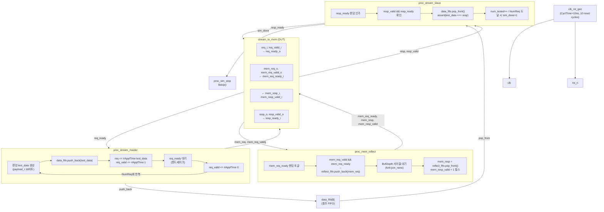

# stream_to_mem_tb.sv

## 개요

`stream_to_mem_tb`는 `stream_to_mem` 모듈에 대한 기능 검증 테스트벤치입니다. `stream_to_mem`은 AXI-Stream 요청을 메모리 인터페이스로 변환하고, 메모리 응답을 다시 스트림으로 반환하는 모듈입니다.

이 테스트벤치는 세 가지 병렬 프로세스로 구성됩니다:
1. 스트림 마스터(소스): 랜덤 요청 데이터를 DUT에 전송
2. 스트림 슬레이브(싱크): DUT 출력을 수신하여 데이터 정확성 검증
3. 메모리 모델: DUT의 메모리 요청을 수신하고 `BufDepth` 사이클 후 응답 반환

## 다이어그램



## 상세 내용

### 파라미터

| 파라미터 | 기본값 | 설명 |
|----------|--------|------|
| `NumReq` | 10000 | 총 요청 횟수 |
| `BufDepth` | 1 | 메모리 응답 지연 사이클 수 (버퍼 깊이) |

### 타이밍 상수

| 상수 | 값 | 설명 |
|------|-----|------|
| `CyclTime` | 10ns | 클럭 주기 |
| `ApplTime` | 2ns | 자극 인가 지연 (클럭 상승 에지 이후) |
| `TestTime` | 8ns | 신호 샘플링 시점 |

### 데이터 타입

```systemverilog
typedef logic [15:0] payload_t;  // 16비트 페이로드
```

### 주요 신호

| 신호 그룹 | 신호 | 방향 | 설명 |
|-----------|------|------|------|
| 스트림 입력 | `req`, `req_valid`, `req_ready` | TB→DUT / DUT→TB | AXI-Stream 요청 |
| 스트림 출력 | `resp`, `resp_valid`, `resp_ready` | DUT→TB / TB→DUT | AXI-Stream 응답 |
| 메모리 요청 | `mem_req`, `mem_req_valid`, `mem_req_ready` | DUT→TB / TB→DUT | 메모리 요청 인터페이스 |
| 메모리 응답 | `mem_resp`, `mem_resp_valid` | TB→DUT | 메모리 응답 인터페이스 |

### `proc_stream_master` 동작 흐름

1. 리셋 해제 후 5 클럭 대기
2. `NumReq`회 반복:
   - 0~5 클럭 랜덤 지연
   - 랜덤 `test_data` 생성, `data_fifo`에 push
   - `req`, `req_valid` 인가
   - `TestTime` 후 `req_ready` 확인 (핸드셰이크 완료 대기)
   - 전송 완료 후 `req_valid = 0`

### `proc_stream_slave` 동작 흐름

1. 리셋 해제 후 5 클럭 대기
2. `num_tested < NumReq` 동안 반복:
   - `resp_ready`를 랜덤(0 또는 1)으로 인가
   - `resp_valid && resp_ready` 시 `data_fifo`에서 팝하여 비교 검증
3. 50 클럭 추가 대기 후 `sim_done = 1`

### `proc_mem_reflect` 동작 흐름 (메모리 모델)

1. `mem_req_ready`를 랜덤으로 토글 (백프레셔 시뮬레이션)
2. `mem_req_valid && mem_req_ready` 성립 시:
   - `reflect_fifo`에 요청 데이터 저장
   - `fork-join_none`으로 비동기 응답 생성:
     - `BufDepth` 사이클 대기 (Verilator는 `#(BufDepth * CyclTime)`)
     - `mem_resp` 데이터 설정 및 1 클럭 유효 펄스 전송

### Verilator 호환성

```systemverilog
`ifndef VERILATOR
repeat (BufDepth) @(posedge clk);
`else
#(BufDepth * CyclTime);
`endif
```
Verilator는 `fork-join_none` 내 `@(posedge clk)` 지원이 제한적이므로 시간 지연 방식으로 대체합니다.

## 의존성 및 관계

| 항목 | 설명 |
|------|------|
| **검증 대상** | `stream_to_mem` - 스트림-메모리 변환 모듈 |
| **사용 모듈** | `clk_rst_gen` - 클럭 및 리셋 생성기 |
| **참조 모델** | `data_fifo[$]` - 순서 검증용 참조 큐 |
| **작성자** | Wolfgang Rönninger (ETH Zurich IIS) |
| **라이선스** | Solderpad Hardware License v0.51 |
