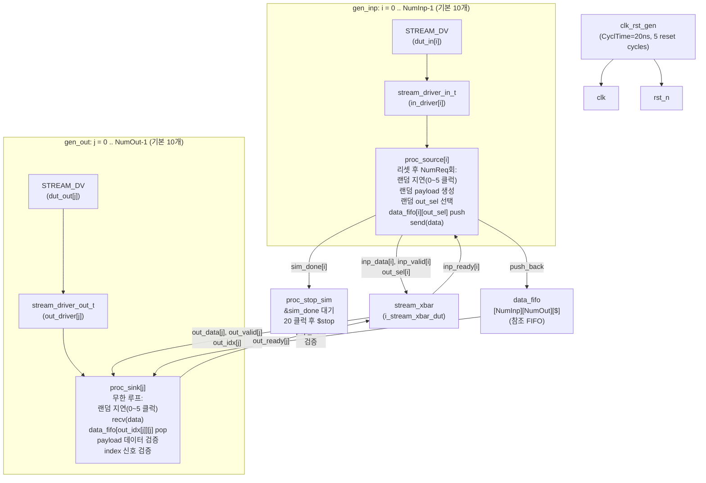

# stream_xbar_tb.sv

## 개요

`stream_xbar_tb`는 `stream_xbar` 모듈(스트림 크로스바 스위치)에 대한 기능 검증 테스트벤치입니다. 다수의 입력 포트에서 임의의 출력 포트로 스트림 패킷을 전송하고, 수신 측에서 데이터 및 출처 인덱스의 정확성을 검증합니다.

`stream_test::stream_driver` 클래스를 활용하여 각 포트에 독립적인 드라이버를 연결하고, 2차원 참조 FIFO(`data_fifo[NumInp][NumOut][$]`)로 예상 데이터를 추적합니다.

`stream_omega_net_tb.sv`와 거의 동일한 구조이며, DUT만 `stream_xbar`로 다릅니다.

## 다이어그램



## 상세 내용

### 파라미터

| 파라미터 | 기본값 | 설명 |
|----------|--------|------|
| `NumReq` | 10000 | 입력 포트당 요청 수 |
| `NumInp` | 10 | 입력 포트 수 |
| `NumOut` | 10 | 출력 포트 수 |
| `SpillReg` | 0 | 출력 스필 레지스터 사용 여부 |
| `CyclTime` | 20ns | 클럭 주기 |

### 내부 타입 정의

```systemverilog
localparam OutSelWidth = (NumOut > 1) ? $clog2(NumOut) : 1;
localparam InpIdxWidth = (NumInp > 1) ? $clog2(NumInp) : 1;

typedef logic [OutSelWidth-1:0] sel_t;   // 출력 선택 비트폭 (log2(NumOut))
typedef logic [InpIdxWidth-1:0] idx_t;  // 입력 인덱스 비트폭 (log2(NumInp))

typedef struct packed {
    logic [15:0] payload;  // 16비트 페이로드
    idx_t        index;    // 출처 입력 인덱스
} payload_t;
```

### 드라이버 타이밍

| 상수 | 값 | 설명 |
|------|-----|------|
| `TA` | `CyclTime * 0.2` = 4ns | 자극 인가 시간 |
| `TT` | `CyclTime * 0.8` = 16ns | 샘플링 시간 |

### `proc_source` 동작 (각 입력 포트 i)

1. 리셋(`rst_n`) 상승 에지 대기
2. `in_driver.reset_in()` - valid 초기화
3. `out_sel[i] = 0`, `sim_done[i] = 0`
4. `NumReq`회 반복:
   - 0~5 클럭 랜덤 대기
   - 랜덤 `payload` 생성 (`$urandom()`)
   - 랜덤 출력 포트 선택 (`$urandom_range(0, NumOut-1)`)
   - `data_fifo[i][out_sel[i]].push_back(data)` - 참조 저장
   - `in_driver.send(data)` - 핸드셰이크 완료까지 전송
5. `sim_done[i] = 1`

### `proc_sink` 동작 (각 출력 포트 j)

1. 리셋 상승 에지 대기
2. `out_driver.reset_out()` - ready 초기화
3. 무한 루프:
   - 0~5 클럭 랜덤 대기
   - `out_driver.recv(data)` - 데이터 수신
   - `exp = data_fifo[out_idx[j]][j].pop_front()` - 예상값 조회
   - `assert(data == exp)` - 페이로드 검증
   - `assert(data.index == out_idx[j])` - 출처 인덱스 검증

### 검증 항목

| 검증 항목 | 검증 방법 | 오류 시 출력 |
|-----------|-----------|-------------|
| 페이로드 데이터 일치 | `data == exp` | `Out %d: Payload data does not match.` |
| 출처 인덱스 일치 | `data.index == out_idx[j]` | `Index in payload: %d does not match idx_o[%d]: %d` |

### DUT 파라미터 설정

| 파라미터 | 값 | 설명 |
|----------|-----|------|
| `OutSpillReg` | `SpillReg` | 출력 스필 레지스터 (기본 비활성화) |
| `ExtPrio` | `1'b0` | 외부 우선순위 비활성화 |
| `AxiVldRdy` | `1'b1` | AXI valid/ready 핸드셰이크 |
| `LockIn` | `1'b1` | 입력 잠금 활성화 |
| `rr_i` | `'0` | 라운드 로빈 초기값 |

## 의존성 및 관계

| 항목 | 설명 |
|------|------|
| **검증 대상** | `stream_xbar` - 완전 연결형 스트림 크로스바 스위치 |
| **사용 패키지** | `stream_test::stream_driver` (`stream_test.sv`) |
| **사용 인터페이스** | `STREAM_DV` - 동적 검증용 스트림 인터페이스 |
| **사용 모듈** | `clk_rst_gen` - 클럭 및 리셋 생성기 |
| **유사 테스트벤치** | `stream_omega_net_tb.sv` - 동일 구조, DUT만 `stream_omega_net`으로 다름 |
| **작성자** | Wolfgang Roenninger (ETH Zurich) |
| **라이선스** | Solderpad Hardware License v0.51 |

### `stream_xbar_tb`와 `stream_omega_net_tb`의 차이점

| 항목 | `stream_xbar_tb` | `stream_omega_net_tb` |
|------|-----------------|----------------------|
| DUT | `stream_xbar` | `stream_omega_net` |
| 기본 NumReq | 10000 | 20000 |
| 추가 파라미터 | `SpillReg` | `DutSpillReg`, `DutRadix` |
| 소스 반복 횟수 | `NumReq` | `NumReq / DutNumInp` |
