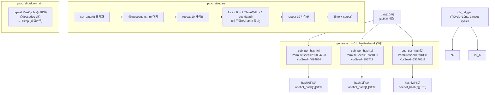

# sub_per_hash_tb.sv

## 개요

`sub_per_hash_tb`는 `sub_per_hash` 모듈에 대한 기능 검증 테스트벤치입니다. `sub_per_hash`는 치환-치환(substitution-permutation) 기반 해시 함수로, Counting Bloom Filter(`cb_filter`) 등에 사용됩니다.

이 테스트벤치는 모든 가능한 입력값(0부터 2^DataWidth - 1)을 순차적으로 인가하여 해시 출력을 확인합니다. 3가지 서로 다른 시드(seed) 설정으로 동시에 3개의 해시 인스턴스를 생성하여 출력을 비교 관찰할 수 있습니다.

주요 목적은 기능 검증보다는 해시 출력 분포를 파형으로 관찰하는 것입니다.

## 다이어그램



## 상세 내용

### TB 파라미터

| 상수 | 값 | 설명 |
|------|-----|------|
| `TCycle` | 10ns | 클럭 주기 |
| `TAppli` | 2ns | 자극 인가 지연 |
| `TTest` | 8ns | 샘플링 지연 |
| `MaxCycles` | 100,000,000 | 최대 시뮬레이션 사이클 수 (타임아웃) |

### DUT 파라미터

| 파라미터 | 값 | 설명 |
|----------|-----|------|
| `DataWidth` | 11 | 입력 데이터 비트폭 (2^11 = 2048가지 입력) |
| `HashWidth` | 5 | 해시 출력 비트폭 (2^5 = 32 버킷) |
| `NoHashes` | 3 | 해시 인스턴스 수 |
| `NoRounds` | 1 | 해시 라운드 수 |

### 시드 설정 (`cb_filter_pkg::cb_seed_t`)

| 인스턴스 | `PermuteSeed` | `XorSeed` | 설명 |
|----------|--------------|-----------|------|
| `i=0` | 299034753 | 4094834 | 해시 함수 0번 키 |
| `i=1` | 19921030 | 995713 | 해시 함수 1번 키 |
| `i=2` | 294388 | 65146511 | 해시 함수 2번 키 |

### 데이터 타입

```systemverilog
typedef logic [DataWidth-1:0]    data_t;        // 11비트 입력
typedef logic [HashWidth-1:0]    hash_t;        // 5비트 해시 출력
typedef logic [2**HashWidth-1:0] onehot_hash_t; // 32비트 원핫 해시 출력
```

### 출력 신호

| 신호 | 비트폭 | 설명 |
|------|--------|------|
| `data` | 11 | 현재 입력 데이터 |
| `hash[i]` | 5 | i번째 해시 함수의 이진 해시 값 |
| `onehot_hash[i]` | 32 | i번째 해시 함수의 원핫 인코딩 해시 값 |

### 태스크 설명

#### `cycle_start()`
```systemverilog
task cycle_start();
    #TTest;  // 8ns 대기 (샘플링 포인트)
endtask
```

#### `cycle_end()`
```systemverilog
task cycle_end();
    @(posedge clk);  // 다음 클럭 상승 에지 대기
endtask
```

#### `set_data(input longint unsigned nbr)`
```systemverilog
task set_data(input longint unsigned nbr);
    data <= #TAppli data_t'(nbr);  // 2ns 후 데이터 인가
    cycle_end();                   // 다음 클럭 대기
endtask
```

### 시뮬레이션 종료 조건

| 조건 | 메시지 |
|------|--------|
| 모든 입력값 소진 (2^11 = 2048개) | `Stop, because all possible inputs were applied.` |
| MaxCycles(10억 사이클) 초과 | `Stop, because max cycles was reached.` |

## 의존성 및 관계

| 항목 | 설명 |
|------|------|
| **검증 대상** | `sub_per_hash` - 치환-치환 해시 함수 모듈 |
| **의존 패키지** | `cb_filter_pkg` - `cb_seed_t` 타입 정의 포함 |
| **사용 모듈** | `clk_rst_gen` - 클럭 및 리셋 생성기 |
| **작성자** | Wolfgang Roenninger (ETH Zurich) |
| **라이선스** | Solderpad Hardware License v0.51 |

이 테스트벤치는 자동화된 합격/불합격 판정 로직이 없으며, 주로 파형 관찰(waveform inspection)을 통해 해시 분포 특성을 시각적으로 확인하는 목적으로 사용됩니다.
