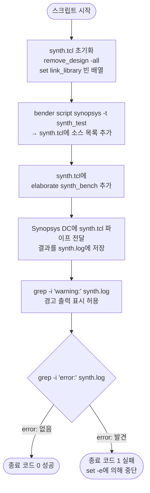

# synth.sh

## 개요

Synopsys Design Compiler(DC)를 사용하여 `common_cells` 라이브러리의 합성(Synthesis) 검증을 수행하는 스크립트입니다. `bender` 도구로 합성 대상 소스 목록을 자동 생성한 뒤 `synth_bench` 모듈을 elaborate하고, 합성 로그에서 경고(warning)와 오류(error)를 필터링하여 결과를 검증합니다.

## 실행 흐름 다이어그램



## 사용 방법

```bash
# 기본 실행 (SYNOPSYS_DC 미설정 시 기본값 사용)
bash test/synth.sh

# Synopsys DC 경로 직접 지정
SYNOPSYS_DC="dc_shell -64" bash test/synth.sh

# 전체 경로 지정
SYNOPSYS_DC="/opt/synopsys/dc/bin/dc_shell -64" bash test/synth.sh
```

## 주요 변수 / 설정

| 변수명 | 기본값 | 설명 |
|--------|--------|------|
| `SYNOPSYS_DC` | `synopsys dc_shell -64` | Synopsys DC 실행 명령 (환경변수로 재정의 가능) |
| `synth.tcl` | (자동 생성) | DC에 전달되는 TCL 합성 스크립트 (실행 중 생성) |
| `synth.log` | (자동 생성) | DC 실행 출력 로그 (`tee`로 화면과 파일에 동시 기록) |

## 실행 단계 상세 설명

### 1단계: synth.tcl 생성

스크립트가 실행될 때마다 `synth.tcl`을 새로 작성합니다. 첫 두 줄은 `echo`로 직접 기록됩니다.

```tcl
remove_design -all      # 이전 DC 세션의 설계 데이터 초기화
set link_library []     # 링크 라이브러리를 빈 배열로 설정
```

### 2단계: bender를 통한 소스 추가

`bender script synopsys -t synth_test` 명령은 `synth_test` 태그가 붙은 모든 소스 파일에 대한 Synopsys DC용 `analyze` 명령들을 생성하여 `synth.tcl`에 추가합니다.

### 3단계: elaborate 명령 추가

`elaborate synth_bench` 명령이 `synth.tcl` 마지막에 추가됩니다. `synth_bench`는 합성 검증용 래퍼(wrapper) 모듈입니다.

### 4단계: Synopsys DC 실행

완성된 `synth.tcl`을 파이프(`cat ... | $SYNOPSYS_DC`)로 DC에 전달합니다. `tee`를 사용하여 터미널과 `synth.log`에 동시 출력합니다.

### 5단계: 로그 검증

| 검사 | 명령 | 동작 |
|------|------|------|
| 경고 확인 | `grep -i 'warning:' synth.log \|\| true` | 경고가 있으면 화면에 출력 (실패 아님) |
| 오류 확인 | `! grep -i 'error:' synth.log` | 오류가 있으면 스크립트 실패 종료 |

> `set -e`가 설정되어 있어 오류 감지 시 즉시 종료됩니다.

## 지원 도구

| 도구 | 용도 |
|------|------|
| **Synopsys Design Compiler** (`dc_shell`) | RTL 합성 및 elaborate |
| **bender** | Synopsys 형식의 소스 파일 목록 자동 생성 |

- Synopsys DC는 64비트 모드(`-64`)로 실행됩니다.
- `bender`는 프로젝트 루트에서 실행 가능해야 합니다(`Bender.yml` 필요).
- 라이브러리 설정 없이 elaborate 단계만 수행하므로, 전체 합성(compile/optimization)은 수행하지 않습니다.
