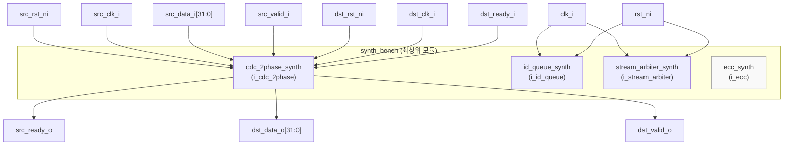
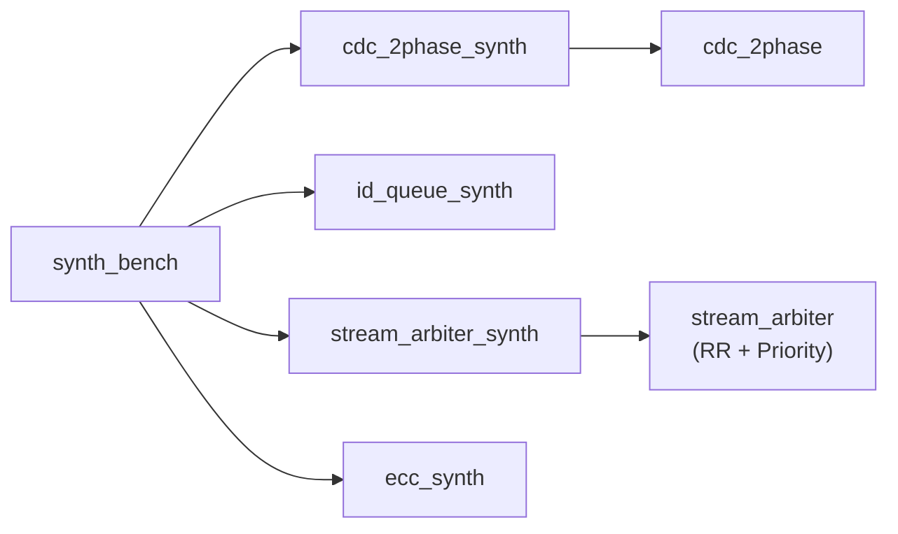

# synth_bench.sv

## 개요

`synth_bench`는 common_cells 저장소에 포함된 여러 합성 벤치마크 서브모듈들을 하나로 묶는 최상위 합성 검증 모듈입니다. 합성 도구(synthesis tool)가 각 서브모듈을 올바르게 처리할 수 있는지 확인하기 위한 목적으로 사용됩니다.

이 모듈은 다음 4가지 합성 벤치마크를 통합합니다:
- `cdc_2phase_synth`: 2-phase CDC(Clock Domain Crossing) 합성 검증
- `id_queue_synth`: ID 큐 합성 검증
- `stream_arbiter_synth`: 스트림 중재기 합성 검증
- `ecc_synth`: ECC(Error Correcting Code) 합성 검증

## 다이어그램

## 상세 내용

### 모듈 포트

| 포트 | 방향 | 비트폭 | 설명 |
|------|------|--------|------|
| `clk_i` | input | 1 | 공용 클럭 (id_queue, stream_arbiter용) |
| `rst_ni` | input | 1 | 공용 액티브 로우 리셋 |
| `src_rst_ni` | input | 1 | CDC 소스 도메인 리셋 |
| `src_clk_i` | input | 1 | CDC 소스 도메인 클럭 |
| `src_data_i` | input | 32 | CDC 소스 입력 데이터 |
| `src_valid_i` | input | 1 | CDC 소스 유효 신호 |
| `src_ready_o` | output | 1 | CDC 소스 준비 신호 |
| `dst_rst_ni` | input | 1 | CDC 목적지 도메인 리셋 |
| `dst_clk_i` | input | 1 | CDC 목적지 도메인 클럭 |
| `dst_data_o` | output | 32 | CDC 목적지 출력 데이터 |
| `dst_valid_o` | output | 1 | CDC 목적지 유효 신호 |
| `dst_ready_i` | input | 1 | CDC 목적지 준비 신호 |

### 인스턴스 목록

#### `i_cdc_2phase` - 2-phase CDC 합성 벤치마크
- 두 개의 서로 다른 클럭 도메인(`src_clk_i`, `dst_clk_i`) 간 valid/ready 핸드셰이크 데이터 전송
- 상위 모듈의 모든 CDC 관련 포트가 이 인스턴스에 연결됨
- 32비트 데이터를 CDC를 통해 전달하는 실제 인터페이스 포트 포함

#### `i_id_queue` - ID 큐 합성 벤치마크
- `clk_i`, `rst_ni`만 연결 (데이터 포트는 서브모듈 내부에서 처리)
- 다양한 ID 너비 및 깊이 설정에 대한 합성 가능성 검증

#### `i_stream_arbiter` - 스트림 중재기 합성 벤치마크
- `clk_i`, `rst_ni`만 연결
- RR(라운드 로빈) 및 우선순위 방식의 중재기를 다양한 입력 수로 검증 (`stream_arbiter_synth.sv` 참조)

#### `i_ecc` - ECC 합성 벤치마크
- 포트 연결 없음 (`i_ecc()` - 모든 신호가 내부적으로 처리됨)
- 오류 정정 코드 관련 모듈의 합성 가능성 검증

### 합성 검증 목적

이 모듈은 시뮬레이션용이 아닌 합성 플로우 전용으로 설계되었습니다:
- 실제 입출력 포트가 있어 합성 도구가 최적화로 로직을 제거하지 않음
- 다양한 파라미터 조합의 모듈들을 한 번의 합성으로 검증 가능
- Lint 및 합성 경고 검출에 활용

## 의존성 및 관계

| 항목 | 설명 |
|------|------|
| **포함 모듈** | `cdc_2phase_synth`, `id_queue_synth`, `stream_arbiter_synth`, `ecc_synth` |
| **관련 파일** | `stream_arbiter_synth.sv` - 스트림 중재기 합성 벤치마크 구현 |
| **라이선스** | Solderpad Hardware License v0.51 (ETH Zurich / University of Bologna) |
