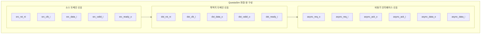
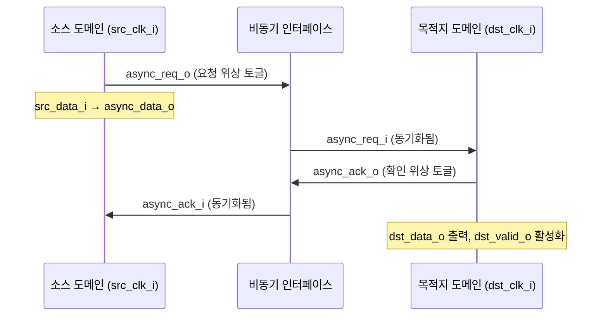

# cdc_2phase.tcl

## 개요

`cdc_2phase.tcl`은 QuestaSim/ModelSim 시뮬레이터의 파형 뷰어(Wave Window)에서 `cdc_2phase` 모듈의 신호를 표시하기 위한 TCL 파형 설정 스크립트입니다. `cdc_2phase_tb` 테스트벤치 실행 중 이 스크립트를 로드하면 미리 정의된 신호 목록이 파형 창에 자동으로 추가됩니다.

2-phase 핸드셰이크 방식 CDC(Clock Domain Crossing) 모듈의 소스 도메인 신호, 목적지 도메인 신호, 비동기 인터페이스 신호를 순서대로 표시합니다.

## 다이어그램





## 상세 내용

### 파형에 추가되는 신호 목록

#### 소스 도메인 신호 (Source Domain)

| 신호 경로 | 설명 |
|-----------|------|
| `/cdc_2phase_tb/g_dut/i_dut/src_rst_ni` | 소스 도메인 액티브 로우 리셋 |
| `/cdc_2phase_tb/g_dut/i_dut/src_clk_i` | 소스 도메인 클럭 |
| `/cdc_2phase_tb/g_dut/i_dut/src_data_i` | 소스 도메인 입력 데이터 |
| `/cdc_2phase_tb/g_dut/i_dut/src_valid_i` | 소스 도메인 유효 신호 |
| `/cdc_2phase_tb/g_dut/i_dut/src_ready_o` | 소스 도메인 준비 신호 |

#### 목적지 도메인 신호 (Destination Domain)

| 신호 경로 | 설명 |
|-----------|------|
| `/cdc_2phase_tb/g_dut/i_dut/dst_rst_ni` | 목적지 도메인 액티브 로우 리셋 |
| `/cdc_2phase_tb/g_dut/i_dut/dst_clk_i` | 목적지 도메인 클럭 |
| `/cdc_2phase_tb/g_dut/i_dut/dst_data_o` | 목적지 도메인 출력 데이터 |
| `/cdc_2phase_tb/g_dut/i_dut/dst_valid_o` | 목적지 도메인 유효 신호 |
| `/cdc_2phase_tb/g_dut/i_dut/dst_ready_i` | 목적지 도메인 준비 신호 |

#### 비동기 인터페이스 신호 (Asynchronous Interface)

| 신호 경로 | 설명 |
|-----------|------|
| `/cdc_2phase_tb/g_dut/i_dut/async_req_o` | 비동기 요청 출력 (소스→목적지) |
| `/cdc_2phase_tb/g_dut/i_dut/async_req_i` | 비동기 요청 입력 (소스→목적지) |
| `/cdc_2phase_tb/g_dut/i_dut/async_ack_o` | 비동기 확인 출력 (목적지→소스) |
| `/cdc_2phase_tb/g_dut/i_dut/async_ack_i` | 비동기 확인 입력 (목적지→소스) |
| `/cdc_2phase_tb/g_dut/i_dut/async_data_o` | 비동기 데이터 출력 |
| `/cdc_2phase_tb/g_dut/i_dut/async_data_i` | 비동기 데이터 입력 |

### 파형 창 설정

| 설정 항목 | 값 | 설명 |
|-----------|-----|------|
| `namecolwidth` | 198 | 신호 이름 열 너비 (픽셀) |
| `valuecolwidth` | 165 | 값 열 너비 (픽셀) |
| `justifyvalue` | left | 값 정렬 방향 |
| `signalnamewidth` | 1 | 신호 이름 표시 모드 (단축형) |
| `gridperiod` | 500 | 그리드 주기 |
| `timelineunits` | ns | 시간 단위 |
| 초기 줌 범위 | 0 ps ~ 603392 ps | 초기 파형 표시 구간 (~603ns) |
| 커서 위치 | 0 ps | 초기 커서 위치 |

### 신호 계층 구조

```
cdc_2phase_tb           ← 최상위 테스트벤치
  └── g_dut             ← generate 블록
        └── i_dut       ← cdc_2phase DUT 인스턴스
              ├── src_*   소스 도메인 신호
              ├── dst_*   목적지 도메인 신호
              └── async_* 비동기 인터페이스 신호
```

### 스크립트 주요 명령어

| TCL 명령 | 설명 |
|----------|------|
| `onerror {resume}` | 오류 발생 시 스크립트 계속 실행 |
| `WaveActivateNextPane {} 0` | 파형 창 활성화 |
| `add wave -noupdate <path>` | 갱신 없이 신호 추가 |
| `TreeUpdate [SetDefaultTree]` | 계층 트리 업데이트 |
| `WaveRestoreCursors` | 커서 위치 복원 |
| `configure wave -...` | 파형 창 표시 옵션 설정 |
| `WaveRestoreZoom` | 줌 범위 복원 |

## 의존성 및 관계

| 항목 | 설명 |
|------|------|
| **대상 테스트벤치** | `cdc_2phase_tb` - 2-phase CDC 테스트벤치 |
| **대상 모듈** | `cdc_2phase` - 2-phase 핸드셰이크 CDC 모듈 |
| **시뮬레이터** | QuestaSim / ModelSim |
| **관련 파형 스크립트** | `cdc_fifo_2phase.tcl` - FIFO 기반 2-phase CDC 파형 설정 |
| **사용 방법** | QuestaSim 콘솔에서 `do waves/cdc_2phase.tcl` 실행 |
