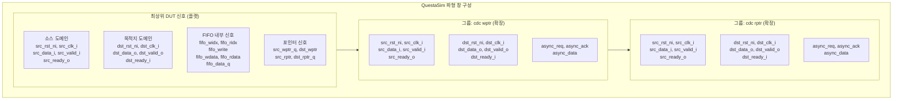
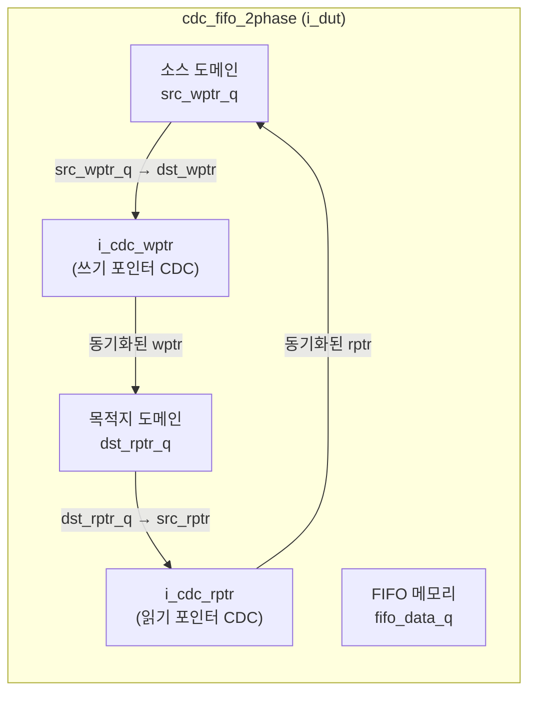

# cdc_fifo_2phase.tcl

## 개요

`cdc_fifo_2phase.tcl`은 QuestaSim/ModelSim 파형 뷰어에서 `cdc_fifo_2phase` 모듈(2-phase 핸드셰이크 기반 CDC FIFO)의 신호를 표시하기 위한 TCL 파형 설정 스크립트입니다.

`cdc_2phase.tcl`과 달리, 이 스크립트는 FIFO 내부 포인터(`fifo_widx`, `fifo_ridx`), FIFO 데이터(`fifo_wdata`, `fifo_rdata`), FIFO 상태(`fifo_data_q`) 등의 내부 신호를 추가로 포함합니다. 또한 쓰기 포인터 CDC(`i_cdc_wptr`)와 읽기 포인터 CDC(`i_cdc_rptr`) 서브모듈의 신호를 각각 그룹으로 묶어 표시합니다.

## 다이어그램





## 상세 내용

### 신호 계층 구조

```
cdc_fifo_tb             ← 최상위 테스트벤치
  └── i_dut             ← cdc_fifo_2phase DUT 인스턴스
        ├── 소스 도메인 신호 (src_*)
        ├── 목적지 도메인 신호 (dst_*)
        ├── FIFO 내부 신호 (fifo_*)
        ├── 포인터 동기화 신호 (src_wptr_q, dst_wptr, ...)
        ├── i_cdc_wptr  ← 쓰기 포인터 CDC 인스턴스
        │     ├── 소스/목적지 도메인 신호
        │     └── async_req, async_ack, async_data
        └── i_cdc_rptr  ← 읽기 포인터 CDC 인스턴스
              ├── 소스/목적지 도메인 신호
              └── async_req, async_ack, async_data
```

### 파형에 추가되는 신호 목록

#### 최상위 DUT 신호 (`/cdc_fifo_tb/i_dut/`)

**소스 도메인:**

| 신호 | 설명 |
|------|------|
| `src_rst_ni` | 소스 도메인 리셋 |
| `src_clk_i` | 소스 도메인 클럭 |
| `src_data_i` | 소스 입력 데이터 |
| `src_valid_i` | 소스 유효 신호 |
| `src_ready_o` | 소스 준비 신호 |

**목적지 도메인:**

| 신호 | 설명 |
|------|------|
| `dst_rst_ni` | 목적지 도메인 리셋 |
| `dst_clk_i` | 목적지 도메인 클럭 |
| `dst_data_o` | 목적지 출력 데이터 |
| `dst_valid_o` | 목적지 유효 신호 |
| `dst_ready_i` | 목적지 준비 신호 |

**FIFO 내부 신호 (중복 포함):**

| 신호 | 설명 |
|------|------|
| `fifo_widx` | FIFO 쓰기 인덱스 (2회 추가됨) |
| `fifo_ridx` | FIFO 읽기 인덱스 (2회 추가됨) |
| `fifo_write` | FIFO 쓰기 활성화 신호 (2회 추가됨) |
| `fifo_wdata` | FIFO 쓰기 데이터 (2회 추가됨) |
| `fifo_rdata` | FIFO 읽기 데이터 (2회 추가됨) |
| `fifo_data_q` | FIFO 저장 데이터 레지스터 |

**포인터 동기화 신호:**

| 신호 | 설명 |
|------|------|
| `src_wptr_q` | 소스 도메인 쓰기 포인터 레지스터 |
| `dst_wptr` | 목적지 도메인으로 동기화된 쓰기 포인터 |
| `src_rptr` | 소스 도메인으로 동기화된 읽기 포인터 |
| `dst_rptr_q` | 목적지 도메인 읽기 포인터 레지스터 |

#### `cdc wptr` 그룹 (`/cdc_fifo_tb/i_dut/i_cdc_wptr/`)

`-expand -group {cdc wptr}` 옵션으로 묶여 확장된 상태로 표시:

| 신호 | 설명 |
|------|------|
| `src_rst_ni` ~ `src_ready_o` | 쓰기 포인터 CDC 소스 도메인 신호 |
| `dst_rst_ni` ~ `dst_ready_i` | 쓰기 포인터 CDC 목적지 도메인 신호 |
| `async_req` | 비동기 요청 신호 |
| `async_ack` | 비동기 확인 신호 |
| `async_data` | 비동기 데이터 신호 |

#### `cdc rptr` 그룹 (`/cdc_fifo_tb/i_dut/i_cdc_rptr/`)

`-expand -group {cdc rptr}` 옵션으로 묶여 확장된 상태로 표시:

| 신호 | 설명 |
|------|------|
| `src_rst_ni` ~ `src_ready_o` | 읽기 포인터 CDC 소스 도메인 신호 |
| `dst_rst_ni` ~ `dst_ready_i` | 읽기 포인터 CDC 목적지 도메인 신호 |
| `async_req` | 비동기 요청 신호 |
| `async_ack` | 비동기 확인 신호 |
| `async_data` | 비동기 데이터 신호 |

### 파형 창 설정

| 설정 항목 | 값 | 설명 |
|-----------|-----|------|
| `namecolwidth` | 150 | 신호 이름 열 너비 (픽셀) |
| `valuecolwidth` | 100 | 값 열 너비 (픽셀) |
| `justifyvalue` | left | 값 정렬 방향 |
| `signalnamewidth` | 1 | 신호 이름 단축 표시 모드 |
| `gridperiod` | 500 | 그리드 주기 |
| `timelineunits` | ns | 시간 단위 |
| 초기 커서 위치 | 186436 ps | 약 186ns 지점 |
| 초기 줌 범위 | 0 ps ~ 525 ns | 초기 파형 표시 구간 |

## 의존성 및 관계

| 항목 | 설명 |
|------|------|
| **대상 테스트벤치** | `cdc_fifo_tb` - CDC FIFO 테스트벤치 |
| **대상 모듈** | `cdc_fifo_2phase` - 2-phase 핸드셰이크 기반 CDC FIFO |
| **서브모듈** | `i_cdc_wptr`, `i_cdc_rptr` - 각각 쓰기/읽기 포인터를 전달하는 `cdc_2phase` 인스턴스 |
| **시뮬레이터** | QuestaSim / ModelSim |
| **관련 파형 스크립트** | `cdc_2phase.tcl` - 단일 CDC 모듈 파형 설정 |
| **사용 방법** | QuestaSim 콘솔에서 `do waves/cdc_fifo_2phase.tcl` 실행 |

> **참고**: 스크립트 내에 `fifo_widx`, `fifo_ridx`, `fifo_write`, `fifo_wdata`, `fifo_rdata` 신호가 중복으로 추가되어 있습니다. 이는 원본 파일의 의도적 또는 비의도적 중복으로 보이며, 파형 창에 동일 신호가 두 번 표시됩니다.
