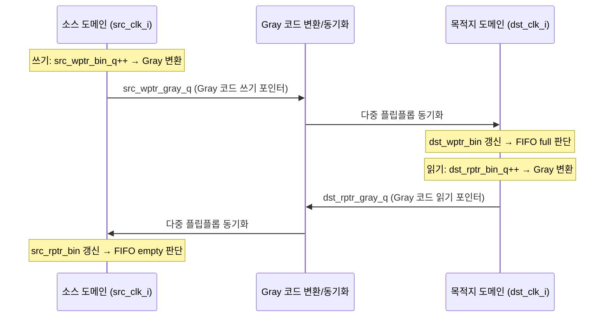

# cdc_fifo_gray.tcl

## 개요

`cdc_fifo_gray.tcl`은 QuestaSim/ModelSim 파형 뷰어에서 `cdc_fifo_gray` 모듈(Gray 코드 포인터 기반 CDC FIFO)의 신호를 표시하기 위한 TCL 파형 설정 스크립트입니다.

`cdc_fifo_2phase.tcl`과 달리 구분선(`-divider`)을 사용하여 신호를 논리적 그룹으로 시각적으로 구분합니다. FIFO 메모리 영역, 소스 도메인, 목적지 도메인, 비동기(Gray 코드) 포인터 영역으로 나뉩니다.

Gray 코드 방식은 2-phase 핸드셰이크 방식보다 높은 처리량을 제공하며, 이 스크립트는 이진 포인터(`*_bin`)와 Gray 코드 포인터(`*_gray`)를 모두 표시하여 CDC 동작을 분석할 수 있도록 구성됩니다.

## 다이어그램

```mermaid
graph TD
    subgraph Wave["QuestaSim 파형 창 구성 (구분선 기반)"]
        subgraph MEM["=== DIVIDER: memory ==="]
            M1["fifo_widx - FIFO 쓰기 인덱스"]
            M2["fifo_ridx - FIFO 읽기 인덱스"]
            M3["fifo_write - FIFO 쓰기 활성화"]
            M4["fifo_wdata - FIFO 쓰기 데이터"]
            M5["fifo_rdata - FIFO 읽기 데이터"]
        end

        subgraph SRC["=== DIVIDER: src ==="]
            S1["src_rst_ni / src_clk_i"]
            S2["src_data_i / src_valid_i / src_ready_o"]
            S3["src_wptr_bin_q - 소스 이진 쓰기 포인터"]
            S4["src_rptr_bin - 소스 이진 읽기 포인터 (동기화됨)"]
        end

        subgraph DST["=== DIVIDER: dst ==="]
            D1["dst_rst_ni / dst_clk_i"]
            D2["dst_data_o / dst_valid_o / dst_ready_i"]
            D3["dst_rptr_bin_q - 목적지 이진 읽기 포인터"]
            D4["dst_wptr_bin - 목적지 이진 쓰기 포인터 (동기화됨)"]
        end

        subgraph ASYNC["=== DIVIDER: async ==="]
            A1["src_wptr_gray_q - 소스 Gray 쓰기 포인터"]
            A2["dst_rptr_gray_q - 목적지 Gray 읽기 포인터"]
        end
    end

    MEM --> SRC --> DST --> ASYNC
```





## 상세 내용

### 신호 계층 구조

```
cdc_fifo_tb             ← 최상위 테스트벤치
  └── genblk1           ← generate 블록 (DUT 선택)
        └── i_dut       ← cdc_fifo_gray DUT 인스턴스
              ├── [memory] fifo_widx, fifo_ridx, fifo_write, fifo_wdata, fifo_rdata
              ├── [src]    src_*, src_wptr_bin_q, src_rptr_bin
              ├── [dst]    dst_*, dst_rptr_bin_q, dst_wptr_bin
              └── [async]  src_wptr_gray_q, dst_rptr_gray_q
```

> **참고**: `cdc_fifo_2phase.tcl`은 `i_dut`를 직접 참조하지만, 이 스크립트는 `genblk1/i_dut` 경로를 사용합니다. 이는 테스트벤치가 generate 블록으로 여러 DUT 구현을 선택하는 구조이기 때문입니다.

### 파형에 추가되는 신호 목록

#### memory 구분선 (`/cdc_fifo_tb/genblk1/i_dut/`)

| 신호 | 설명 |
|------|------|
| `fifo_widx` | FIFO 쓰기 인덱스 (이진) |
| `fifo_ridx` | FIFO 읽기 인덱스 (이진) |
| `fifo_write` | FIFO 쓰기 활성화 신호 |
| `fifo_wdata` | FIFO 쓰기 데이터 |
| `fifo_rdata` | FIFO 읽기 데이터 |

#### src 구분선 (`/cdc_fifo_tb/genblk1/i_dut/`)

| 신호 | 설명 |
|------|------|
| `src_rst_ni` | 소스 도메인 리셋 |
| `src_clk_i` | 소스 도메인 클럭 |
| `src_data_i` | 소스 입력 데이터 |
| `src_valid_i` | 소스 유효 신호 |
| `src_ready_o` | 소스 준비 신호 |
| `src_wptr_bin_q` | 소스 도메인 이진 쓰기 포인터 레지스터 |
| `src_rptr_bin` | 소스 도메인으로 동기화된 이진 읽기 포인터 |

#### dst 구분선 (`/cdc_fifo_tb/genblk1/i_dut/`)

| 신호 | 설명 |
|------|------|
| `dst_rst_ni` | 목적지 도메인 리셋 |
| `dst_clk_i` | 목적지 도메인 클럭 |
| `dst_data_o` | 목적지 출력 데이터 |
| `dst_valid_o` | 목적지 유효 신호 |
| `dst_ready_i` | 목적지 준비 신호 |
| `dst_rptr_bin_q` | 목적지 도메인 이진 읽기 포인터 레지스터 |
| `dst_wptr_bin` | 목적지 도메인으로 동기화된 이진 쓰기 포인터 |

#### async 구분선 (`/cdc_fifo_tb/genblk1/i_dut/`)

| 신호 | 설명 |
|------|------|
| `src_wptr_gray_q` | 소스 도메인의 Gray 코드 쓰기 포인터 (CDC 전송용) |
| `dst_rptr_gray_q` | 목적지 도메인의 Gray 코드 읽기 포인터 (CDC 전송용) |

### Gray 코드 포인터 방식의 특징

Gray 코드 기반 CDC FIFO는 2-phase 방식과 달리 각 포인터 증가 시 1비트만 변경되는 Gray 코드를 사용하므로, 직접 플립플롭 동기화(다중 D-FF 체인)로 안전하게 클럭 도메인을 건널 수 있습니다.

| 항목 | 2-phase (`cdc_fifo_2phase`) | Gray 코드 (`cdc_fifo_gray`) |
|------|---------------------------|---------------------------|
| 동기화 방식 | 2-phase 핸드셰이크 | 다중 FF 동기화 |
| 처리량 | 낮음 (핸드셰이크 왕복 필요) | 높음 (파이프라인 가능) |
| 포인터 전달 | `async_req/ack/data` | `*_gray_q` 직접 동기화 |
| 파형 내 비동기 신호 | `async_req, async_ack, async_data` | `src_wptr_gray_q, dst_rptr_gray_q` |

### 파형 창 설정

| 설정 항목 | 값 | 설명 |
|-----------|-----|------|
| `namecolwidth` | 159 | 신호 이름 열 너비 (픽셀) |
| `valuecolwidth` | 100 | 값 열 너비 (픽셀) |
| `justifyvalue` | left | 값 정렬 방향 |
| `signalnamewidth` | 1 | 신호 이름 단축 표시 모드 |
| `gridperiod` | 500 | 그리드 주기 |
| `timelineunits` | ns | 시간 단위 |
| 초기 커서 위치 | 162840203 ps | 약 162.8µs 지점 (긴 시뮬레이션 구간) |
| 초기 줌 범위 | 0 ps ~ 704185650 ps | 약 704µs (전체 시뮬레이션 구간) |

> 초기 커서가 162.8µs에 위치하는 것은 이 지점이 분석상 중요한 이벤트(예: 특정 데이터 전송, 포인터 wrap-around 등)가 발생하는 시점임을 의미합니다.

## 의존성 및 관계

| 항목 | 설명 |
|------|------|
| **대상 테스트벤치** | `cdc_fifo_tb` - CDC FIFO 공용 테스트벤치 |
| **대상 모듈** | `cdc_fifo_gray` - Gray 코드 포인터 기반 CDC FIFO |
| **시뮬레이터** | QuestaSim / ModelSim |
| **관련 파형 스크립트** | `cdc_fifo_2phase.tcl` - 2-phase 방식 CDC FIFO 파형 설정 |
| **관련 파형 스크립트** | `cdc_2phase.tcl` - 단일 CDC 채널 파형 설정 |
| **사용 방법** | QuestaSim 콘솔에서 `do waves/cdc_fifo_gray.tcl` 실행 |
